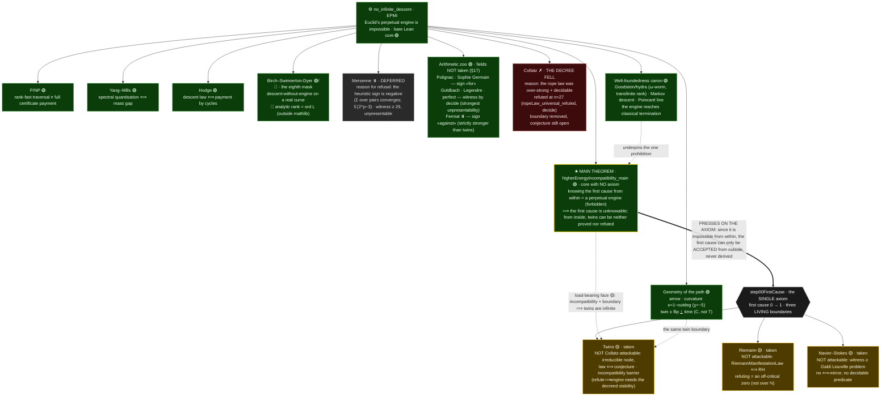

# Euclids-path

[](https://doi.org/10.5281/zenodo.21198730)
[](LICENSE)
[](lean-toolchain)

> 🇷🇺 **Русская версия:** [`README.ru.md`](README.ru.md) · 🇬🇧 You are reading the English version.
> On the [documentation site](https://elamaunt.github.io/Euclids-path/en/) a language switcher is
> available; on GitHub the prose links below point straight to the English `*.en.md` chapters.

A consolidation of the proof programme for the **twin-prime conjecture**, built around
**Euclid's perpetual engine** (the impossibility of an infinite "clean" descent — a version of
Fermat's infinite descent).

This is **not a finished proof**. It is a machine-checkable assembly in which the conjecture is
reduced to a **single** open node, and the whole path — from the engine's laws to the final
reduction — is visible across the numbered files.

> **Paper.** An arXiv-style write-up of the whole programme (LaTeX + PDF) is attached to the
> [latest release](https://github.com/elamaunt/Euclids-path/releases/latest) and is being prepared for
> publication. What still changes is mostly the **prose** — the exposition is being refined; the
> mathematical content and the machine-checked results are settled.


*Euclid's-path fractal · **genealogy ornament**: the full old-peel descent of every centre
$6m\pm1$, woven with chords on the circle of centres; the colour is the Euclid prime of the step
$6m\mp1=p\cdot(6t\pm1)$. The yellow points on the circle are the **twin-centres with empty
genealogy** (those whose descent breaks off at once): their infinitude is exactly the twin
conjecture. The other five kinds live in [`tools/fractal/`](tools/fractal/).*

> **★ Main theorem: "Higher-energy incompatibility"**
> ([`higherEnergyIncompatibility_main`](EuclidsPath/Engine/FiniteKnowledgeBarrier.lean), core 🟢).
> It proves, strictly, exactly this: **you cannot know that the twins are infinite; but if the
> non-knowledge of the first cause is taken for truth — they are infinite, and that is strict.** To
> learn the first cause from within would cost a perpetual engine, which does not exist — so it is
> unknowable; and a finite observer tells even a single twin apart only by a whole clean class. Both
> walls are of one nature; the load-bearing edge closes the circle: this very incompatibility plus the
> accepted causal boundary ⟹ the twins are infinite
> (`higherEnergyIncompatibility_twins` 🟡 — conditional on the axiom, **not** a proof).
>
> **Cosmologically** (strict theorems, [chapter 33](prose/33_CausalFirstCause.en.md)): the number line
> and the impossibility of the engine together encode space and time. The strict traversal order is
> space (with a floor-singularity at `0`); the irreversible **arrow of time is proved strictly**
> (`engine_never_returns` — height is strictly antimonotone, there is no way back), with an unreachable
> end at `∞`, which only a perpetual engine could reach. The first cause is the instant when the engine
> emerges from the singularity `0` and sets off forward without turning; it cannot be given from within
> (self-start = perpetual engine, `no_internalisedOriginEvent`), so it is accepted **from outside** — by
> the single axiom. Hence, inside the system, the infinitude of the twins can be neither proved nor
> refuted: both actions would require a perpetual engine. There is no tower of causes beneath the first
> cause — the regress is well-founded (`no_rankedMetaFractalBranch`); the universe is one.
>
> **Map of the path:** [`prose/00_Overview.en.md`](prose/00_Overview.en.md) — the main navigator.
> **Source of truth:** the primary records in `f:/Primes/*.md`/`*.csv` (not edited).

---

## Map: one engine — seven branches, a zoo and geometry

At the foundation lies a single physical prohibition: **the impossibility of a perpetual engine**
(`no_infinite_descent`, the bare Lean core). Seven great questions turn out to be its shadows on
different objects. The structural half of each is proved **green** (where the engine is forbidden,
there is no deviation); and the last step — the tie to a real object — is either accepted by the
**single first-cause axiom** `step00FirstCause` (three yellow decree boundaries), or remains a green
conditional theorem, or stays an open 🔴 input. A through-line discussion is in the
[prologue](prose/00_Overview.en.md).

**Universal form** (`Engine/UniversalEngine`): the engine is defined over ANY relation
(`PerpetualEngine`), and its impossibility follows from an internal cause: the definition is an
infinite strict descent, and well-foundedness is exactly its prohibition
(`no_perpetual_engine_of_wellFounded`; `perpetualEngine_iff_not_wellFounded`). It carries into any
space with an ℕ-rank (`no_perpetual_engine_of_rank` — every front is a corollary of one theorem; EPMI
is shown as an instance). But not "everywhere": on the continuum ℝ the engine **works**
(`perpetualEngine_on_real`) — which makes Euclid's path a **controller**
(`universal_engine_dividing_line`, M6): it decides where motion is forbidden (the discrete) and where
it is realised (the continuum). The core is mathlib well-foundedness; the contribution is
formalisation-unifying; the taint is unchanged.



Colours: 🟢 — machine-proved under standard axioms (the structural part / a green conditional
theorem); 🟡 — AXIOM-TAINTED, conditional on the first cause (the object accepted by decree at an
honestly disclosed price); 🔴 — an open input (the real object: the QFT spectrum, the primes'
Hamiltonian, a Leray solution, the `(p,p)`-classes, a Turing machine — absent from the formalisation).
⏸️ — the problem is examined but its boundary is NOT taken: deferred by heuristic sign (Mersenne, Fermat)
or a zoo front with no field (§16–17). ✗ — the decree was taken and FELL (Collatz, refuted at n = 27).
Collatz went through the full cycle of the discipline: its rope law was the **fourth boundary** of
`step00FirstCause` — and it was machine-REFUTED (`ropeLaw_universal_refuted`, witness n = 27); the
tripwire fired, the boundary was removed, the decree path closed by a forged refutation. The green
front is `Engine/CollatzTugOfWar`, the post-mortem `Engine/CollatzFirstCause`
(chapters [55](prose/55_Collatz.en.md)–[56](prose/56_CollatzFirstCause.en.md)).

**The arithmetic zoo (ch. 44–48, all 🟢, no fields taken).** The same manifestation apparatus is run
through six new number-theoretic stories: cousins and sexy primes (Polignac), Sophie Germain,
Goldbach, Legendre, odd perfect numbers, Fermat numbers. All are green and conditional only on the
definitions of the laws; not a single open problem is solved or declared. The gem is the **green
Euler–Lagrange classic**: SG-primes with `p ≡ 3 (mod 4)` divide the Mersenne number `M_p` (23 ∣ M₁₁),
a formal fragment of the very heuristic whose sign defers the Mersenne boundary (§16). The trilemmas
are passed everywhere, but no fields are taken, deliberately (§17): five stories carry the sign "for"
(like Riemann), Fermat the sign "against" (stronger than Mersenne); for Goldbach/Legendre/perfect the
witness is pointwise **decidable** (decide) — the strongest non-presentability. The only unconditional
green theorem about primes here is **Bertrand** (a prime desert does not survive doubling), and it is
disclosed honestly why Legendre needs more than it.

**Geometry of the path (ch. 49, 🟢 + 2 🟡).** The concrete descent graph is read geometrically: the
arrow of time (`lexRank` only falls), the **computed curvature** `κ = 1 − outdeg` (spectrum from −8 to
+1, discrete Gauss–Bonnet `χ(cone3) = −5`), "flatness everywhere ⟹ a perpetual engine", and the
irony — Euclid's path violates Euclid's own **second postulate** (a line cannot be extended without
bound), and so there are no parallels. The intersection of lines is proved 🟡 from the **same** first
cause (exactly two axiom-tainted declarations, no new field), but it cannot be known from within (🟢) —
the knowledge would cost an engine. **Navier–Stokes on ℝ³** (a postscript to ch. 41): the box-class
energy balance is **derived green**, the divergence theorem genuinely engaged; the cascade smoothness
of this class is decree-free. **The Clay reduction** (`Engine/NavierStokesClayReduction`): the exact
Clay-(A) statement is encoded, and the logical reduction "known theory (Kato + Beale–Kato–Majda) + one
criterion `GlobalVorticityControl` ⟹ Clay-(A)" is proved green — the single open theorem is
**isolated and named** (vorticity control, the supercriticality barrier). NS is **not solved and not
declared solved**; it is machine-recorded that the engine surrogate is **strictly weaker** than the
criterion (`greenBudget_strictly_weaker_than_vorticityControl`, via a non-uniform cascade) — the
engine reading does **not** close the problem.
**A discrete fluid model** (`Engine/CascadeBudget`, `Engine/DyadicBlowup`, `Engine/DyadicFirstCause`,
[chapter 52](prose/52_DyadicModel.en.md)): probably **the first formalisation of a fluid model** in a
proof assistant (known mathematics: the budget principle + the Katz–Pavlović model). A machine map of
the boundary of the engine reading: where it works (budget ⟹ finite time under UNIFORM dissipation)
and where it breaks (`superlinear_blowup_sq` + `dyadic_blowup` — the cascade **blows up**, the engine
is REALISED). The connecting cascade-drive `y'≥C·y²` is now **derived from the raw λⁿ relations** — for
the exact self-similar solution (`ssLead_drive`) and for a whole class through a front invariant
(`frontDrive_of_invariant`): a monolithic named hypothesis is narrowed to a smaller,
coordinate-close invariant; the only isolated input left open is front persistence for infinitely many
modes (the moving KP front). And the source of the cascade (the pump `n=0`, uncausable from within — 🟢
`dyadicOrigin_uncausable_from_inside`) is **decreed by the first cause** (🟡 `DyadicFirstCause`, via
`nsBoundary`): the fluid blow-up joins the masks through its own `0`. There is no new MATHEMATICS (the
Tao barrier); the novelty is in the formalisation. NS is not solved.

## Structure

- **`EuclidsPath/Engine/*.lean`** — the main (proved) line: the engine and its laws → reduction to the
  twins → attack lines → the final node. Imported by the root `EuclidsPath.lean` **in the order of the
  proof's progression**.
- **`prose/NN_*.md`** — the paired prose, the same through numbering 00→50 (+ appendix `A`), a single
  academic narrative: engine → twins → first cause and THE MAIN THEOREM → side branches → the
  arithmetic zoo (44–48) → the geometry of the path (49) → the coda (50). English siblings live in
  `prose/NN_*.en.md`.
- **`tools/`** — numerical harnesses (`*_harness.py`) and results (`RESULTS_*.md`);
  **`tools/fractal/`** — visualisation of Euclid's fractal (8 kinds: descent forest, rank field, twin
  spiral, load landscape, the line of centres with genealogies, the ornament of genealogies — and two
  conceptual cosmological views for the coda: an observer with an event horizon and an arrow of time
  pointing inward, a time-sphere with observer/singularity antipodes; the last two are a superstructure
  over the real substrate, `euclid_cosmology.py`).

## The path (prose ↔ Lean)

| № | Topic | Prose | Lean | Status |
|---|---|---|---|---|
| 00 | Goal, map of the path, definitions | [00](prose/00_Overview.en.md) | `Step00_Overview` | 🔴 goal |
| 01 | Impossibility of the engine (EPMI) | [01](prose/01_EPMI.en.md) | `Engine/EPMI` | 🟢 |
| 02 | Carrier of two `gcd∣2` | [02](prose/02_Carrier.en.md) | `Engine/Carrier` | 🟢 |
| 03 | Conservation of two `XY−ZW=2` | [03](prose/03_TwoGap.en.md) | `Engine/TwoGap` | 🟢 |
| 04 | Descent + boundary-law | [04](prose/04_Descent.en.md) | `Engine/Descent` | 🟢 |
| 05 | Irreversibility / 2 laws | [05](prose/05_Irreversibility.en.md) | `Engine/Irreversibility` | 🟢 |
| 06 | No way back (exclusivity) | [06](prose/06_NoBackward.en.md) | `Engine/NoBackward` | 🟢 |
| 07 | Short train (squeeze) | [07](prose/07_Squeeze.en.md) | `Engine/Squeeze` | 🟢 |
| 08 | Bounded cycle | [08](prose/08_BK.en.md) | `Engine/BK` | 🟢 |
| 09 | Factor-repeat rigidity | [09](prose/09_Cycle.en.md) | `Engine/Cycle` | 🟢 |
| 10 | survivor ⇒ twin; the ∞ bridge | [10](prose/10_NonCover.en.md) | `Engine/NonCover` | 🟢 |
| 11 | Conjecture ⟸ block core | [11](prose/11_TwoTransport.en.md) | `Engine/TwoTransport` | 🟢 |
| 12 | Four-corner (negative association) | [12](prose/12_FourCorner.en.md) | `Engine/FourCorner` | 🟢 |
| 13 | Fractal layer / model | [13](prose/13_FractalLayer.en.md) | `Engine/ModelFourCorner` | 🟢 |
| 14 | Remainder decomposition | [14](prose/14_RealFourCorner.en.md) | `Engine/RealFourCorner` | 🟢 |
| 15 | Chain to the twins (conditional `H`) | [15](prose/15_ToTwins.en.md) | `Engine/ToTwins` | 🟢 |
| 16 | By contradiction: finite∧H⇒False | [16](prose/16_FiniteContradiction.en.md) | `Engine/FiniteContradiction` | 🟢 |
| 17 | Payment law (ledger) | [17](prose/17_PaymentLedger.en.md) | `Engine/PaymentLedger` | 🟢 |
| 18 | SNOL — shifted-neighbour node | [18](prose/18_SNOL.en.md) | `Engine/SNOL` | 🟢 |
| 19 | Old-peel: catch as a descent step | [19](prose/19_OldPeel.en.md) | `Engine/OldPeel` | 🟢 |
| 20 | NOPSL: no old-peel sink | [20](prose/20_NOPSL.en.md) | `Engine/NOPSL` | 🟢 |
| 21 | Regeneration dichotomy (Ω_A) | [21](prose/21_Regeneration.en.md) | `Engine/Regeneration` | 🟢 |
| 22 | Residuals: start, sink⇒twin | [22](prose/22_Residuals.en.md) | `Engine/Residuals` | 🟢 |
| 23 | Clean/boundary graph | [23](prose/23_CleanGraph.en.md) | `Engine/CleanGraph` | 🟢 |
| 24 | Boundary decomposition + global node | [24](prose/24_BoundaryDecomp.en.md) | `Engine/BoundaryDecomp`, `Engine/LabelledFanIn`, `Engine/AtomicSNOL`, `Engine/ConcreteComponents`, `Engine/BadCoverDescent`, `Engine/ObstructionClosure`, `Engine/ManyUnresolved`, `Engine/HigherEnergy`, `Engine/HigherTower`, `Engine/EngineTower`, `Engine/ParityBarrier`, `Engine/ReverseTower`, `Engine/AboveConflict`, `Engine/JumpBarrier`, `Engine/PaidDynamics`, `Engine/ClosedUniverse`, `Engine/BoundaryDefectPayment`, `Engine/BoundaryLedgerCollision`, `Engine/ConcreteStep00Graph`, `Engine/DichotomyEngine`, `Engine/DissipativeCascade` | 🟢 decomp.; 🔴 node |
| 25 | Rigid closure (reaches_twin) | [25](prose/25_RigidClose.en.md) | `Engine/RigidClose` | 🟢 |
| 26 | Separating scale ⟹ ¬ProductHall | [26](prose/26_SeparatingScale.en.md) | `Engine/SeparatingScale` | 🟢 |
| 27 | Product-core: the whole machine | [27](prose/27_ProductCore.en.md) | `Engine/ProductCore` | 🟢 |
| 28 | Factorisation → RankNode | [28](prose/28_MkNode.en.md) | `Engine/MkNode` | 🟢 |
| 29 | **The last link + boundary** | [29](prose/29_CarrierBridge.en.md) | `Engine/CarrierBridge` | 🔴 the single node |
| 30 | Riemann: contraposition (engine) | [30](prose/30_RiemannBranch.en.md) | `Engine/RiemannBranch`, `Engine/RiemannEngine`, `Engine/RiemannImpossibleEngine`, `Engine/RiemannImpossibleEngineOff`, `Engine/RankJumpBridge` | 🔴 RH input |
| 31 | Riemann via Liouville (λ=(−1)^rank) | [31](prose/31_RiemannLiouville.en.md) | `Engine/RiemannLiouville` | 🔴 RH input |
| 32 | Unified rank-parity node (epilogue) | [32](prose/32_RankParityUnity.en.md) | — (synthesis) | 🔴 unity conjecture |
| 33 | First cause + THE MAIN THEOREM | [33](prose/33_CausalFirstCause.en.md) | `Engine/CausalClosureAxiom` (quarantine), `Engine/FiniteKnowledgeBarrier` | 🟢 core; 🟡 corollaries |
| 34 | Mersenne branch | [34](prose/34_MersenneBranch.en.md) | `Engine/MersenneBranch`, `MersennePaymentConflict`, `MersennePeelPressure`, `MersenneForwardFront` | 🟢 bridge; 🔴 inputs; ⚠️ vacuity №3 |
| 35 | P/NP: node and classical bridge | [35](prose/35_ClassicalPNP.en.md) | `Engine/LocalPNPNode`, `ClassicalPNPBridge`, `CanonicalSelfReduction`, `ClassicalFrontierRoutes`, `RankClosureFront` | 🟢 assembly; 🔴 frame+reconstruction |
| 36 | Navier–Stokes | [36](prose/36_NavierStokes.en.md) | `Engine/NavierStokes` | 🟢 skeleton; 🔴 EnergyBalanceLaw |
| 37 | Riemann fronts | [37](prose/37_RiemannFronts.en.md) | `Engine/RiemannTrivialZeros` (input №1 CLOSED), `RiemannRankProjection(+Audit)`, `RiemannTwoTransportFront`, `RiemannArithmeticTwoTransport`, `RiemannSpectralAnchorAudit`, `RiemannLayerBoxFront`, `RiemannTerminalRankFront` | 🟢 arithmetic; 🔴 two inputs; ⚠️ vacuity №2 |
| 38 | **Riemann via the first cause** | [38](prose/38_RiemannFirstCause.en.md) | `Engine/RiemannManifestationFront` (green chain), `Engine/CausalClosureAxiom` §10, `Engine/RiemannDualEngineFront` | 🟢 chain; 🟡 RH from decree; 🔴 dual packages |
| 39 | **P/NP: rank certificate payment** | [39](prose/39_PNPRankPayment.en.md) | `Engine/PNPRankPaymentFront` (green separation A ≤ 4 + trilemma), `Engine/PNPFirstCause` (epistemic complement), `Engine/CausalClosureAxiom` §11 | 🟢 separation in the rank model; 🟢 the decision is unknowable from inside a finite-fuel machine (`pnpCause_unknowable`, ch. 56); 🟡 P/NP-language decree; ⚠️ vacuity №4 |
| 40 | **Yang–Mills: mass gap via the engine** | [40](prose/40_YangMills.en.md) | `Engine/YangMillsFront` (green chain + trilemma), `Engine/CausalClosureAxiom` §12 | 🟢 quantisation⟹gap; 🟡 decree language; 🔴 spectral data-anchor |
| 41 | **NS: smoothness via cascade + integral** | [41](prose/41_NSSmoothness.en.md) | `Engine/NavierStokesFront` (identity + trilemma + COMPLETION: two forgings and the gate law), `Engine/CausalClosureAxiom` §13+§15 | 🟢 identity+cascade+forgings; 🟡 THE THIRD BOUNDARY (gate law) — smoothness of gate-solutions from decree |
| 42 | **Hodge: quantised charges and payment** | [42](prose/42_Hodge.en.md) | `Engine/HodgeFront` (hero + collapse + trilemma), `Engine/CausalClosureAxiom` §14 | 🟢 descent⟹payment, the engine dead unconditionally; 🟡 tripwire; 🔴 DescentLaw |
| 43 | **Mersenne: refutation = engine** | [43](prose/43_MersenneFirstCause.en.md) | `Engine/MersenneManifestationFront` (Π-witness, law, essence M3), `Engine/CausalClosureAxiom` §16 (comment) | 🟢 chain + "the 4c+1 chain does not peel"; a field is ADMISSIBLE but DEFERRED (heuristic sign against) |
| 41′ | *(postscript)* **NS: integral assembled on ℝ³ (box)** | [41](prose/41_NSSmoothness.en.md) | `Engine/NavierStokesR3Assembly` | 🟢 R1 derivative under the integral + R2 divergence (faces vanish) + **three integrations by parts DERIVED** (pressure/convection/viscosity) ⟹ box-class energy balance unconditional ⟹ cascade smoothness WITHOUT the decree; 🔴 only the box→ℝ³ limit and TimeDomination remain |
| 44 | **Sides and Polignac (cousins p+4, sexy p+6)** | [44](prose/44_SidesAndPolignac.en.md) | `Engine/SideInfinitude`, `Engine/PolignacBranch`, `Engine/PolignacManifestationFront` | 🟢 Dirichlet: the sides are separately infinite; classification, constellation, essence; NO field (§17, no chain — nothing to forge) |
| 45 | **Sophie Germain: the gem of the series** | [45](prose/45_SophieGermain.en.md) | `Engine/SophieGermainBranch`, `Engine/SophieGermainManifestationFront` | 🟢 SG-primes with p≡3 (mod 4) DIVIDE Mersenne (23∣M₁₁) — the Euler–Lagrange classic; centre doubling; anti-Mersenne restriction ("two bets") |
| 46 | **Goldbach and Legendre** | [46](prose/46_GoldbachLegendre.en.md) | `Engine/GoldbachManifestationFront`, `Engine/LegendreDesertFront` | 🟢 the witness is pointwise DECIDABLE (decide up to 52/up to 10); GREEN Bertrand (a desert does not double), but shorter than Legendre; NO field |
| 47 | **Perfect numbers: Euclid–Euler** | [47](prose/47_PerfectNumbers.en.md) | `Engine/PerfectNumberBranch`, `Engine/OddPerfectManifestationFront` | 🟢 BOTH directions of Euclid–Euler (Archive); Mersenne primes ⟺ even perfect numbers unbounded; odd witness ≥ 101 |
| 48 | **Fermat numbers: a second bet against** | [48](prose/48_Fermat.en.md) | `Engine/FermatBranch`, `Engine/FermatManifestationFront` | 🟢 F_k ≡ 5 (mod 6) minus-side; the quadratic chain does not peel; localisation ≥ 65537; the sign is INVERTED more strongly than Mersenne — NO field |
| 49 | **★ Geometry of the path: curvature, arrow, intersection** | [49](prose/49_Geometry.en.md) | `Engine/GeometryFront` | 🟢 arrow of time; κ=1−outdeg COMPUTED (−8…+1, χ=−5); flatness⟹engine; Euclid's SECOND postulate falls; 🟡 intersection from the first cause, but it cannot be known (2 declarations) |
| 50 | **★ Coda: Euclid's path and the structure of spacetime** | [50](prose/50_Coda.en.md) | — (synthesis) | a philosophical/physical summary: one prohibition — seven masks + zoo + geometry; a possible TOE |
| — | **Appendices & later fronts** | | | *the synthesis is closed; what follows extends the core* |
| 51 | Numerical data | [51](prose/51_NumericalEvidence.en.md) | `tools/RESULTS_*` | — |
| 52 | Discrete fluid model | [52](prose/52_DyadicModel.en.md) | `Engine/CascadeBudget`, `Engine/DyadicBlowup`, `Engine/DyadicFirstCause` | 🟢 budget+Katz–Pavlović blow-up, the drive DERIVED from the relations; 🟡 the cascade's source = the first cause |
| 53 | **Birch–Swinnerton-Dyer (the eighth mask)** | [53](prose/53_BirchSwinnertonDyer.en.md) | `Engine/BSDFront` | 🟢 descent-without-engine on a REAL curve (Mordell–Weil) + a parity bridge to Liouville; 🔴 analytic rank = ord L (outside mathlib); NO boundary (trilemma); NOT a solution of BSD |
| 54 | **Neighbours beyond the horizon (5 shadows)** | [54](prose/54_OpenNeighbors.en.md) | `Engine/{Chowla,Abc,Beal,Lehmer,Landau}Front` | 🟢 REAL mathlib anchors (Mason–Stothers, Polynomial.flt_catalan, Northcott+Kronecker, Dirichlet, Liouville); 🔴 the conjectures themselves (Chowla/abc/Beal/Lehmer/Landau) are open; no decrees; NOT solutions |
| 55 | **Collatz: an engine on bounded fuel** | [55](prose/55_Collatz.en.md) | `Engine/CollatzEngine`, `Engine/CollatzFuel`, `Engine/CollatzTugOfWar` | 🟢 engine/rope laws + window budget ⟹ descent + "refutation = perpetual engine"; 🟢 the universal rope law is REFUTED (`not_ropeCountingLaw_27`) |
| 56 | **The Collatz first cause: the decree that fell** | [56](prose/56_CollatzFirstCause.en.md) | `Engine/CollatzFirstCause`, `Engine/CausalClosureAxiom` §18 | 🟢 post-mortem: the boundary taken and REMOVED (the tripwire fired, the law is false); 🟢 the "verification, not derivation" epistemics survived; the conjecture 🔴 open |

🟢 = machine-checked, without `sorry` (standard axioms). 🟡 = AXIOM-TAINTED (conditional on
`step00FirstCause`; exactly **47** declarations — 42 in quarantine + the corollary
`higherEnergyIncompatibility_twins` + **2 geometry declarations** of ch. 49
(`twin_vertices_beyond_every_horizon`, `lines_meet_but_unknowable_from_inside`, via the accepted twin
boundary) + **2 dyadic-source declarations** (`DyadicFirstCause.dyadicOrigin_from_firstCause`,
`dyadicBlowup_is_firstCauseManifestation`, via the `nsBoundary` boundary) — all through accepted
boundaries. There are NO Collatz declarations in the taint any more: the fourth boundary was removed
after its law was refuted. 🔴 = an open node / input.

## Status — honestly

Three colours run through the whole programme, and here we name them plainly.

**The green corpus — machine-proved, under standard axioms, without `sorry`.** The whole of Euclid's
engine and its laws (EPMI: the impossibility of infinite descent, irreversibility, finiteness in a
finite number of steps); the reduction of the twin conjecture to a single block core; the entire
product-core machine (rank-descent 4→1, pigeonhole); the infinitude of the carrier. The former walls —
parity, circular payment, the three rank-descent defects — are all removed. This is the genuinely
checked part: a "green" module cannot be forged, and the verifier's axiom tracker does not let a decree
hide behind a green label.

**The single open node.** The whole twin branch is machine-reduced to one statement —
`TheLastStep00Obligation`: *a finite semantic key resolves genealogy collisions*. It is honest: at
every scale `M0` it itself exhibits a twin-centre above `M0` (that is, it is scale-wise no weaker than
the goal) and exists in a dozen and a half equivalent forms — energetic, embedded, seam. The small
branch `A ≤ 4` we **machine-refuted** (a five-adic chain gives infinitely many genealogies without a
single twin hypothesis), so the node lives only at `A ≥ 5`; its satisfiability there is genuinely open.
`twin_prime_conjecture` remains a `sorry` — this is an honest **reduction, not a proof**. In detail —
[chapter 24](prose/24_BoundaryDecomp.en.md) and [29](prose/29_CarrierBridge.en.md).

**The single axiom — the first cause** ([chapter 33](prose/33_CausalFirstCause.en.md)). The node cannot
be closed from within: its self-grounding would build a perpetual engine, and that is a proved
impossibility. So we accept it **from outside**, by the single axiom `step00FirstCause` — a deliberate
"0 → 1" event with three causal boundaries: the twins (`causalBoundary`), Riemann (`riemannBoundary`)
and Navier–Stokes (`nsBoundary`). A fourth boundary — the Collatz rope law — was taken and REMOVED: the
law was machine-refuted (`ropeLaw_universal_refuted`), the tripwire fired (chapters 55–56). The axiom is
locked in a quarantine module; the verifier marks every declaration that depends on it (exactly 47:
43 in quarantine + 2 geometry of ch. 49 through the accepted twin boundary + 2 dyadic-source through
`nsBoundary`) — there are no leaks into the green line. The honesty is machine-level: the strength of
the decree is exactly the sum of the accepted boundaries, and it is no weaker than its conclusions (to
accept the axiom = to accept the twins, and the same for RH). Knowing the cause from within is
impossible as a theorem (`cause_unknowable`); hence the main theorem above.

**Seven branches around one engine.** Every great question is a shadow of the perpetual-engine
prohibition on its own object, and the outcome is honestly different in each case:

- **Twins** and **Riemann** — a decree boundary 🟡: the node and an off-critical zero are green
  non-presentable, so they can be honestly accepted by axiom
  ([33](prose/33_CausalFirstCause.en.md), [38](prose/38_RiemannFirstCause.en.md)).
- **P/NP** — 🟢 **a theorem with no decree at all**: fast rank traversal provably does not pay for an
  unbounded family of certificates ([39](prose/39_PNPRankPayment.en.md)).
- **Yang–Mills** and **Hodge** — 🟢 conditional theorems: spectral quantisation ⟹ mass gap, the
  descent law ⟹ payment by cycles ([40](prose/40_YangMills.en.md), [42](prose/42_Hodge.en.md)).
- **Navier–Stokes** — 🟢 the cascade and the assembled integral; the gate energy balance survived as
  the third decree boundary ([36](prose/36_NavierStokes.en.md), [41](prose/41_NSSmoothness.en.md)).
- **Mersenne** — a side branch: an honest bridge, all load-bearing inputs 🔴
  ([34](prose/34_MersenneBranch.en.md)).

The recurring lesson, machine-proved across all fronts: **an honest decree boundary exists only where
the "deviation" itself is green non-presentable.** Where the deviation can be forged — frames for P/NP,
spectra for Yang–Mills, profiles for Navier–Stokes, charges for Hodge — the decree either explodes or
is empty, and what remains is a green conditional theorem with an honestly named 🔴 input. The missing
object is every time the same — a **data anchor**: a constructed YM spectrum, a Leray solution, the
`(p,p)`-classes, a machine model — mathlib has none of them. **Not a single Millennium problem is
solved or declared solved.**

**Adversarial honesty.** Four times the internal audit found an empty wrapper before it reached the
showcase — vacuities №1–№4 (a degenerate peel of the node; an uninhabited Riemann rank-jump; a free
`witness` for Mersenne; classically empty decider-fronts for P/NP). All were exposed by machine and
documented in the modules themselves, not painted over — and that is the best argument to trust the
parts that did pass the showcase.

## Build

```sh
lake exe cache get    # precompiled mathlib oleans (v4.31.0)
lake build            # the whole Engine line; exit 0 = checked
lake env lean EuclidsPath/Engine/EPMI.lean   # a quick check of the engine core
```

## Verification

```sh
lake env lean scripts/VerifyAll.lean   # enumerates declarations, counts the taint, self-checks the invariants
```

The verifier walks over every non-internal `EuclidsPath*` theorem/definition, collects the axioms it
depends on, and prints: total declarations, `sorryAx`-tainted, tainted by a non-standard axiom. Then
it **self-checks the two eternal honesty invariants** and fails with a non-zero code if either is
violated: (1) the only non-standard axiom in the whole repository is `step00FirstCause`; (2) the only
`sorryAx`-tainted declaration is `twin_prime_conjecture`. Current run: **20018** declarations, sorryAx
**1**, tainted by a non-standard axiom **47** (the number itself changes with the content and is not
hard-pinned — only the two invariants are).
