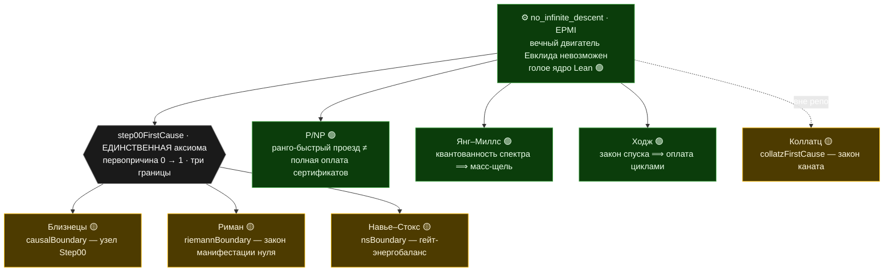

# Euclids-path

Консолидация доказательной программы гипотезы **простых-близнецов**, выстроенной вокруг
**вечного двигателя Евклида** (невозможность бесконечного «чистого» спуска — версия бесконечного
спуска Ферма).

Это **не завершённое доказательство**. Это машинно-проверяемая сборка, в которой гипотеза сведена
к **одному** открытому узлу, а весь ход — от законов двигателя до финальной редукции — виден по
пронумерованным файлам.


*Фрактал пути Евклида · **генеалогический орнамент**: полный old-peel-спуск каждого центра
$6m\pm1$, сотканный хордами на круге центров; цвет — простое Евклида шага $6m\mp1=p\cdot(6t\pm1)$.
Жёлтые точки на окружности — **twin-центры с пустой генеалогией** (те, чей спуск обрывается сразу):
именно их бесконечность и есть гипотеза близнецов. Остальные пять видов — в
[`tools/fractal/`](tools/fractal/).*

> **★ Главная теорема: «Высшая энергетическая несовместимость»**
> ([`higherEnergyIncompatibility_main`](EuclidsPath/Engine/FiniteKnowledgeBarrier.lean), ядро 🟢).
> Узнать первопричину изнутри стоило бы вечного двигателя, которого нет, — **поэтому она
> непознаваема**. А конечный наблюдатель и близнеца-то различает лишь целым чистым классом. Обе
> стены — одна природа; и несущая грань замыкает круг: сама эта несовместимость плюс принятая
> причинная граница ⟹ близнецы бесконечны. Энергетически: *«знать изнутри» стоит вечного
> двигателя, которого нет; бесконечность близнецов — внешнее знание, оплаченное первопричиной.*
> Следствие `higherEnergyIncompatibility_twins` 🟡 — условно на аксиому, **не** доказательство.
> Полный разбор — [глава 33](prose/33_CausalFirstCause.md).
>
> **Карта хода:** [`prose/00_Overview.md`](prose/00_Overview.md) — главный навигатор.
> **Источник истины:** первичные записи в `f:/Primes/*.md`/`*.csv` (не редактируются).

---

## Карта: один двигатель — семь ветвей

В основании — один физический запрет: **невозможность вечного двигателя** (`no_infinite_descent`,
голое ядро Lean). Семь великих вопросов оказываются его тенями на разных объектах. Структурная
половина каждого доказывается **зелёно** (где есть запрет двигателя — там нет отклонения); а
последний шаг — привязка к настоящему объекту — либо принимается **единственной аксиомой-первопричиной**
`step00FirstCause` (три жёлтые границы декрета), либо остаётся зелёной условной теоремой, либо —
открытым 🔴-входом. Философский разбор сквозной темы — в [прологе](prose/00_Overview.md).



Цвета: 🟢 — доказано машинно при стандартных аксиомах (структурная часть / зелёная условная теорема);
🟡 — AXIOM-TAINTED, условно на первопричину (объект принят декретом под честно раскрытую цену);
🔴 — открытый вход (настоящий объект: спектр КТП, гамильтониан простых, решение Лерэ, `(p,p)`-классы,
машина Тьюринга — в формализации отсутствует). Коллатц — **вне репозитория** (постоянное правило),
со своим карантином; при ручном включении его граница вольётся в `step00FirstCause`.

## Структура

- **`EuclidsPath/Engine/*.lean`** — основная (доказанная) линия: двигатель и его законы → редукция к
  близнецам → линии-атаки → финальный узел. Импортируются корневым `EuclidsPath.lean` **в порядке
  хода доказательства**.
- **`prose/NN_*.md`** — парная проза, та же сквозная нумерация 00→42 (+ приложение `A`), единый
  академический нарратив: двигатель → близнецы → первопричина и ГЛАВНАЯ ТЕОРЕМА → побочные ветви.
- **`tools/`** — числовые харнессы (`*_harness.py`) и результаты (`RESULTS_*.md`);
  **`tools/fractal/`** — визуализация фрактала Евклида (6 видов: спуск-лес, поле ранга, спираль
  близнецов, ландшафт нагрузки, линия центров с родословными, узор из родословных).
- **`archive/`** — первая **аналитическая** линия (PMKLS/DASC/G2/O4C, `B₅=N₀₀−N₃₃`), изученная и
  **обойдённая**. Сохранена ради видимого хода мысли (см. `archive/README.md`).

## Ход (проза ↔ Lean)

| № | Тема | Проза | Lean | Статус |
|---|---|---|---|---|
| 00 | Цель, карта хода, определения | [00](prose/00_Overview.md) | `Step00_Overview` | 🔴 цель |
| 01 | Невозможность двигателя (EPMI) | [01](prose/01_EPMI.md) | `Engine/EPMI` | 🟢 |
| 02 | Носитель двойки `gcd∣2` | [02](prose/02_Carrier.md) | `Engine/Carrier` | 🟢 |
| 03 | Сохранение двойки `XY−ZW=2` | [03](prose/03_TwoGap.md) | `Engine/TwoGap` | 🟢 |
| 04 | Спуск + boundary-law | [04](prose/04_Descent.md) | `Engine/Descent` | 🟢 |
| 05 | Необратимость / 2 закона | [05](prose/05_Irreversibility.md) | `Engine/Irreversibility` | 🟢 |
| 06 | Нет хода назад (эксклюзивность) | [06](prose/06_NoBackward.md) | `Engine/NoBackward` | 🟢 |
| 07 | Короткий train (squeeze) | [07](prose/07_Squeeze.md) | `Engine/Squeeze` | 🟢 |
| 08 | Ограниченный цикл | [08](prose/08_BK.md) | `Engine/BK` | 🟢 |
| 09 | Factor-repeat rigidity | [09](prose/09_Cycle.md) | `Engine/Cycle` | 🟢 |
| 10 | survivor ⇒ twin; мост ∞ | [10](prose/10_NonCover.md) | `Engine/NonCover` | 🟢 |
| 11 | Гипотеза ⟸ блочное ядро | [11](prose/11_TwoTransport.md) | `Engine/TwoTransport` | 🟢 |
| 12 | Four-corner (отриц. ассоциация) | [12](prose/12_FourCorner.md) | `Engine/FourCorner` | 🟢 |
| 13 | Фрактальный слой / модель | [13](prose/13_FractalLayer.md) | `Engine/ModelFourCorner` | 🟢 |
| 14 | Декомпозиция остатка | [14](prose/14_RealFourCorner.md) | `Engine/RealFourCorner` | 🟢 |
| 15 | Цепь к близнецам (условно `H`) | [15](prose/15_ToTwins.md) | `Engine/ToTwins` | 🟢 |
| 16 | От противного: finite∧H⇒False | [16](prose/16_FiniteContradiction.md) | `Engine/FiniteContradiction` | 🟢 |
| 17 | Закон оплаты (ledger) | [17](prose/17_PaymentLedger.md) | `Engine/PaymentLedger` | 🟢 |
| 18 | SNOL — shifted-neighbour узел | [18](prose/18_SNOL.md) | `Engine/SNOL` | 🟢 |
| 19 | Old-peel: catch как шаг спуска | [19](prose/19_OldPeel.md) | `Engine/OldPeel` | 🟢 |
| 20 | NOPSL: нет old-peel sink | [20](prose/20_NOPSL.md) | `Engine/NOPSL` | 🟢 |
| 21 | Дихотомия регенерации (Ω_A) | [21](prose/21_Regeneration.md) | `Engine/Regeneration` | 🟢 |
| 22 | Residuals: старт, sink⇒twin | [22](prose/22_Residuals.md) | `Engine/Residuals` | 🟢 |
| 23 | Clean/boundary граф | [23](prose/23_CleanGraph.md) | `Engine/CleanGraph` | 🟢 |
| 24 | Boundary-декомпозиция + глоб. узел | [24](prose/24_BoundaryDecomp.md) | `Engine/BoundaryDecomp`, `Engine/LabelledFanIn`, `Engine/AtomicSNOL`, `Engine/ConcreteComponents`, `Engine/BadCoverDescent`, `Engine/ObstructionClosure`, `Engine/ManyUnresolved`, `Engine/HigherEnergy`, `Engine/HigherTower`, `Engine/EngineTower`, `Engine/ParityBarrier`, `Engine/ReverseTower`, `Engine/AboveConflict`, `Engine/JumpBarrier`, `Engine/PaidDynamics`, `Engine/ClosedUniverse`, `Engine/BoundaryDefectPayment`, `Engine/BoundaryLedgerCollision`, `Engine/ConcreteStep00Graph`, `Engine/DichotomyEngine`, `Engine/DissipativeCascade` | 🟢 деком.; 🔴 узел |
| 25 | Rigid-замыкание (reaches_twin) | [25](prose/25_RigidClose.md) | `Engine/RigidClose` | 🟢 |
| 26 | Separating scale ⟹ ¬ProductHall | [26](prose/26_SeparatingScale.md) | `Engine/SeparatingScale` | 🟢 |
| 27 | Product-core: вся машина | [27](prose/27_ProductCore.md) | `Engine/ProductCore` | 🟢 |
| 28 | Факторизация → RankNode | [28](prose/28_MkNode.md) | `Engine/MkNode` | 🟢 |
| 29 | **Последнее звено + граница** | [29](prose/29_CarrierBridge.md) | `Engine/CarrierBridge` | 🔴 единственный узел |
| 30 | Риман: контрапозиция (двигатель) | [30](prose/30_RiemannBranch.md) | `Engine/RiemannBranch`, `Engine/RiemannEngine`, `Engine/RiemannImpossibleEngine`, `Engine/RiemannImpossibleEngineOff`, `Engine/RankJumpBridge` | 🔴 вход RH |
| 31 | Риман через Лиувилля (λ=(−1)^rank) | [31](prose/31_RiemannLiouville.md) | `Engine/RiemannLiouville` | 🔴 вход RH |
| 32 | Единый rank-parity узел (эпилог) | [32](prose/32_RankParityUnity.md) | — (синтез) | 🔴 гипотеза единства |
| 33 | Первопричина + ГЛАВНАЯ ТЕОРЕМА | [33](prose/33_CausalFirstCause.md) | `Engine/CausalClosureAxiom` (карантин), `Engine/FiniteKnowledgeBarrier` | 🟢 ядро; 🟡 следствия |
| 34 | Ветка Мерсенна | [34](prose/34_MersenneBranch.md) | `Engine/MersenneBranch`, `MersennePaymentConflict`, `MersennePeelPressure`, `MersenneForwardFront` | 🟢 мост; 🔴 входы; ⚠️ вакуумность №3 |
| 35 | P/NP: узел и классический мост | [35](prose/35_ClassicalPNP.md) | `Engine/LocalPNPNode`, `ClassicalPNPBridge`, `CanonicalSelfReduction`, `ClassicalFrontierRoutes`, `RankClosureFront` | 🟢 сборка; 🔴 фрейм+реконструкция |
| 36 | Навье–Стокс | [36](prose/36_NavierStokes.md) | `Engine/NavierStokes` | 🟢 каркас; 🔴 EnergyBalanceLaw |
| 37 | Римановы фронты | [37](prose/37_RiemannFronts.md) | `Engine/RiemannTrivialZeros` (вход №1 ЗАКРЫТ), `RiemannRankProjection(+Audit)`, `RiemannTwoTransportFront`, `RiemannArithmeticTwoTransport`, `RiemannSpectralAnchorAudit`, `RiemannLayerBoxFront`, `RiemannTerminalRankFront` | 🟢 арифметика; 🔴 два входа; ⚠️ вакуумность №2 |
| 38 | **Риман через первопричину** | [38](prose/38_RiemannFirstCause.md) | `Engine/RiemannManifestationFront` (зелёная цепь), `Engine/CausalClosureAxiom` §10, `Engine/RiemannDualEngineFront` | 🟢 цепь; 🟡 RH из декрета; 🔴 дуальные пакеты |
| 39 | **P/NP: оплата сертификатов ранга** | [39](prose/39_PNPRankPayment.md) | `Engine/PNPRankPaymentFront` (зелёная сепарация A ≤ 4 + трилемма), `Engine/CausalClosureAxiom` §11 | 🟢 сепарация в ранговой модели; 🟡 P/NP-язык декрета; ⚠️ вакуумность №4 |
| 40 | **Янг–Миллс: масс-щель через двигатель** | [40](prose/40_YangMills.md) | `Engine/YangMillsFront` (зелёная цепь + трилемма), `Engine/CausalClosureAxiom` §12 | 🟢 квантованность⟹щель; 🟡 язык декрета; 🔴 data-anchor спектра |
| 41 | **НС: гладкость через каскад + интеграл** | [41](prose/41_NSSmoothness.md) | `Engine/NavierStokesFront` (тождество + трилемма + ДОБИТИЕ: две ковки и гейт-закон), `Engine/CausalClosureAxiom` §13+§15 | 🟢 тождество+каскад+ковки; 🟡 ТРЕТЬЯ ГРАНИЦА (гейт-закон) — гладкость гейт-решений из декрета |
| 42 | **Ходж: квантованные заряды и оплата** | [42](prose/42_Hodge.md) | `Engine/HodgeFront` (герой + коллапс + трилемма), `Engine/CausalClosureAxiom` §14 | 🟢 спуск⟹оплата, двигатель мёртв безусловно; 🟡 растяжка; 🔴 DescentLaw |
| A | Численные данные | [A](prose/A_NumericalEvidence.md) | `tools/RESULTS_*` | — |

🟢 = машинно проверено, без `sorry` (стандартные аксиомы). 🟡 = AXIOM-TAINTED (условно на
`step00FirstCause`; ровно 43 декларации — 42 в карантине + задокументированное следствие
`higherEnergyIncompatibility_twins`). 🔴 = открытый узел / вход.

## Статус — честно

Через всю программу проходят три цвета, и здесь мы называем их прямо.

**Зелёный корпус — доказано машинно, при стандартных аксиомах, без `sorry`.** Весь двигатель Евклида
и его законы (EPMI: невозможность бесконечного спуска, необратимость, конечность за конечное число
шагов); редукция гипотезы близнецов к одному блочному ядру; вся product-core машина (rank-descent
4→1, pigeonhole); бесконечность носителя. Прежние стены — parity, циркулярная оплата, три дефекта
rank-descent — все сняты. Это реально проверенная часть: «зелёный» модуль подделать нельзя, а
аксиом-трекер верификатора не даёт спрятать декрет за зелёной вывеской.

**Единственный открытый узел.** Вся близнецовая ветка машинно сведена к одному утверждению —
`TheLastStep00Obligation`: *конечный семантический ключ разрешает коллизии генеалогий*. Он честен: на
каждом масштабе `M0` он сам предъявляет twin-центр выше `M0` (то есть не слабее цели по-масштабно) и
существует в полутора десятках эквивалентных форм — энергетической, вложенной, шовной. Маленькую
ветвь `A ≤ 4` мы **машинно опровергли** (пятиадическая цепь даёт бесконечно много генеалогий без
единой twin-гипотезы), так что узел живёт только при `A ≥ 5`; его выполнимость там подлинно открыта.
`twin_prime_conjecture` остаётся `sorry` — это честная **редукция, а не доказательство**. Подробно —
[глава 24](prose/24_BoundaryDecomp.md) и [29](prose/29_CarrierBridge.md).

**Единственная аксиома — первопричина** ([глава 33](prose/33_CausalFirstCause.md)). Узел нельзя
закрыть изнутри: его самообоснование строило бы вечный двигатель, а это доказанная невозможность.
Поэтому мы принимаем его **извне**, единственной аксиомой `step00FirstCause` — намеренным событием
«0 → 1» с тремя причинными границами: близнецов (`causalBoundary`), Римана (`riemannBoundary`) и
Навье–Стокса (`nsBoundary`). Аксиома заперта в карантинном модуле; верификатор помечает каждую
зависящую от неё декларацию (ровно 43, все в карантине) — утечек в зелёную линию нет. Честность
машинная: сила декрета — ровно сумма принятых границ, и он не слабее своих выводов (принять
аксиому = принять близнецов, и то же для RH). Знание причины изнутри невозможно как теорема
(`cause_unknowable`); отсюда и главная теорема выше.

**Семь ветвей вокруг одного двигателя.** Каждый великий вопрос — тень запрета вечного двигателя на
своём объекте, и исход честно разный:

- **Близнецы** и **Риман** — граница декрета 🟡: узел и off-critical нуль зелёно непредъявимы, потому
  их можно честно принять аксиомой ([33](prose/33_CausalFirstCause.md), [38](prose/38_RiemannFirstCause.md)).
- **P/NP** — 🟢 **теорема без всякого декрета**: быстрый проезд по рангу доказуемо не оплачивает
  неограниченное семейство сертификатов ([39](prose/39_PNPRankPayment.md)).
- **Янг–Миллс** и **Ходж** — 🟢 условные теоремы: квантованность спектра ⟹ масс-щель, закон спуска ⟹
  оплата циклами ([40](prose/40_YangMills.md), [42](prose/42_Hodge.md)).
- **Навье–Стокс** — 🟢 каскад и взятый интеграл; гейт-энергобаланс выжил как третья граница декрета
  ([36](prose/36_NavierStokes.md), [41](prose/41_NSSmoothness.md)).
- **Мерсенн** — боковая ветка: честный мост, все несущие входы 🔴 ([34](prose/34_MersenneBranch.md)).

Повторяющийся урок, доказанный машинно во всех фронтах: **честная граница декрета есть только там, где
само «отклонение» зелёно непредъявимо.** Где отклонение куётся — фреймы у P/NP, спектры у Янг–Миллса,
профили у Навье–Стокса, заряды у Ходжа — декрет либо взрывается, либо пуст, и остаётся зелёная
условная теорема с честно названным 🔴-входом. Недостающий объект всякий раз один и тот же — **привязка
к данным** (data-anchor): построенный YM-спектр, решение Лерэ, `(p,p)`-классы, машинная модель — в
mathlib их нет. **Ни одна проблема тысячелетия не решена и не объявляется решённой.**

**Адверсариальная честность.** Четыре раза внутренний аудит нашёл пустую обёртку раньше, чем она
попала в витрину, — вакуумности №1–№4 (дегенеративный peel узла; необитаемый rank-jump Римана;
свободный `witness` Мерсенна; классически пустые decider-фронты P/NP). Все вскрыты машинно и
задокументированы в самих модулях, а не замазаны, — и это лучший аргумент доверять тем частям, что
витрину прошли.

## Сборка

```sh
lake exe cache get    # прекомпилированные oleans mathlib (v4.31.0)
lake build            # вся Engine-линия; exit 0 = проверено
lake env lean EuclidsPath/Engine/EPMI.lean   # быстрый чек ядра двигателя
```

`archive/` не входит в основную сборку (исторический контекст).
