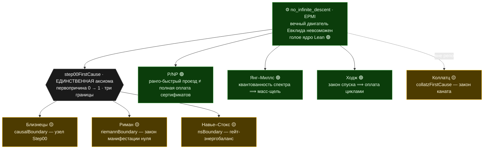

# Euclids-path

Консолидация доказательной программы гипотезы **простых-близнецов**, выстроенной вокруг
**вечного двигателя Евклида** (невозможность бесконечного «чистого» спуска — версия бесконечного
спуска Ферма).

Это **не завершённое доказательство**. Это машинно-проверяемая сборка, в которой гипотеза сведена
к **одному** открытому узлу, а весь ход — от законов двигателя до финальной редукции — виден по
пронумерованным файлам.


*Фрактал пути Евклида · **генеалогический орнамент**: полный old-peel-спуск каждого центра
$6m\pm1$, сотканный хордами на круге центров; цвет — простое Евклида шага $6m\mp1=p\cdot(6t\pm1)$.
Жёлтые точки на окружности — **twin-центры с пустой генеалогией** (те, чей спуск обрывается сразу):
именно их бесконечность и есть гипотеза близнецов. Остальные пять видов — в
[`tools/fractal/`](tools/fractal/).*

> **★ ГЛАВНАЯ ТЕОРЕМА (по решению автора): «Высшая энергетическая несовместимость»** —
> `higherEnergyIncompatibility_main` ([`Engine/FiniteKnowledgeBarrier`](EuclidsPath/Engine/FiniteKnowledgeBarrier.lean)),
> пять граней, ядро 🟢 (стандартные аксиомы): знание первопричины строит вечный двигатель;
> потому она непознаваема; конечный вид знает близнеца только чистым классом; при смешении
> бесконечность изнутри неудостоверима; и НЕСУЩАЯ грань — сама несовместимость + принятая
> граница ⟹ близнецы бесконечны. Следствие `higherEnergyIncompatibility_twins` 🟡 (при
> `step00FirstCause`): близнецы бесконечны, потому что узнать нельзя.
>
> **Карта хода доказательства:** [`prose/00_Overview.md`](prose/00_Overview.md) — главный навигатор.
> **Источник истины:** первичные записи в `f:/Primes/*.md`/`*.csv` (не редактируются). При расхождении
> первичны исходники.

---

## Карта: один двигатель — семь ветвей

В основании — один физический запрет: **невозможность вечного двигателя** (`no_infinite_descent`,
голое ядро Lean). Семь великих вопросов оказываются его тенями на разных объектах. Структурная
половина каждого доказывается **зелёно** (где есть запрет двигателя — там нет отклонения); а
последний шаг — привязка к настоящему объекту — либо принимается **единственной аксиомой-первопричиной**
`step00FirstCause` (три жёлтые границы декрета), либо остаётся зелёной условной теоремой, либо —
открытым 🔴-входом. Философский разбор сквозной темы — в [прологе](prose/00_Overview.md).



Цвета: 🟢 — доказано машинно при стандартных аксиомах (структурная часть / зелёная условная теорема);
🟡 — AXIOM-TAINTED, условно на первопричину (объект принят декретом под честно раскрытую цену);
🔴 — открытый вход (настоящий объект: спектр КТП, гамильтониан простых, решение Лерэ, `(p,p)`-классы,
машина Тьюринга — в формализации отсутствует). Коллатц — **вне репозитория** (постоянное правило),
со своим карантином; при ручном включении его граница вольётся в `step00FirstCause`.

## Структура

- **`EuclidsPath/Engine/*.lean`** — основная (доказанная) линия: двигатель и его законы → редукция к
  близнецам → линии-атаки → финальный узел. Импортируются корневым `EuclidsPath.lean` **в порядке
  хода доказательства**.
- **`prose/NN_*.md`** — парная проза, та же сквозная нумерация 00→42 (+ приложение `A`), единый
  академический нарратив: двигатель → близнецы → первопричина и ГЛАВНАЯ ТЕОРЕМА → побочные ветви.
- **`tools/`** — числовые харнессы (`*_harness.py`) и результаты (`RESULTS_*.md`);
  **`tools/fractal/`** — визуализация фрактала Евклида (6 видов: спуск-лес, поле ранга, спираль
  близнецов, ландшафт нагрузки, линия центров с родословными, узор из родословных).
- **`archive/`** — первая **аналитическая** линия (PMKLS/DASC/G2/O4C, `B₅=N₀₀−N₃₃`), изученная и
  **обойдённая**. Сохранена ради видимого хода мысли (см. `archive/README.md`).

## Ход (проза ↔ Lean)

| № | Тема | Проза | Lean | Статус |
|---|---|---|---|---|
| 00 | Цель, карта хода, определения | [00](prose/00_Overview.md) | `Step00_Overview` | 🔴 цель |
| 01 | Невозможность двигателя (EPMI) | [01](prose/01_EPMI.md) | `Engine/EPMI` | 🟢 |
| 02 | Носитель двойки `gcd∣2` | [02](prose/02_Carrier.md) | `Engine/Carrier` | 🟢 |
| 03 | Сохранение двойки `XY−ZW=2` | [03](prose/03_TwoGap.md) | `Engine/TwoGap` | 🟢 |
| 04 | Спуск + boundary-law | [04](prose/04_Descent.md) | `Engine/Descent` | 🟢 |
| 05 | Необратимость / 2 закона | [05](prose/05_Irreversibility.md) | `Engine/Irreversibility` | 🟢 |
| 06 | Нет хода назад (эксклюзивность) | [06](prose/06_NoBackward.md) | `Engine/NoBackward` | 🟢 |
| 07 | Короткий train (squeeze) | [07](prose/07_Squeeze.md) | `Engine/Squeeze` | 🟢 |
| 08 | Ограниченный цикл | [08](prose/08_BK.md) | `Engine/BK` | 🟢 |
| 09 | Factor-repeat rigidity | [09](prose/09_Cycle.md) | `Engine/Cycle` | 🟢 |
| 10 | survivor ⇒ twin; мост ∞ | [10](prose/10_NonCover.md) | `Engine/NonCover` | 🟢 |
| 11 | Гипотеза ⟸ блочное ядро | [11](prose/11_TwoTransport.md) | `Engine/TwoTransport` | 🟢 |
| 12 | Four-corner (отриц. ассоциация) | [12](prose/12_FourCorner.md) | `Engine/FourCorner` | 🟢 |
| 13 | Фрактальный слой / модель | [13](prose/13_FractalLayer.md) | `Engine/ModelFourCorner` | 🟢 |
| 14 | Декомпозиция остатка | [14](prose/14_RealFourCorner.md) | `Engine/RealFourCorner` | 🟢 |
| 15 | Цепь к близнецам (условно `H`) | [15](prose/15_ToTwins.md) | `Engine/ToTwins` | 🟢 |
| 16 | От противного: finite∧H⇒False | [16](prose/16_FiniteContradiction.md) | `Engine/FiniteContradiction` | 🟢 |
| 17 | Закон оплаты (ledger) | [17](prose/17_PaymentLedger.md) | `Engine/PaymentLedger` | 🟢 |
| 18 | SNOL — shifted-neighbour узел | [18](prose/18_SNOL.md) | `Engine/SNOL` | 🟢 |
| 19 | Old-peel: catch как шаг спуска | [19](prose/19_OldPeel.md) | `Engine/OldPeel` | 🟢 |
| 20 | NOPSL: нет old-peel sink | [20](prose/20_NOPSL.md) | `Engine/NOPSL` | 🟢 |
| 21 | Дихотомия регенерации (Ω_A) | [21](prose/21_Regeneration.md) | `Engine/Regeneration` | 🟢 |
| 22 | Residuals: старт, sink⇒twin | [22](prose/22_Residuals.md) | `Engine/Residuals` | 🟢 |
| 23 | Clean/boundary граф | [23](prose/23_CleanGraph.md) | `Engine/CleanGraph` | 🟢 |
| 24 | Boundary-декомпозиция + глоб. узел | [24](prose/24_BoundaryDecomp.md) | `Engine/BoundaryDecomp`, `Engine/LabelledFanIn`, `Engine/AtomicSNOL`, `Engine/ConcreteComponents`, `Engine/BadCoverDescent`, `Engine/ObstructionClosure`, `Engine/ManyUnresolved`, `Engine/HigherEnergy`, `Engine/HigherTower`, `Engine/EngineTower`, `Engine/ParityBarrier`, `Engine/ReverseTower`, `Engine/AboveConflict`, `Engine/JumpBarrier`, `Engine/PaidDynamics`, `Engine/ClosedUniverse`, `Engine/BoundaryDefectPayment`, `Engine/BoundaryLedgerCollision`, `Engine/ConcreteStep00Graph`, `Engine/DichotomyEngine`, `Engine/DissipativeCascade` | 🟢 деком.; 🔴 узел |
| 25 | Rigid-замыкание (reaches_twin) | [25](prose/25_RigidClose.md) | `Engine/RigidClose` | 🟢 |
| 26 | Separating scale ⟹ ¬ProductHall | [26](prose/26_SeparatingScale.md) | `Engine/SeparatingScale` | 🟢 |
| 27 | Product-core: вся машина | [27](prose/27_ProductCore.md) | `Engine/ProductCore` | 🟢 |
| 28 | Факторизация → RankNode | [28](prose/28_MkNode.md) | `Engine/MkNode` | 🟢 |
| 29 | **Последнее звено + граница** | [29](prose/29_CarrierBridge.md) | `Engine/CarrierBridge` | 🔴 единственный узел |
| 30 | Риман: контрапозиция (двигатель) | [30](prose/30_RiemannBranch.md) | `Engine/RiemannBranch`, `Engine/RiemannEngine`, `Engine/RiemannImpossibleEngine`, `Engine/RiemannImpossibleEngineOff`, `Engine/RankJumpBridge` | 🔴 вход RH |
| 31 | Риман через Лиувилля (λ=(−1)^rank) | [31](prose/31_RiemannLiouville.md) | `Engine/RiemannLiouville` | 🔴 вход RH |
| 32 | Единый rank-parity узел (эпилог) | [32](prose/32_RankParityUnity.md) | — (синтез) | 🔴 гипотеза единства |
| 33 | Первопричина + ГЛАВНАЯ ТЕОРЕМА | [33](prose/33_CausalFirstCause.md) | `Engine/CausalClosureAxiom` (карантин), `Engine/FiniteKnowledgeBarrier` | 🟢 ядро; 🟡 следствия |
| 34 | Ветка Мерсенна | [34](prose/34_MersenneBranch.md) | `Engine/MersenneBranch`, `MersennePaymentConflict`, `MersennePeelPressure`, `MersenneForwardFront` | 🟢 мост; 🔴 входы; ⚠️ вакуумность №3 |
| 35 | P/NP: узел и классический мост | [35](prose/35_ClassicalPNP.md) | `Engine/LocalPNPNode`, `ClassicalPNPBridge`, `CanonicalSelfReduction`, `ClassicalFrontierRoutes`, `RankClosureFront` | 🟢 сборка; 🔴 фрейм+реконструкция |
| 36 | Навье–Стокс | [36](prose/36_NavierStokes.md) | `Engine/NavierStokes` | 🟢 каркас; 🔴 EnergyBalanceLaw |
| 37 | Римановы фронты | [37](prose/37_RiemannFronts.md) | `Engine/RiemannTrivialZeros` (вход №1 ЗАКРЫТ), `RiemannRankProjection(+Audit)`, `RiemannTwoTransportFront`, `RiemannArithmeticTwoTransport`, `RiemannSpectralAnchorAudit`, `RiemannLayerBoxFront`, `RiemannTerminalRankFront` | 🟢 арифметика; 🔴 два входа; ⚠️ вакуумность №2 |
| 38 | **Риман через первопричину** | [38](prose/38_RiemannFirstCause.md) | `Engine/RiemannManifestationFront` (зелёная цепь), `Engine/CausalClosureAxiom` §10, `Engine/RiemannDualEngineFront` | 🟢 цепь; 🟡 RH из декрета; 🔴 дуальные пакеты |
| 39 | **P/NP: оплата сертификатов ранга** | [39](prose/39_PNPRankPayment.md) | `Engine/PNPRankPaymentFront` (зелёная сепарация A ≤ 4 + трилемма), `Engine/CausalClosureAxiom` §11 | 🟢 сепарация в ранговой модели; 🟡 P/NP-язык декрета; ⚠️ вакуумность №4 |
| 40 | **Янг–Миллс: масс-щель через двигатель** | [40](prose/40_YangMills.md) | `Engine/YangMillsFront` (зелёная цепь + трилемма), `Engine/CausalClosureAxiom` §12 | 🟢 квантованность⟹щель; 🟡 язык декрета; 🔴 data-anchor спектра |
| 41 | **НС: гладкость через каскад + интеграл** | [41](prose/41_NSSmoothness.md) | `Engine/NavierStokesFront` (тождество + трилемма + ДОБИТИЕ: две ковки и гейт-закон), `Engine/CausalClosureAxiom` §13+§15 | 🟢 тождество+каскад+ковки; 🟡 ТРЕТЬЯ ГРАНИЦА (гейт-закон) — гладкость гейт-решений из декрета |
| 42 | **Ходж: квантованные заряды и оплата** | [42](prose/42_Hodge.md) | `Engine/HodgeFront` (герой + коллапс + трилемма), `Engine/CausalClosureAxiom` §14 | 🟢 спуск⟹оплата, двигатель мёртв безусловно; 🟡 растяжка; 🔴 DescentLaw |
| A | Численные данные | [A](prose/A_NumericalEvidence.md) | `tools/RESULTS_*` | — |

🟢 = машинно проверено, без `sorry` (стандартные аксиомы). 🟡 = AXIOM-TAINTED (условно на
`step00FirstCause`; ровно 43 декларации — 42 в карантине + задокументированное следствие
`higherEnergyIncompatibility_twins`). 🔴 = открытый узел / вход.

## Статус (честно)

- **Доказано (без `sorry`, стандартные аксиомы):** весь двигатель и его законы (EPMI); редукция
  гипотезы к блочному ядру; модельный four-corner; алгебра оплаты; раскрытие SNOL в old-peel-спуск
  (sign law, height drop, замыкание на двигатель); дихотомия регенерации; separating scale ⟹
  `¬ProductHall` **чистой арифметикой**; **вся product-core машина** (экстенсиональность, rank-descent
  4→1, база rank-1, pigeonhole); факторизация `RankNode` из составной стороны; бесконечность carrier.
  Все прежние стены (parity, трилемма `UniqueLegalLift`, steering-self-loop, циркулярный payment,
  три дефекта rank-descent) **сняты**.
- **Единственный открытый узел (острейшая форма, [24](prose/24_BoundaryDecomp.md)):**
  `TheLastStep00Obligation` — «конечный семантический ключ разрешает коллизии генеалогий»
  (`SemanticExtendedFlowLedgerCollisionResolves`). Вся близнецовая ветка сведена к нему машинно
  (`twinLowersInfinite_of_lastStep00Obligation`); ∞ чистых стартов закрыта **конструктивным примориалом**,
  flow-builder и cofactor-нормализатор — реальной `6m±1`-арифметикой. **Честность (машинно):**
  `twin_above_of_resolves` — этот вход на масштабе `M0` **предъявляет twin выше `M0`**, т.е. он не слабее
  цели по-масштабно; достаточно кофинальных масштабов (`twinLowersInfinite_of_cofinal_resolves`).
  Энергетическая форма узла (`ExtendedFlowEnergyLedger`: конечный `(ключ, токен)` ⟹ double spend ⟹
  сожжённая альтернатива) **машинно факторизуется через старый узел** (`lastStep00Obligation_of_energy`)
  и тоже twin-детектор (`twin_above_of_energyLedger`) — переформулировка, не обход. Nested-форма
  (вложенные вселенные: одностороннее вложение — строгий спуск `lexRank`, взаимное — сожжённый цикл,
  ∞-цепь вложений невозможна) **эквивалентна** старому узлу
  (`nestedUniverseLastStep00Obligation_iff_lastStep00Obligation`). Seam-форма (сингулярность =
  коллизия без легальной склейки; dangling = спуск вместо двигателя) — две половины аудита
  **взаимно аннигилируют** в инъективность (`seamAudit_iff_resolves`,
  `seamAuditLastStep00Obligation_iff_lastStep00Obligation`).
  ⚠️ **Сужение узла (машинно, адверсариальный probe):** ветвь `A ≤ 4` **ОПРОВЕРГНУТА** — 5-адическая
  цепь `c(k+1)=5·c(k)+1` даёт ∞ admissible-генеалогий БЕЗ twin-гипотез
  (`smallScale_branch_of_lastStep00Obligation_refuted`); `∃A` живёт только в `A ≥ 5`
  (`lastStep00Obligation_forces_scale_ge_five`). Тот же приём для `A ≥ 5` требует дирихле-класса
  арифметики (вероятно, за красной линией) — выполнимость при `A ≥ 5` подлинно открыта.
  ⚠️ **Эпизод вакуумности (вскрыт адверсариальным аудитом, починен).** Первая версия фабрики имела
  дегенеративный peel «простая сторона `p = p·1`, `1 = 6·0+1`» в центр 0 БЕЗ twin-гипотезы — узел был
  машинно ОПРОВЕРЖИМ (редукция ex-falso). Заплата: `properDiv` (собственный делитель) + `targetPos ≥ 1`
  на peel-целях; эксплойт-свидетели аудита теперь не компилируются, twin-гипотеза несущая. После заплаты
  выполнимость узла — подлинно открыта (опровержение неизвестно).
  `Step00.twin_prime_conjecture` остаётся `sorry`. Это **честная редукция**, а не доказательство.
  (Историческая форма узла — `GlobalOldAbsorption`, [29](prose/29_CarrierBridge.md).)
- **Побочная ветвь (Риман):** контрапозиции через двигатель и через `λ(n)=(−1)^{rank(n)}`
  ([30](prose/30_RiemannBranch.md), [31](prose/31_RiemannLiouville.md); тождество и флип **доказаны**;
  цель — официальная mathlib-`RiemannHypothesis`).
  ✅ **ВХОД ЗАКРЫТ:** `TrivialBelowZeroClassification` **ДОКАЗАНА** (`Engine/RiemannTrivialZeros`,
  функциональное уравнение mathlib): всякий нуль с `Re ≤ 0` тривиален. Следствия безусловны:
  локализация в полосу — теорема; **RH теперь условна ТОЛЬКО на `EngineBridge`**
  (`riemannHypothesis_of_engineBridge_only`) или `TwoTransportBridge`.
  ⚠️ **Эпизод вакуумности №2 (вскрыт адверсариальным probe, полное раскрытие —
  `Engine/RiemannRankProjectionAudit`):** цель rank-jump-маршрута `TwinCarrierEnergyJump` НЕ привязана
  к нарушению — для естественной системы (rank = Ω, sign = λ) она безусловная теорема; ПОЛНЫЙ пакет
  `LiouvilleToTwinLocalization` обитаем с нулевым входом (`fullLocalization_noInput`); поле `paired`
  инертно. Декомпозиция «cancellation + pairing» была **ложной**: честная стена маршрута —
  ровно `¬LiouvilleViolation` (`wall_global`) = RH-силы Лиувилль-bound. Window-бухгалтерия при этом
  закрыта честно (`relevantViolation_gives_window`). Маршрут требует переформулировки с привязанной целью.
  **Честность (машинно):** `offCriticalBridge_iff_RH` — вход impossible-engine-маршрута
  **эквивалентен RH дословно**; `spectralBridge_forces_no_violation` — мост скрыто несёт RH-силы.
  Вход №1 декомпозирован в two-transport форму (`Engine/RiemannTwoTransportFront`: split +
  local realization + builder; вся сборка доказана) — но честность машинная:
  `coherentTwoTransportBridge_iff_RH` — когерентный two-transport мост **⟺ RH дословно**
  (циркулярность наследуется через пустоту фабрики: `no_coherent_twoTransportLaw`); аудит-гейты
  кирпичей свободны (`regateTrivially`). Декомпозиция — карта обязательств, не некруговой путь.
  Живые входы после всего: `EngineBridge` (или `TwoTransportBridge`) / `LiouvilleBound`(⟺RH классически).
  Единый rank-parity узел ([32](prose/32_RankParityUnity.md)) — гипотеза единства, не редукция.
  ✳️ **РАСШИРЕННЫЙ ДЕКРЕТ ([38](prose/38_RiemannFirstCause.md)):** RH проведена через ту же ранговую
  машину, что близнецы, — нуль вне прямой = неоплаченное отклонение; закон манифестации
  (`RiemannManifestationLaw`, вторая граница первопричины) + зелёная невозможность на разрешённых
  масштабах (`no_deviationFlowSupply_at_resolved_scale` 🟢) ⟹ `riemannHypothesis_from_firstCause` 🟡.
  **НЕ доказательство RH** — редукция, закрытая декретом; цена раскрыта машинно:
  `riemannManifestation_asserts_RH` — при границе закон ⟺ RH (декрет не слабее вывода).
- **P/NP как оплата сертификатов ранга ([39](prose/39_PNPRankPayment.md)):** прочтение «NP = полная
  оплата всех сертификатов ранга, P = ранго-быстрый проезд без посещения всех состояний» —
  **🟢 ТЕОРЕМА при стандартных аксиомах**: `pnp_rank_separation_smallScale` (A ≤ 4: проезд быстр,
  проверка легка, поставка неограничена 5-адикой, полная оплата невозможна, поиск несжимаем);
  «NP = полная оплата» — теорема на каждом масштабе (`concrete_localPSuccess_iff_fullPayment`).
  Раскол по масштабам: декрет на A ≥ 5 сам ПЛАТИТ все сертификаты (`decreedScale_fullPayment` 🟡).
  **Третьей границы декрета НЕТ — машинно** (трилемма: универсальный/decider-gated кандидаты
  опровержимы, экзистенциальный вакуумен); классическое P ≠ NP НЕ объявлено — путь к нему через
  data-anchored машинную модель. ⚠️ **Вакуумность №4 (вскрыта):** decider-gated extraction-фронты
  (`FaithfulSelfReductionFront`, `CurrentExtractionFront`) классически ПУСТЫ (`PDecider` свободен) —
  их `gives_classicalSeparation` вакуумны; InP-gated мост не затронут.
- **Янг–Миллс: безмассовость = вечный двигатель ([40](prose/40_YangMills.md)):** halving-лестница
  сколь-угодно-дешёвых возбуждений — бесконечный мультипликативный ℝ-спуск (тот самый контрпример
  каскадного предупреждения); **квантованность спектра ⟹ масс-щель — 🟢 ТЕОРЕМА**
  (`massGap_of_quantizationLaw`: лестница + ранг = ℕ-спуск, убит EPMI). Четвёртой границы декрета
  НЕТ — машинно (трилемма: универсал опровержим кованой лестницей, экзистенциал вакуумен,
  риманово зеркало НЕСОВМЕСТИМО с принятой границей — лестница, в отличие от нуля, предъявима;
  коллапс `quantizationLaw_iff_massGap` — закон ⟺ щель зелёно). Мир декрета гэпнут в языке
  поставок (`decreedScale_no_deviationSupply` 🟡). Проблема Клэя НЕ решена и НЕ объявлена:
  🔴 вход — data-anchored построенный YM-спектр (в mathlib отсутствует).
- **НС: гладкость через каскад + взятый интеграл ([41](prose/41_NSSmoothness.md)):** сингулярность =
  сингулярный каскад (∞ квантованных диссипаций, сжатых до конечного T) = вечный двигатель;
  **`noSingularCascade_of_energyBalance`** 🟢 — энергобаланс ⟹ точек разрыва каскадного типа нет
  (суррогат гладкости; НЕ C^∞ — раскрыто). **Интеграл взят**: `energy_identity_of_energyBalance` 🟢 —
  тождество E(t₂) = E(t₁) − ∫D равенством (старое неравенство — огрубление);
  `isNSSolution_integral_form` 🟢 — u t x = u 0 x + ∫₀ᵗ(νΔu − ∇p + f − (u·∇)u) (mild-форма, E3-значный
  FTC). Пятой границы декрета НЕТ — трилемма (универсал опровержим `cookedFlow`, экзистенциал
  вакуумен нулём, манифестация несовместима с границей — кованый профильный каскад предъявим).
  Клэй НЕ решён: Лерэ/единственность/C^∞/`EnergyBalanceLaw` — 🔴 входы.
- **Ходж: квантованные заряды и оплата циклами ([42](prose/42_Hodge.md)):** класс Ходжа =
  квантованный (p,p)-заряд (ℕ-высота), цикл = оплата; **двигатель (цепь неоплаченного спуска)
  мёртв БЕЗУСЛОВНО** (`isEmpty_unpaidDescentChain` 🟢 — квантование встроено в модель, асимметрия
  с ЯМ раскрыта); **`hodgeProperty_of_descentLaw`** 🟢 — закон спуска ⟹ гипотеза модели (сильная
  индукция по высоте). Коллапс `descentLaw_iff_hodgeProperty` 🟢 (закон ⟺ гипотеза, обратная
  сторона вакуумна — раскрыто) — шестого поля декрета НЕТ; трилемма: универсал опровержим
  (`cookedUnpaid` — шаг с высоты 1 упирается в якорь квантования), экзистенциал доказан ВООБЩЕ
  без аксиом, chain-форма вырождена в зелёную (V2′), манифестация над предъявимым классом
  несовместима с границей. В mathlib теории Ходжа НЕТ (3 хита «Hodge» — все нерелевантны);
  Клэй НЕ решён: 🔴 вход — `DescentLaw` для data-anchored (p,p)-классов.
- ⚠️ **Единственный `axiom` репозитория — ПЕРВОПРИЧИНА (карантин):** `Engine/CausalClosureAxiom.lean`
  объявляет `step00FirstCause : Step00FirstCause` — намеренно структурированное внешнее начало
  `0 → 1` с **ДВУМЯ причинными границами**: twin-узел `causalBoundary`
  (= `TheStrictLastStep00Obligation`) и римановский закон манифестации `riemannBoundary`
  (= `RiemannManifestationLaw`, [38](prose/38_RiemannFirstCause.md)). Прежняя `step00CausalClosure` —
  теперь ТЕОРЕМА из первопричины; из границ условно следуют `TwinLowers.Infinite` и
  `riemannHypothesis_from_firstCause` — **условные выводы, НЕ доказательства**;
  `twin_prime_conjecture` через аксиому не замыкается. Честность (машинно):
  `step00FirstCause_iff_causalClosure` — маркеры несут `True`, первопричина ⟺ конъюнкция границ:
  включение первопричины меняет корень архитектуры, сила декрета — ровно сумма принятого; декрет
  не слабее выводов (`causalClosureAxiom_asserts_twins_at_every_scale`,
  `riemannManifestation_asserts_RH`); интернализация первопричины невозможна
  (двигатель). **Эпистемика (машинно, аксиомо-свободно):** узнать причину нельзя — теорема
  (`cause_unknowable`: знание = вечный двигатель); «близнецы бесконечны, потому что узнать нельзя» —
  несущая лемма `twins_infinite_of_noEngine_and_boundary` (непознаваемость потребляется
  по-настоящему); знание финитизировало бы близнецов (`knowledge_finitizes_twins`, ex-falso маршрут
  честно помечен companion'ом). **Непротиворечивость** расширенной теории ⟺ неопровержимость узла
  **и RH в базе**; растяжки `quarantine_inconsistent_if_*` (узел, старый узел, off-critical нуль,
  ¬RH, закон манифестации) фиксируют точку взрыва. Карантин машинно отслеживается:
  верификатор репортит каждую AXIOM-TAINTED декларацию (утечек нет).
- `sorry` подделать нельзя: «зелёный» модуль = реально проверенная часть (и аксиом-трекинг верификатора
  не даёт спрятать декрет).

## Сборка

```sh
lake exe cache get    # прекомпилированные oleans mathlib (v4.31.0)
lake build            # вся Engine-линия; exit 0 = проверено
lake env lean EuclidsPath/Engine/EPMI.lean   # быстрый чек ядра двигателя
```

`archive/` не входит в основную сборку (исторический контекст).
