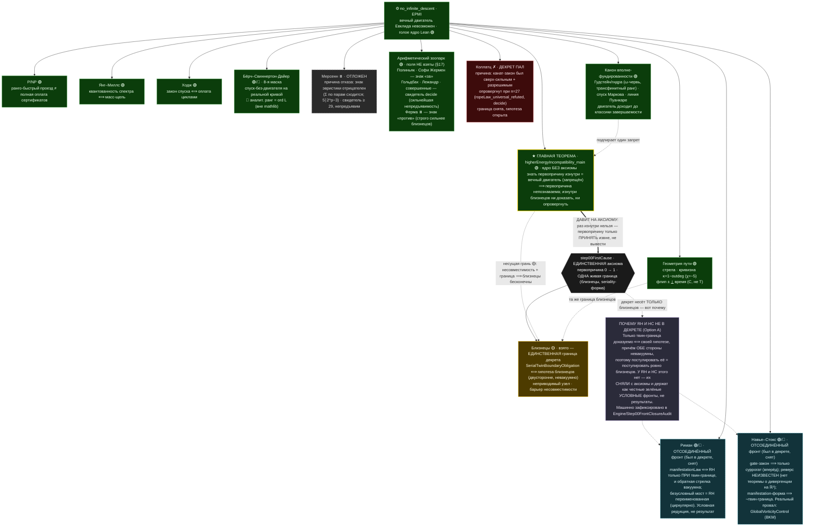

# Euclids-path

[](https://doi.org/10.5281/zenodo.21198730)
[](LICENSE)
[](lean-toolchain)

> 🇬🇧 **English:** [`README.md`](README.md) · 🇷🇺 Вы читаете русскую версию.
> На [сайте документации](https://elamaunt.github.io/Euclids-path/) доступен переключатель языка;
> на GitHub ссылки на главы ниже ведут прямо на русские `*.md`-файлы.

Консолидация доказательной программы гипотезы **простых-близнецов**, выстроенной вокруг
**вечного двигателя Евклида** (невозможность бесконечного «чистого» спуска — версия бесконечного
спуска Ферма).

Это **не завершённое доказательство**. Это машинно-проверяемая сборка, в которой гипотеза сведена
к **одному** открытому узлу, а весь ход — от законов двигателя до финальной редукции — виден по
пронумерованным файлам.

> **Статья.** Оформление всей программы в стиле arXiv (LaTeX + PDF) приложено к
> [последнему релизу](https://github.com/elamaunt/Euclids-path/releases/latest) и готовится к
> публикации. Меняется в основном **проза** — шлифуется изложение; математическое содержание и
> машинно-проверенные результаты устоялись.


Фрактал пути Евклида · **генеалогический орнамент**: полный old-peel-спуск каждого центра
$6m\pm1$, сотканный хордами на круге центров; цвет — простое Евклида шага $6m\mp1=p\cdot(6t\pm1)$.
Жёлтые точки на окружности — **twin-центры с пустой генеалогией** (те, чей спуск обрывается сразу):
именно их бесконечность и есть гипотеза близнецов. Остальные пять видов — в
[`tools/fractal/`](tools/fractal/).

> **★ Главная теорема: «Высшая энергетическая несовместимость»**
> ([`higherEnergyIncompatibility_main`](EuclidsPath/Engine/FiniteKnowledgeBarrier.lean), ядро 🟢).
> Она доказывает строго вот что: **знать, что близнецы бесконечны, нельзя; но если незнание
> первопричины принять за истину — они бесконечны, и это строго.** Узнать первопричину изнутри стоило
> бы вечного двигателя, которого нет, — поэтому она непознаваема; а конечный наблюдатель и близнеца-то
> различает лишь целым чистым классом. Обе стены — одна природа; несущая грань замыкает круг: сама эта
> несовместимость плюс принятая причинная граница ⟹ близнецы бесконечны
> (`higherEnergyIncompatibility_twins` 🟡 — условно на аксиому, **не** доказательство).
>
> **Космологически** (строгие теоремы, [глава 33](prose/33_CausalFirstCause.md)): числовая прямая и
> невозможность двигателя вместе кодируют пространство и время. Строгий порядок обхода — пространство
> (с дном-сингулярностью в `0`); необратимая **стрела времени доказана строго**
> (`engine_never_returns` — высота строго антимонотонна, назад хода нет), с недостижимым концом в `∞`,
> куда доехал бы лишь вечный двигатель. Первопричина — миг, когда двигатель появляется из сингулярности
> `0` и трогается вперёд не сворачивая; дать её изнутри нельзя (самозапуск = вечный двигатель,
> `no_internalisedOriginEvent`), потому она принимается **извне** — единственной аксиомой. Оттого
> внутри системы бесконечность близнецов нельзя ни доказать, ни опровергнуть: оба действия потребовали
> бы вечного двигателя. Башни причин под первопричиной нет — регресс вполне-фундирован
> (`no_rankedMetaFractalBranch`), вселенная одна.
>
> **Карта хода:** [`prose/00_Overview.md`](prose/00_Overview.md) — главный навигатор.
> **Источник истины:** первичные записи в `f:/Primes/*.md`/`*.csv` (не редактируются).

---

## Карта: один двигатель — семь ветвей, зоопарк и геометрия

В основании — один физический запрет: **невозможность вечного двигателя** (`no_infinite_descent`,
голое ядро Lean). Семь великих вопросов оказываются его тенями на разных объектах. Структурная
половина каждого доказывается **зелёно** (где есть запрет двигателя — там нет отклонения); а
последний шаг — привязка к настоящему объекту — либо принимается **единственной аксиомой-первопричиной**
`step00FirstCause` (ОДНА жёлтая граница декрета — близнецы), либо остаётся зелёной условной теоремой,
либо — открытым 🔴-входом. Философский разбор сквозной темы — в [прологе](prose/00_Overview.md).

**Универсальная форма** (`Engine/UniversalEngine`): двигатель определён над ЛЮБЫМ отношением
(`PerpetualEngine`), а его невозможность — из внутренней причины: определение = бесконечный строгий
спуск, а вполне-фундированность есть ровно его запрет (`no_perpetual_engine_of_wellFounded`;
`perpetualEngine_iff_not_wellFounded`). Он переносится в любое пространство с ℕ-рангом
(`no_perpetual_engine_of_rank` — все фронты суть следствия одной теоремы; EPMI показан инстансом).
Но не «везде»: на континууме ℝ двигатель **работает** (`perpetualEngine_on_real`) — это делает путь
Евклида **контролёром** (`universal_engine_dividing_line`, M6): он решает, где движение запрещено
(дискретное) и где реализуется (континуум). Ядро — mathlib-фундированность; вклад
формализационно-унифицирующий; таинт неизменен.



Цвета: 🟢 — доказано машинно при стандартных аксиомах (структурная часть / зелёная условная теорема);
🟡 — AXIOM-TAINTED, условно на первопричину (объект принят декретом под честно раскрытую цену);
🔴 — открытый вход (настоящий объект: спектр КТП, гамильтониан простых, решение Лерэ, `(p,p)`-классы,
машина Тьюринга — в формализации отсутствует). 🔵 пунктир — **ОТСОЕДИНЁННЫЙ фронт**: когда-то стоял на
декрете, но СНЯТ (Option A), потому что у него нет двусторонней границы ⟺ гипотеза; выживает как честная
зелёная/красная условная редукция, никогда как результат декрета (Риман, Навье–Стокс; причина — блок
`WHY` в графе). ⏸️ — задача рассмотрена, но граница НЕ взята: отложена по
знаку эвристики (Мерсенн, Ферма) либо зоопарк без поля (§16–17). ✗ — декрет был взят и ПАЛ (Коллатц,
опровергнут при n = 27). Коллатц прошёл полный цикл дисциплины: его закон каната был
**четвёртой границей** `step00FirstCause` — и был машинно ОПРОВЕРГНУТ (`ropeLaw_universal_refuted`,
свидетель n = 27); растяжка сработала, граница снята, декретный путь закрыт кованым опровержением.
Зелёный фронт — `Engine/CollatzTugOfWar`, пост-мортем — `Engine/CollatzFirstCause`
(главы [55](prose/55_Collatz.md)–[56](prose/56_CollatzFirstCause.md)).

**Арифметический зоопарк (гл. 44–48, всё 🟢, полей НЕТ).** Тот же манифестационный аппарат проведён
через шесть новых числовых сюжетов: кузены и секси (Полиньяк), Софи Жермен, Гольдбах, Лежандр,
нечётные совершенные, числа Ферма. Все зелёные и условны лишь на определения законов; ни одна
открытая задача не решена и не объявлена. Жемчужина — **зелёная классика Эйлера–Лагранжа**:
SG-простые при `p ≡ 3 (mod 4)` делят число Мерсенна `M_p` (23 ∣ M₁₁), формальный фрагмент той самой
эвристики, по знаку которой отложена мерсенновская граница (§16). Трилеммы пройдены везде, но полей
не взято намеренно (§17): пять сюжетов со знаком «за» (как Риман), Ферма — со знаком «против»
(сильнее Мерсенна); у Гольдбаха/Лежандра/совершенных свидетель поточечно **разрешим** (decide) —
сильнейшая непредъявимость. Единственная безусловная зелёная теорема о простых здесь — **Бертран**
(пустыня простых не переживает удвоения), и честно раскрыто, почему её не хватает Лежандру.

**Геометрия пути (гл. 49, 🟢 + 2 🟡).** Конкретный граф спуска прочитан геометрически: стрела
времени (`lexRank` только падает), **вычисленная кривизна** `κ = 1 − outdeg` (спектр от −8 до +1,
дискретный Гаусс–Бонне `χ(cone3) = −5`), «плоскость всюду ⟹ вечный двигатель», и ирония — путь
Евклида нарушает **второй постулат** самого Евклида (прямую нельзя продлить неограниченно), а потому
параллельных нет. Пересечение прямых доказано 🟡 из **той же** первопричины (ровно две
axiom-tainted-декларации, никакого нового поля), но знать его изнутри нельзя (🟢) — знание стоило бы
двигателя. **Навье–Стокс на ℝ³** (постскриптум гл. 41): энергобаланс бокс-класса **выведен зелёно**,
теорема о дивергенции задействована по-настоящему; каскадная гладкость этого класса — без декрета.
**Редукция Клэя** (`Engine/NavierStokesClayReduction`): точная постановка Клэя-(A) закодирована, и
зелёно доказана логическая редукция «известная теория (Като + Билл–Като–Майда) + один критерий
`GlobalVorticityControl` ⟹ Клэй-(A)» — единственная открытая теорема **изолирована и названа** (контроль
вихря, барьер суперкритичности). НС **не решена и не объявлена решённой**; машинно зафиксировано, что
двигательный суррогат **строго слабее** критерия (`greenBudget_strictly_weaker_than_vorticityControl`,
через неравномерный каскад) — прочтение-двигатель проблему **не закрывает**.
**Дискретная модель жидкости** (`Engine/CascadeBudget`, `Engine/DyadicBlowup`, `Engine/DyadicFirstCause`,
[глава 52](prose/52_DyadicModel.md)): вероятно **первая формализация модели жидкости** в
пруф-ассистенте (известная математика: принцип бюджета + модель Кац–Павлович). Машинная карта границы
двигательного прочтения: где оно работает (бюджет ⟹ конечное время при РАВНОМЕРНОЙ диссипации) и где
ломается (`superlinear_blowup_sq` + `dyadic_blowup` — каскад **взрывается**, двигатель РЕАЛИЗУЕТСЯ).
Связующий cascade-drive `y'≥C·y²` теперь **выведен из сырых λⁿ-связей** — для точного автомодельного
решения (`ssLead_drive`) и для целого класса через инвариант фронта (`frontDrive_of_invariant`):
монолитная именованная гипотеза сужена до меньшего координатно-близкого инварианта; открытым остаётся
лишь один изолированный вход — сохранность фронта для бесконечно многих мод (движущийся фронт КП).
А исток каскада (насос `n=0`, неказуемый изнутри — 🟢 `dyadicOrigin_uncausable_from_inside`) когда-то был
**декретирован первопричиной** (`DyadicFirstCause`, через `nsBoundary`) — но эта декретная проекция СНЯТА
вместе с НС (Option A); выживает лишь зелёная стена `dyadicOrigin_uncausable_from_inside`, так что исток
каскада теперь открытый/условный фронт, не результат декрета. Новой МАТЕМАТИКИ нет (барьер Тао); новизна
формализационная. НС не решена.

## Структура

- **`EuclidsPath/Engine/*.lean`** — основная (доказанная) линия: двигатель и его законы → редукция к
  близнецам → линии-атаки → финальный узел. Импортируются корневым `EuclidsPath.lean` **в порядке
  хода доказательства**.
- **`prose/NN_*.md`** — парная проза, та же сквозная нумерация 00→50 (+ приложение `A`), единый
  академический нарратив: двигатель → близнецы → первопричина и ГЛАВНАЯ ТЕОРЕМА → побочные ветви →
  арифметический зоопарк (44–48) → геометрия пути (49) → кода (50).
- **`tools/`** — числовые харнессы (`*_harness.py`) и результаты (`RESULTS_*.md`);
  **`tools/fractal/`** — визуализация фрактала Евклида (8 видов: спуск-лес, поле ранга, спираль
  близнецов, ландшафт нагрузки, линия центров с родословными, узор из родословных — и два
  концептуальных космологических вида к коде: наблюдатель с горизонтом событий и стрелой времени
  внутрь, сфера времени с антиподами наблюдатель/сингулярность; последние два — надстройка над
  реальным субстратом, `euclid_cosmology.py`).

## Ход (проза ↔ Lean)

| № | Тема | Проза | Lean | Статус |
|---|---|---|---|---|
| 00 | Цель, карта хода, определения | [00](prose/00_Overview.md) | `Step00_Overview` | 🔴 цель |
| 01 | Невозможность двигателя (EPMI) | [01](prose/01_EPMI.md) | `Engine/EPMI` | 🟢 |
| 02 | Носитель двойки `gcd∣2` | [02](prose/02_Carrier.md) | `Engine/Carrier` | 🟢 |
| 03 | Сохранение двойки `XY−ZW=2` | [03](prose/03_TwoGap.md) | `Engine/TwoGap` | 🟢 |
| 04 | Спуск + boundary-law | [04](prose/04_Descent.md) | `Engine/Descent` | 🟢 |
| 05 | Необратимость / 2 закона | [05](prose/05_Irreversibility.md) | `Engine/Irreversibility` | 🟢 |
| 06 | Нет хода назад (эксклюзивность) | [06](prose/06_NoBackward.md) | `Engine/NoBackward` | 🟢 |
| 07 | Короткий train (squeeze) | [07](prose/07_Squeeze.md) | `Engine/Squeeze` | 🟢 |
| 08 | Ограниченный цикл | [08](prose/08_BK.md) | `Engine/BK` | 🟢 |
| 09 | Factor-repeat rigidity | [09](prose/09_Cycle.md) | `Engine/Cycle` | 🟢 |
| 10 | survivor ⇒ twin; мост ∞ | [10](prose/10_NonCover.md) | `Engine/NonCover` | 🟢 |
| 11 | Гипотеза ⟸ блочное ядро | [11](prose/11_TwoTransport.md) | `Engine/TwoTransport` | 🟢 |
| 12 | Four-corner (отриц. ассоциация) | [12](prose/12_FourCorner.md) | `Engine/FourCorner` | 🟢 |
| 13 | Фрактальный слой / модель | [13](prose/13_FractalLayer.md) | `Engine/ModelFourCorner` | 🟢 |
| 14 | Декомпозиция остатка | [14](prose/14_RealFourCorner.md) | `Engine/RealFourCorner` | 🟢 |
| 15 | Цепь к близнецам (условно `H`) | [15](prose/15_ToTwins.md) | `Engine/ToTwins` | 🟢 |
| 16 | От противного: finite∧H⇒False | [16](prose/16_FiniteContradiction.md) | `Engine/FiniteContradiction` | 🟢 |
| 17 | Закон оплаты (ledger) | [17](prose/17_PaymentLedger.md) | `Engine/PaymentLedger` | 🟢 |
| 18 | SNOL — shifted-neighbour узел | [18](prose/18_SNOL.md) | `Engine/SNOL` | 🟢 |
| 19 | Old-peel: catch как шаг спуска | [19](prose/19_OldPeel.md) | `Engine/OldPeel` | 🟢 |
| 20 | NOPSL: нет old-peel sink | [20](prose/20_NOPSL.md) | `Engine/NOPSL` | 🟢 |
| 21 | Дихотомия регенерации (Ω_A) | [21](prose/21_Regeneration.md) | `Engine/Regeneration` | 🟢 |
| 22 | Residuals: старт, sink⇒twin | [22](prose/22_Residuals.md) | `Engine/Residuals` | 🟢 |
| 23 | Clean/boundary граф | [23](prose/23_CleanGraph.md) | `Engine/CleanGraph` | 🟢 |
| 24 | Boundary-декомпозиция + глоб. узел | [24](prose/24_BoundaryDecomp.md) | `Engine/BoundaryDecomp`, `Engine/LabelledFanIn`, `Engine/AtomicSNOL`, `Engine/ConcreteComponents`, `Engine/BadCoverDescent`, `Engine/ObstructionClosure`, `Engine/ManyUnresolved`, `Engine/HigherEnergy`, `Engine/HigherTower`, `Engine/EngineTower`, `Engine/ParityBarrier`, `Engine/ReverseTower`, `Engine/AboveConflict`, `Engine/JumpBarrier`, `Engine/PaidDynamics`, `Engine/ClosedUniverse`, `Engine/BoundaryDefectPayment`, `Engine/BoundaryLedgerCollision`, `Engine/ConcreteStep00Graph`, `Engine/DichotomyEngine`, `Engine/DissipativeCascade` | 🟢 деком.; 🔴 узел |
| 25 | Rigid-замыкание (reaches_twin) | [25](prose/25_RigidClose.md) | `Engine/RigidClose` | 🟢 |
| 26 | Separating scale ⟹ ¬ProductHall | [26](prose/26_SeparatingScale.md) | `Engine/SeparatingScale` | 🟢 |
| 27 | Product-core: вся машина | [27](prose/27_ProductCore.md) | `Engine/ProductCore` | 🟢 |
| 28 | Факторизация → RankNode | [28](prose/28_MkNode.md) | `Engine/MkNode` | 🟢 |
| 29 | **Последнее звено + граница** | [29](prose/29_CarrierBridge.md) | `Engine/CarrierBridge` | 🔴 единственный узел |
| 30 | Риман: контрапозиция (двигатель) | [30](prose/30_RiemannBranch.md) | `Engine/RiemannBranch`, `Engine/RiemannEngine`, `Engine/RiemannImpossibleEngine`, `Engine/RiemannImpossibleEngineOff`, `Engine/RankJumpBridge` | 🔴 вход RH |
| 31 | Риман через Лиувилля (λ=(−1)^rank) | [31](prose/31_RiemannLiouville.md) | `Engine/RiemannLiouville` | 🔴 вход RH |
| 32 | Единый rank-parity узел (эпилог) | [32](prose/32_RankParityUnity.md) | — (синтез) | 🔴 гипотеза единства |
| 33 | Первопричина + ГЛАВНАЯ ТЕОРЕМА | [33](prose/33_CausalFirstCause.md) | `Engine/CausalClosureAxiom` (карантин), `Engine/FiniteKnowledgeBarrier` | 🟢 ядро; 🟡 следствия |
| 34 | Ветка Мерсенна | [34](prose/34_MersenneBranch.md) | `Engine/MersenneBranch`, `MersennePaymentConflict`, `MersennePeelPressure`, `MersenneForwardFront` | 🟢 мост; 🔴 входы; ⚠️ вакуумность №3 |
| 35 | P/NP: узел и классический мост | [35](prose/35_ClassicalPNP.md) | `Engine/LocalPNPNode`, `ClassicalPNPBridge`, `CanonicalSelfReduction`, `ClassicalFrontierRoutes`, `RankClosureFront` | 🟢 сборка; 🔴 фрейм+реконструкция |
| 36 | Навье–Стокс | [36](prose/36_NavierStokes.md) | `Engine/NavierStokes` | 🟢 каркас; 🔴 EnergyBalanceLaw |
| 37 | Римановы фронты | [37](prose/37_RiemannFronts.md) | `Engine/RiemannTrivialZeros` (вход №1 ЗАКРЫТ), `RiemannRankProjection(+Audit)`, `RiemannTwoTransportFront`, `RiemannArithmeticTwoTransport`, `RiemannSpectralAnchorAudit`, `RiemannLayerBoxFront`, `RiemannTerminalRankFront` | 🟢 арифметика; 🔴 два входа; ⚠️ вакуумность №2 |
| 38 | **Риман через первопричину** | [38](prose/38_RiemannFirstCause.md) | `Engine/RiemannManifestationFront` (зелёная цепь), `Engine/RiemannLawEpistemic`, `Engine/RiemannDualEngineFront` | 🟢 цепь (RH ⟺ manifestation-закон только ПРИ твин-границе, реверс вакуумен); 🔵 ОТСОЕДИНЁН — RH снят с декрета (Option A); 🔴 дуальные пакеты |
| 39 | **P/NP: оплата сертификатов ранга** | [39](prose/39_PNPRankPayment.md) | `Engine/PNPRankPaymentFront` (зелёная сепарация A ≤ 4 + трилемма), `Engine/PNPFirstCause` (эпистемический комплемент) | 🟢 сепарация в ранговой модели; 🟢 решение непознаваемо изнутри конечнотопливной машины (`pnpCause_unknowable`, гл. 56); 🔵 P/NP-проекция декрета снята (Option A); ⚠️ вакуумность №4 |
| 40 | **Янг–Миллс: масс-щель через двигатель** | [40](prose/40_YangMills.md) | `Engine/YangMillsFront` (зелёная цепь + трилемма), `Engine/CausalClosureAxiom` §12 | 🟢 квантованность⟹щель; 🟡 язык декрета; 🔴 data-anchor спектра |
| 41 | **НС: гладкость через каскад + интеграл** | [41](prose/41_NSSmoothness.md) | `Engine/NavierStokesFront` (тождество + трилемма + ДОБИТИЕ: две ковки и гейт-закон), `Engine/Step00FrontClosureAudit` | 🟢 тождество+каскад+ковки; 🔵 ОТСОЕДИНЁН — НС снят с декрета (Option A); gate-закон ⟹ лишь суррогат (вперёд, реверс неизвестен), manifestation-форма опровергает твин-границу |
| 42 | **Ходж: квантованные заряды и оплата** | [42](prose/42_Hodge.md) | `Engine/HodgeFront` (герой + коллапс + трилемма), `Engine/CausalClosureAxiom` §14 | 🟢 спуск⟹оплата, двигатель мёртв безусловно; 🟡 растяжка; 🔴 DescentLaw |
| 43 | **Мерсенн: опровержение = двигатель** | [43](prose/43_MersenneFirstCause.md) | `Engine/MersenneManifestationFront` (свидетель-Π, закон, essence M3), `Engine/CausalClosureAxiom` §16 (комментарий) | 🟢 цепь + «цепь 4c+1 не пилится»; поле ДОПУСТИМО, но ОТЛОЖЕНО (знак эвристики против) |
| 41′ | *(постскриптум)* **НС: интеграл собран на ℝ³ (бокс)** | [41](prose/41_NSSmoothness.md) | `Engine/NavierStokesR3Assembly` | 🟢 R1 производная под интегралом + R2 дивергенция (грани гаснут) + **три интегрирования по частям ВЫВЕДЕНЫ** (давление/конвекция/вязкость) ⟹ энергобаланс бокс-класса безусловен ⟹ каскадная гладкость БЕЗ декрета; 🔴 остались только предел box→ℝ³ и TimeDomination |
| 44 | **Стороны и Полиньяк (кузены p+4, секси p+6)** | [44](prose/44_SidesAndPolignac.md) | `Engine/SideInfinitude`, `Engine/PolignacBranch`, `Engine/PolignacManifestationFront` | 🟢 Дирихле: стороны порознь бесконечны; классификация, созвездие, essence; поля НЕТ (§17, цепи нет — коваться нечему) |
| 45 | **Софи Жермен: жемчужина серии** | [45](prose/45_SophieGermain.md) | `Engine/SophieGermainBranch`, `Engine/SophieGermainManifestationFront` | 🟢 SG-простые при p≡3 (mod 4) ДЕЛЯТ Мерсенна (23∣M₁₁) — классика Эйлера–Лагранжа; удвоение центра; анти-Мерсенн рестрикт («две ставки») |
| 46 | **Гольдбах и Лежандр** | [46](prose/46_GoldbachLegendre.md) | `Engine/GoldbachManifestationFront`, `Engine/LegendreDesertFront` | 🟢 свидетель поточечно РАЗРЕШИМ (decide до 52/до 10); ЗЕЛЁНЫЙ Бертран (пустыня не удваивается), но короче Лежандра; поля НЕТ |
| 47 | **Совершенные числа: Евклид–Эйлер** | [47](prose/47_PerfectNumbers.md) | `Engine/PerfectNumberBranch`, `Engine/OddPerfectManifestationFront` | 🟢 ОБА направления Евклида–Эйлера (Archive); простые Мерсенна ⟺ чётные совершенные неограничены; нечётный свидетель ≥ 101 |
| 48 | **Числа Ферма: вторая ставка против** | [48](prose/48_Fermat.md) | `Engine/FermatBranch`, `Engine/FermatManifestationFront` | 🟢 F_k ≡ 5 (mod 6) минус-сторона; квадратичная цепь не пилится; локализация ≥ 65537; знак ИНВЕРТИРОВАН сильнее Мерсенна — поля НЕТ |
| 49 | **★ Геометрия пути: кривизна, стрела, пересечение** | [49](prose/49_Geometry.md) | `Engine/GeometryFront` | 🟢 стрела времени; κ=1−outdeg ВЫЧИСЛЕНА (−8…+1, χ=−5); плоскость⟹двигатель; падает ВТОРОЙ постулат Евклида; 🟡 пересечение из первопричины, но знать нельзя (2 декларации) |
| 50 | **★ Кода: путь Евклида и структура пространства-времени** | [50](prose/50_Coda.md) | — (синтез) | философский/физический свод: один запрет — семь масок + зоопарк + геометрия; возможная ТВ |
| — | **Приложения и поздние фронты** | | | *свод закрыт; дальше — расширения ядра* |
| 51 | Численные данные | [51](prose/51_NumericalEvidence.md) | `tools/RESULTS_*` | — |
| 52 | Дискретная модель жидкости | [52](prose/52_DyadicModel.md) | `Engine/CascadeBudget`, `Engine/DyadicBlowup`, `Engine/DyadicFirstCause` | 🟢 бюджет+взрыв Кац–Павлович, драйв ВЫВЕДЕН из связей; 🔵 дядическая проекция декрета снята (Option A) — исток неказуем изнутри (зелёная стена `dyadicOrigin_uncausable_from_inside`) |
| 53 | **Бёрч–Свиннертон-Дайер (восьмая маска)** | [53](prose/53_BirchSwinnertonDyer.md) | `Engine/BSDFront` | 🟢 спуск-без-двигателя на РЕАЛЬНОЙ кривой (Морделл–Вейль) + паритет-мост к Лиувиллю; 🔴 аналитический ранг = ord L (вне mathlib); границы НЕТ (трилемма); НЕ решение BSD |
| 54 | **Соседи за горизонтом (5 теней)** | [54](prose/54_OpenNeighbors.md) | `Engine/{Chowla,Abc,Beal,Lehmer,Landau}Front` | 🟢 РЕАЛЬНЫЕ якоря mathlib (Мейсон–Стотерс, Polynomial.flt_catalan, Нортокотт+Кронекер, Дирихле, Лиувилль); 🔴 сами гипотезы (Чоула/abc/Бил/Лемер/Landau) открыты; декретов нет; НЕ решения |
| 55 | **Коллатц: двигатель на ограниченном топливе** | [55](prose/55_Collatz.md) | `Engine/CollatzEngine`, `Engine/CollatzFuel`, `Engine/CollatzTugOfWar` | 🟢 законы двигателя/каната + бюджет окна ⟹ спуск + «опровержение = вечный двигатель»; 🟢 универсальный закон каната ОПРОВЕРГНУТ (`not_ropeCountingLaw_27`) |
| 56 | **Первопричина Коллатца: декрет, который пал** | [56](prose/56_CollatzFirstCause.md) | `Engine/CollatzFirstCause`, `Engine/CausalClosureAxiom` §18 | 🟢 пост-мортем: граница взята и СНЯТА (растяжка сработала, закон ложен); 🟢 эпистемика «проверка, а не вывод» уцелела; гипотеза 🔴 открыта |

🟢 = машинно проверено, без `sorry` (стандартные аксиомы). 🟡 = AXIOM-TAINTED (условно на
`step00FirstCause`; ровно **16** деклараций, ВСЕ утверждают близнецов через единственную принятую
твин-границу — **13 в карантине** (`CausalClosureAxiom`: семейство декрет-следствий
`…_generates_twins` / `causalClosureAxiom_asserts_twins_at_every_scale` / `twinLowersInfinite_…`,
`step00CausalClosure` плюс слоганы статуса), следствие
`FiniteKnowledgeBarrier.higherEnergyIncompatibility_twins` и **2 декларации геометрии** гл. 49
(`GeometryFront.twin_vertices_beyond_every_horizon`, `lines_meet_but_unknowable_from_inside`, через ту
же твин-границу). Ни Римана, ни Навье–Стокса/дядических, ни Коллатца в таинте больше НЕТ: RH и НС СНЯТЫ
с декрета (Option A), коллатцевская граница пала — аксиома теперь декретирует **только близнецов**.
🔴 = открытый узел / вход.

## Статус — честно

Через всю программу проходят три цвета, и здесь мы называем их прямо.

**Зелёный корпус — доказано машинно, при стандартных аксиомах, без `sorry`.** Весь двигатель Евклида
и его законы (EPMI: невозможность бесконечного спуска, необратимость, конечность за конечное число
шагов); редукция гипотезы близнецов к одному блочному ядру; вся product-core машина (rank-descent
4→1, pigeonhole); бесконечность носителя. Прежние стены — parity, циркулярная оплата, три дефекта
rank-descent — все сняты. Это реально проверенная часть: «зелёный» модуль подделать нельзя, а
аксиом-трекер верификатора не даёт спрятать декрет за зелёной вывеской.

**Единственный открытый узел.** Вся близнецовая ветка машинно сведена к одному утверждению —
`TheLastStep00Obligation`: *конечный семантический ключ разрешает коллизии генеалогий*. Он честен: на
каждом масштабе `M0` он сам предъявляет twin-центр выше `M0` (то есть не слабее цели по-масштабно) и
существует в полутора десятках эквивалентных форм — энергетической, вложенной, шовной. Маленькую
ветвь `A ≤ 4` мы **машинно опровергли** (пятиадическая цепь даёт бесконечно много генеалогий без
единой twin-гипотезы), так что узел живёт только при `A ≥ 5`; его выполнимость там подлинно открыта.
`twin_prime_conjecture` остаётся `sorry` — это честная **редукция, а не доказательство**. Подробно —
[глава 24](prose/24_BoundaryDecomp.md) и [29](prose/29_CarrierBridge.md).

**Единственная аксиома — первопричина** ([глава 33](prose/33_CausalFirstCause.md)). Узел нельзя
закрыть изнутри: его самообоснование строило бы вечный двигатель, а это доказанная невозможность.
Поэтому мы принимаем его **извне**, единственной аксиомой `step00FirstCause` — намеренным событием
«0 → 1», несущим ровно ОДНУ причинную границу: близнецов, в прозрачной seriality-форме
`causalBoundary : SerialTwinBoundaryObligation`. Ранние черновики вешали на декрет ещё Римана и
Навье–Стокса; оба СНЯТЫ (Option A), потому что только твин-граница доказуемо ⟺ своей гипотезе с обеими
невакуумными сторонами (см. «Риман и Навье–Стокс — отсоединены, честно» ниже). Возможная четвёртая
граница — коллатцевский закон каната — была взята и СНЯТА: закон машинно опровергнут
(`ropeLaw_universal_refuted`), растяжка сработала (главы 55–56). Аксиома заперта в карантинном модуле;
верификатор помечает каждую зависящую от неё декларацию (ровно 16, ВСЕ утверждают близнецов: 13 в
карантине + следствие `higherEnergyIncompatibility_twins` + 2 геометрии гл. 49, все через единственную
твин-границу) — утечек в зелёную линию нет. Честность машинная: сила декрета — ровно гипотеза близнецов,
не слабее и не сильнее — принять аксиому = принять ровно близнецов
(`serialTwinBoundary_iff_unboundedTwinCenters`). Знание причины изнутри невозможно как теорема
(`cause_unknowable`); отсюда и главная теорема выше.

**Риман и Навье–Стокс — отсоединены, честно.** Твин-замыкание работает потому, что seriality-граница
доказуемо эквивалентна гипотезе близнецов, причём ОБЕ стрелки несут смысл (вперёд = исчерпание ранга,
назад = построить singleton-двигатель): `serialTwinBoundary_iff_unboundedTwinCenters`. Так что
«постулировать границу» = «постулировать ровно близнецов» — честно и содержательно. Ни у Римана, ни у
Навье–Стокса этого нет, поэтому оба сняты с декрета и держатся как зелёные условные фронты. Асимметрия
машинно зафиксирована в `Engine/Step00FrontClosureAudit`:

- **Риман.** Единственная эквивалентность к RH — `manifestationLaw_iff_RH_of_boundary` — держится ТОЛЬКО
  при твин-силовой гипотезе `TheStrictLastStep00Obligation`, и её обратная стрелка вакуумна (при RH нет
  off-critical нулей, квантор пуст). Безусловные мосты (`offCriticalBridge_iff_RH` и родня) — это RH,
  дословно переименованная: движковая одежда пустая, и репозиторий помечает их циркулярными. Честность
  RH паразитирует на честности близнецов; независимой двусторонней границы ⟺ RH нет.
- **Навье–Стокс.** Эквивалентности нет вовсе. Gate-закон влечёт лишь суррогат `NoSingularCascade`
  (вперёд; `noSingularCascade_of_nsSolutionBalanceLaw`), а реверс НЕИЗВЕСТЕН — блокирован отсутствием
  теоремы о дивергенции на ℝ³ в mathlib — так что декрет «может переплатить». Хуже: manifestation-форма
  НС НЕСОВМЕСТНА с твин-границей (`nsManifestationLaw_refutes_boundary`), её нельзя даже связать в пучок.
  Настоящий открытый провал — `GlobalVorticityControl` (суперкритическая оценка BKM); редукция Клэя
  `clayA_of_regularityTransfer_and_vorticityControl` — только честно-вперёд.

Честное замыкание — это, стало быть, **сама асимметрия**: одна гипотеза (близнецы) допускает прозрачную
двустороннюю эквивалентность; две другие — нет, и мы говорим ровно почему, а не выдаём переименование или
переплату за результат.

**Семь ветвей вокруг одного двигателя.** Каждый великий вопрос — тень запрета вечного двигателя на
своём объекте, и исход честно разный:

- **Близнецы** — ЕДИНСТВЕННАЯ граница декрета 🟡: узел зелёно непредъявим, а seriality-граница доказуемо
  ⟺ гипотезе близнецов (двусторонне), потому её можно честно принять аксиомой
  ([33](prose/33_CausalFirstCause.md)).
- **Риман** — 🔵 ОТСОЕДИНЁННЫЙ фронт (был в декрете, снят): `manifestationLaw ⟺ RH` держится лишь ПРИ
  твин-границе, обратная стрелка вакуумна — RH честная условная редукция, не результат декрета (см.
  «Риман и Навье–Стокс — отсоединены, честно» выше; [38](prose/38_RiemannFirstCause.md)).
- **P/NP** — 🟢 **теорема без всякого декрета**: быстрый проезд по рангу доказуемо не оплачивает
  неограниченное семейство сертификатов ([39](prose/39_PNPRankPayment.md)).
- **Янг–Миллс** и **Ходж** — 🟢 условные теоремы: квантованность спектра ⟹ масс-щель, закон спуска ⟹
  оплата циклами ([40](prose/40_YangMills.md), [42](prose/42_Hodge.md)).
- **Навье–Стокс** — 🔵 ОТСОЕДИНЁННЫЙ фронт (был в декрете, снят): каскад и взятый box-интеграл зелёные,
  но gate-закон достаёт лишь суррогат (вперёд, реверс неизвестен), а manifestation-форма опровергает
  твин-границу — открытый/условный фронт, не результат декрета
  ([36](prose/36_NavierStokes.md), [41](prose/41_NSSmoothness.md)).
- **Мерсенн** — боковая ветка: честный мост, все несущие входы 🔴 ([34](prose/34_MersenneBranch.md)).

Повторяющийся урок, доказанный машинно во всех фронтах: **честная граница декрета есть только там, где
само «отклонение» зелёно непредъявимо.** Где отклонение куётся — фреймы у P/NP, спектры у Янг–Миллса,
профили у Навье–Стокса, заряды у Ходжа — декрет либо взрывается, либо пуст, и остаётся зелёная
условная теорема с честно названным 🔴-входом. Недостающий объект всякий раз один и тот же — **привязка
к данным** (data-anchor): построенный YM-спектр, решение Лерэ, `(p,p)`-классы, машинная модель — в
mathlib их нет. **Ни одна проблема тысячелетия не решена и не объявляется решённой.**

**Адверсариальная честность.** Четыре раза внутренний аудит нашёл пустую обёртку раньше, чем она
попала в витрину, — вакуумности №1–№4 (дегенеративный peel узла; необитаемый rank-jump Римана;
свободный `witness` Мерсенна; классически пустые decider-фронты P/NP). Все вскрыты машинно и
задокументированы в самих модулях, а не замазаны, — и это лучший аргумент доверять тем частям, что
витрину прошли.

## Сборка

```sh
lake exe cache get    # прекомпилированные oleans mathlib (v4.31.0)
lake build            # вся Engine-линия; exit 0 = проверено
lake env lean EuclidsPath/Engine/EPMI.lean   # быстрый чек ядра двигателя
```

## Верификация

```sh
lake env lean scripts/VerifyAll.lean   # перечисляет декларации, считает таинт, самопроверяет инварианты
```

Верификатор перебирает каждую не-internal `EuclidsPath*` теорему/определение, собирает аксиомы, от
которых она зависит, и печатает: всего деклараций, заражённые `sorryAx`, заражённые нестандартной
аксиомой. Затем он **самопроверяет два вечных инварианта честности** и падает с ненулевым кодом, если
нарушен любой: (1) единственная нестандартная аксиома во всём репозитории — `step00FirstCause`;
(2) единственная `sorryAx`-заражённая декларация — `twin_prime_conjecture`. Текущий прогон: sorryAx
**1**, нестандартной аксиомой заражены **16** (все утверждают близнецов через единственную принятую
твин-границу — само число меняется с контентом и не фиксируется жёстко; фиксируются только два
инварианта).
