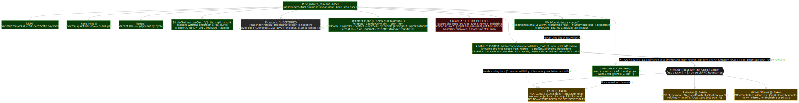

# 00. Prologue: Euclid's engine, twins, Riemann and the classical fronts — one rank-parity programme

<!--navtop-->
[↑ Repository](https://github.com/elamaunt/Euclids-path) · [01. The engine (EPMI) →](01_EPMI.md)
<!--/navtop-->

> This is the entry file of the whole programme — the prologue and chief navigator. Beyond it come
> the numbered chapters `prose/NN_*.md` (paired prose, 00→56) and the modules `EuclidsPath/Engine/*.lean`
> (machine verification).
> Here we introduce the object, declare the strategy, draw the map of parts I–VIII and — above all —
> honestly record what exactly is machine-proven, what is conditional on the single axiom, and what
> remains open.
> **Status legend:** 🟢 — machine-proven under the standard Lean/mathlib axioms;
> 🟡 — **AXIOM-TAINTED**: conditional on the repository's single axiom `step00FirstCause`
> (the first cause `0 → 1` with three boundaries — the twin node, the Riemann manifestation law and
> the NS gate-law of energy balance; the fourth, Collatz boundary, was taken and WITHDRAWN after the
> machine refutation of its law — see chapters 55–56; quarantine
> `Engine/CausalClosureAxiom.lean`, exactly 47 such declarations — 43 in quarantine, 2 declarations
> of the chapter 49 geometry (intersection of lines from the same twin boundary) and 2 declarations
> of the dyadic origin (the cascade pump `n=0` through the boundary `nsBoundary`), with no leaks —
> the verifier tracks every one);
> 🔴 — an open node / goal.
> The goal itself, `twin_prime_conjecture`, remains `sorry`. Nothing stronger than machine facts is claimed here.
> All key notions of the programme are gathered in the [glossary](GLOSSARY.md).

## ★ The programme's main theorem

At the summit of the whole construction stands a single statement — `higherEnergyIncompatibility_main`
(`Engine/FiniteKnowledgeBarrier`), **the higher energy incompatibility**. Its core is entirely
green, with no axiom at all.

**Theorem 0.1** (`higherEnergyIncompatibility_main`). The five faces meet in a single conjunction:

$$
\bigl(\mathsf{KnowsCause}\Rightarrow\mathsf{Engine}\bigr)\ \wedge\ \neg\,\mathsf{KnowsCause}\ \wedge\ W_{\mathrm{fin}}\ \wedge\ W_{\infty}\ \wedge\ \bigl(\neg\,\mathsf{Engine}\wedge\mathsf{Step00}\Rightarrow \#\{\text{twin lowers}\}=\infty\bigr).\tag{0.1}
$$

Here $\mathsf{KnowsCause}\Rightarrow\mathsf{Engine}$ — internal knowledge of the first cause builds a
concrete Euclidean engine; $\neg\,\mathsf{KnowsCause}$ — the cause is unknowable from inside
(`cause_unknowable`); $W_{\mathrm{fin}}$ — for any sieving system $S$, scale $A$, certificate and class
$B$: if $B$ is equivalent to an element $\mathit{bad}$ that is **not** a twin, the system does not certify
$B$ as a twin; $W_{\infty}$ — if arbitrarily far out every class contains a non-twin, the system does not
certify the infinitude of twins; and the fifth face: the absence of an engine together with the causal
boundary `step00FirstCause` entails `TwinLowers.Infinite`. The first four faces are 🟢; the conclusion of
the fifth is 🟡 (conditional on the boundary).

It rests on a simple thought: *learning the cause from inside costs energy that a closed system
does not have.*

The thought unfolds as follows. To know the first cause from inside would mean deriving it from
inside — and that would build a perpetual engine, which does not exist. Hence the cause is
unknowable in principle.

On the other side stands a second, independent wall. A finite sieving observer knows about a twin
only if its *entire* finite class consists of twins; a twin inside a mixed class is invisible to it.
Hence the infinitude of twins, too, cannot be certified from inside.

The two walls — the causal and the epistemic — turn out to be of one nature (`two_walls_one_nature`):
from inside a finite system one can see neither its first cause nor the infinitude of twins. And
then the load-bearing, fifth face closes the circle: this very incompatibility (no engines = the
cause cannot be learnt), together with the accepted causal boundary, entails the infinitude of twins.

Read as a whole, it is priced energetically: "knowing from inside" costs a perpetual engine, of
which there is none; while the infinitude of twins is external knowledge, paid for by the first cause.

Most briefly the theorem reads: *one cannot know that the twins are infinite; but if the
unknowability of the first cause is accepted as truth — they are infinite, and rigorously so.* This
is the corollary below.

**Corollary 0.2** (`higherEnergyIncompatibility_twins`). Instantiating the fifth face of (0.1) by the
decree `step00FirstCause` yields the form-unconditional

$$
\#\{\text{twin lowers}\}=\infty \qquad(\texttt{TwinLowers.Infinite}).\tag{0.2}
$$

🟡: the fifth face, instantiated by the decree `step00FirstCause` (a decree is the intentional
acceptance of a law by axiom rather than by proof; see the [glossary](GLOSSARY.md)). The core above it
stays green, but the corollary itself is conditional — it is **not** a proof of the twin conjecture.

And the whole construction carries a rigorous cosmological reading — the theorems are rigorous, the
cosmology is merely their translation (the full step-by-step account is in [chapter 33](33_CausalFirstCause.md)).

The number line and the impossibility of the engine together encode space and time. The strict order
of traversal is space with a singularity floor at `0`, while the irreversible arrow of time is
proven rigorously (`engine_never_returns`: height is strictly antitone, there is no way back).

The first cause is the instant when the engine emerges from the singularity `0` and sets off forward
without turning. It cannot be supplied from inside, for self-ignition would be a perpetual engine
(`no_internalisedOriginEvent`) — hence it is accepted from outside, by the single axiom.

That is why, inside the system, the infinitude of twins can be neither proven nor refuted: either
act would mean building a perpetual engine. And there is no tower of universes beneath the first
cause — the regress of causes is well-founded (`no_rankedMetaFractalBranch`); the universe is one.

## 1. The object: Euclid's engine as well-founded multiplicative descent

The whole edifice stands on one elementary object: the "state" of the Euclidean decomposition
process reduces to its **height** — the index $m$ of the centre of the pair $(6m-1,\,6m+1)$; a pure
descent step decreases the height *multiplicatively*: $\mathrm{DescentStep}(A,h,h') :\Leftrightarrow A\cdot h' < h$ (`DescentStep`,
`Engine/EPMI`).

Euclid's engine is a hypothetical infinite sequence of heights in which every step
is of this kind. It does not exist: $H(t)+t$ does not increase, and a strictly decreasing chain of
natural heights breaks off — this is Fermat's infinite descent, rewritten multiplicatively.

**Theorem 0.3** (`no_infinite_descent`). Impossibility of the perpetual engine: a strictly decreasing
chain of natural heights breaks off ($H(t)+t$ does not increase). The structural form
`no_perpetual_engine`, the step dichotomy `boundary_dichotomy` — all 🟢, without `sorry`, on the bare
Lean 4 kernel (without even mathlib). This is the hardest stone of the foundation: any construction
presented as a perpetual engine is automatically false.

## 2. The strategy: contraposition through the engine

For every goal $P$ (infinitude of twins; Riemann; the fronts) one builds the bridge
$\neg P \Rightarrow \mathsf{Engine}$ and closes it with the proven EPMI:
$(\neg P \Rightarrow \mathsf{Engine}) \land \neg\,\mathsf{Engine} \Rightarrow P$.

For the twins:
finiteness of twins (`NoNewTwinAbove M0`) drives the infinite stream of pure starts into a finite
set of old absorbers — a rigid cycle, an engine, a contradiction. For Riemann: a zero off the
critical line yields a free directed transfer of mass — again an engine.

We do *not* write
`twins ⟹ RH`: what the branches share is not an implication but a mechanism — one EPMI, one
contraposition and, as §4 will show, one rank-parity invariant.

## 3. Map of parts I–VIII

*Navigator map: one prohibition → the main theorem (pressing on the axiom) → the axiom and its boundaries; every problem with its honest status — taken 🟡 / deferred ⏸️ / fallen ✗.*

{ .nav-map }

**I. The engine and its laws (ch. 01–09, 🟢).** The impossibility core (`Engine/EPMI`, ch. 01);
the carrier of two `no_large_shared_divisor` (`Engine/Carrier`, ch. 02); the 1st law $XY-ZW=2$ —
`det_law_rank33` (`Engine/TwoGap`, ch. 03); descent and the boundary law (`Engine/Descent`, ch. 04);
irreversibility, `turn ⇒ halt` (`Engine/Irreversibility`, ch. 05); the vanishing of the diagonal
(`Engine/NoBackward`, ch. 06); squeeze, the bounded cycle, factor-repeat rigidity
(`Engine/Squeeze`, `Engine/BK`, `Engine/Cycle`, ch. 07–09).

**II. Reduction to twins (ch. 10–11, 🟢).** `infinite_of_unbounded_centers` (`Engine/NonCover`,
ch. 10); `twin_prime_conjecture_of_blocks` (`Engine/TwoTransport`, ch. 11).

**III. Attack lines and the parity wall (ch. 12–17, 🟢 conditionally/model-level).** Four-corner
(`Engine/FourCorner`, ch. 12); the model layer (`Engine/ModelFourCorner`, ch. 13); decomposition of
the remainder (`Engine/RealFourCorner`, ch. 14); the chain to twins (`Engine/ToTwins`, ch. 15);
`finite ∧ H ⇒ False` (`Engine/FiniteContradiction`, ch. 16); the ledger (`Engine/PaymentLedger`, ch. 17).

**IV. The final reduction of the twin line (ch. 18–25, 🟢 + a 🔴 node).** `twin_primes_of_SNOL`
(`Engine/SNOL`, ch. 18); old-peel (`Engine/OldPeel`, ch. 19); NOPSL (ch. 20);
`regeneration_dichotomy` (`Engine/Regeneration`, ch. 21); residuals/clean-graph (ch. 22–23);
the boundary decomposition and the **final twin node** `TheLastStep00Obligation`
(`Engine/BoundaryDecomp`, `Engine/ConcreteStep00Graph` and their retinue, ch. 24); the rigid closure
`reaches_twin` (`Engine/RigidClose`, ch. 25).

**V. Product-core rank descent (ch. 26–29, 🟢 + a 🔴 node).** `no_productHall`
(`Engine/SeparatingScale`, ch. 26); `product_core_engine_of_carrier` (`Engine/ProductCore`, ch. 27);
`factor_rank_le_four` (`Engine/MkNode`, ch. 28); `cleanCenters_infinite`,
`engine_of_factorization` (`Engine/CarrierBridge`, ch. 29).

**VI. The Riemann branch and the rank-parity bridge (ch. 30–32).** `riemannHypothesis_of_engine_bridge`,
`not_RH_gives_engine` (`Engine/RiemannBranch`, `Engine/RiemannEngine`,
`Engine/RiemannImpossibleEngine(-Off)`, `Engine/RankJumpBridge`, ch. 30);
`liouville_eq_neg_one_pow_rank`, `riemann_of_liouville_bound` (`Engine/RiemannLiouville`, ch. 31);
the single rank-parity node — the epilogue conjecture (ch. 32).

**VII. The first cause and the finite-knowledge barrier (ch. 33, written in parallel).** The
quarantined axiom `step00FirstCause` and its theorem retinue: `step00CausalClosure` (now a theorem
from the first cause), the honesty `step00FirstCause_iff_causalClosure` (the markers carry `True`,
all the strength sits in the boundary), the remainder equivalence
`nonAxiomaticRemainingObligation_iff_lastStep00Obligation`
(`Engine/CausalClosureAxiom`); the epistemics — `cause_unknowable`, `two_walls_one_nature` and the
**main theorem** `higherEnergyIncompatibility_main` (`Engine/FiniteKnowledgeBarrier`) — see the ★ block above.

**VIII. The classical fronts (ch. 34–37, written in parallel).**
— *Mersenne (ch. 34):* the identity $M_p = 6c+1$ — `mersenne_eq_sixCenter_add_one`, the conditional
bridge `twinLowersInfinite_of_mersenneTwins`, the honest gate `noTwinsToMersenneImplicationClaimed`
(`Engine/MersenneBranch`); the payment conflict — `soundness_forbids_mersennePrimePaymentConflict`,
`twinLowersInfinite_of_infiniteMersenneSupply` (`Engine/MersennePaymentConflict`); peel pressure —
`mersenneCenter_base4PeelStep`, `absence_forces_peelCoverage_or_paymentLaw_defect`
(`Engine/MersennePeelPressure`); the forward front of 34 bricks (`Engine/MersenneForwardFront`) —
⚠️ the late noEngine packages are **uninhabited** (vacuity no. 3, see §5).
— *P vs NP, locally (ch. 35):* `verificationEasy_always`,
`localPSuccess_iff_semanticFlowLedgerCollisionResolves`, `localP_success_detects_twin`,
the unconditional small-scale incompressibility `concrete_localSearchIncompressible_smallScale`
(`Engine/LocalPNPNode`); the classical bridge — `genealogyLanguage_in_NP`,
`classicalSeparation_of_localIncompressible`, the scope gate `bridgeScopeGuard_ok`
(`Engine/ClassicalPNPBridge`); the canonical self-reduction — `extracts_local_success_of_selfReduction`,
the anti-vacuity gate `trivialFrame_not_faithful` (`Engine/CanonicalSelfReduction`); the front's
routes — `extracts_local_success_of_bitwiseEncoding` (`Engine/ClassicalFrontierRoutes`); the rank
discipline — `no_rankBoundaryEngine`, `taxonomyExpansion_not_strictProgress` (`Engine/RankClosureFront`).
— *Navier–Stokes (ch. 36):* `ns_no_infinite_dissipative_cascade`,
`ns_no_infinite_dissipative_cascade_of_balance`, `kineticEnergy_nonneg` (`Engine/NavierStokes`,
the cascade skeleton — `Engine/DissipativeCascade`) — the structural "no infinite dissipative
cascade", **not** the Clay regularity problem.
— *Riemann fronts (ch. 37):* the entrance is closed — `trivialBelowZeroClassification` 🟢
(`Engine/RiemannTrivialZeros`, mathlib's functional equation): RH is conditional **only** on
`EngineBridge` (`riemannHypothesis_of_engineBridge_only`) or `TwoTransportBridge`; the rank-projection
route and its exposure (`Engine/RiemannRankProjection`, `Engine/RiemannRankProjectionAudit` —
vacuity no. 2, see §5); the two-transport form and its honesty `coherentTwoTransportBridge_iff_RH`
(`Engine/RiemannTwoTransportFront`); the arithmetic atom $+2$ —
`riemannHypothesis_of_arithmeticTwoTransport` (`Engine/RiemannArithmeticTwoTransport`);
the spectral audits — `front_pair_iff_RH`, `no_single_atom_anchors_two_distinct_invariants`
(`Engine/RiemannSpectralAnchorAudit`), the origin-blind firewall
`no_identity_with_residues_555_111_plus_two` (`Engine/RiemannLayerBoxFront`), the terminal
rank front — `no_free_origin_for_distinct_zeros`, the checklist of 66 lines / 11 balances
(`Engine/RiemannTerminalRankFront`).

## 4. The single rank-parity node

Both original conjectures reduce to one invariant — the parity of the rank
$\mathrm{rank}(n)=\Omega(n)$.

The twin side: the exclusivity of two (`no_large_shared_divisor`)
forbids the cross term $xy$ in the rank generating function and forces the four-corner
inequality $N_{00}N_{33}\le N_{03}N_{30}$ (`N33_lt_N00_of_four_corner`, `Engine/FourCorner`) —
the balance of twins is a rank-parity balance.

The Riemann side: $\lambda(n)=(-1)^{\mathrm{rank}(n)}$
(`liouville_eq_neg_one_pow_rank`), `deleteFactor` flips the sign (`liouville_flip_of_mul_prime`),
and RH is the smallness of $L(x)=\sum_{n\le x}(-1)^{\mathrm{rank}(n)}$ (`LiouvilleBound`).

**Conclusion.** One invariant,
one operator, one parity wall — which is why we speak of **one rank-parity node**. The fronts of
part VIII are attempts to get around this wall from different sides; their audits (ch. 37) show
machine-wise where the bypass is genuine and where it is a repackaging of RH.

## 5. Honest status by branch

**Twins — 🔴 a single node, narrowed to the utmost.** The whole branch is machine-reduced to
`TheLastStep00Obligation` (`Engine/ConcreteStep00Graph`):
`twinLowersInfinite_of_lastStep00Obligation` 🟢. The node is a twin detector: `twin_above_of_resolves`
(an input at scale `M0` itself presents a twin above `M0` — scale for scale it is no weaker than the
goal); the whole family of ~15 equivalent forms (energy / nested / seam / gauge / compression …) is
machine-⟺ to it.

⚠️ **Narrowing (an adversarial probe):** the branch `A ≤ 4` is **refuted** — the 5-adic chain
$c(k{+}1)=5c(k)+1$ yields infinitely many admissible genealogies with no twin hypotheses
(`smallScale_branch_of_lastStep00Obligation_refuted`); `∃A` survives only at `A ≥ 5`
(`lastStep00Obligation_forces_scale_ge_five`).

⚠️ **Vacuity no. 1 (exposed, repaired):** the
degenerate peel `p = p·1` made the node refutable; the patch `properDiv` + `targetPos` — now the
twin hypothesis is load-bearing, and satisfiability at `A ≥ 5` is genuinely open. The conditional
closure through the first cause (`higherEnergyIncompatibility_twins` and kin) — 🟡.
`Step00.twin_prime_conjecture` remains `sorry`.

**Riemann — 🔴 the fronts' inputs, 🟡 through the extended decree.** 🟢: `trivialBelowZeroClassification`
(every zero with `Re ≤ 0` is trivial) — RH is conditional only on
`EngineBridge`/`TwoTransportBridge`/`LiouvilleBound`.

⚠️ **Vacuity no. 2 (exposed, not embellished):** the goal of the rank-jump route is not anchored —
the full package `LiouvilleToTwinLocalization` is inhabited with zero input (`fullLocalization_noInput`);
the honest wall is exactly `¬LiouvilleViolation` (`wall_global`) — of RH strength; the window
bookkeeping, meanwhile, is closed honestly (`relevantViolation_gives_window`). The machine honesty
of the bridges: `offCriticalBridge_iff_RH`, `coherentTwoTransportBridge_iff_RH`,
`no_coherent_twoTransportLaw` — the decompositions are maps of obligations, not a non-circular path.

✳️ **Through the first cause (chapter 38):** RH is run through the same rank machine as the twins —
a zero off the line = an unpaid deviation; the manifestation law (the decree's second boundary;
manifestation is the principle "a deviation must show itself", see the [glossary](GLOSSARY.md)) +
the green impossibility of supply at permitted scales ⟹ `riemannHypothesis_from_firstCause` 🟡.
Not a proof of RH; the price is disclosed: `riemannManifestation_asserts_RH` — under the boundary
the law is ⟺ RH.

**P vs NP — a local architecture; the separation in the rank model is a 🟢 theorem (chapter 39).**
🟢: verification is always easy (`verificationEasy_always`), local success ⟺ the semantic twin node
(`localPSuccess_iff_semanticFlowLedgerCollisionResolves`), at the small scale `A ≤ 4`
incompressibility is unconditional (`concrete_localSearchIncompressible_smallScale`).

✳️ **The reading "NP = full payment of rank certificates, P = rank-fast passage" is a theorem**:
`pnp_rank_separation_smallScale` 🟢 and `concrete_localPSuccess_iff_fullPayment` 🟢 (chapter 39);
the split across scales — the decree at `A ≥ 5` itself pays all the certificates
(`decreedScale_fullPayment` 🟡); there is machine-checkedly no third boundary of the decree (the
trilemma — the mandatory three-branch test of a boundary candidate,
see the [glossary](GLOSSARY.md): two candidates are refutable, the third is vacuous).

⚠️ **Vacuity no. 4:** the decider-gated extraction fronts are classically empty (`PDecider` is
free) — their separation conclusions are vacuous. The classical separation
(`classicalSeparation_of_localIncompressible`) is conditional on the InP-gated bridge; the frames
are plastic (`allPFrame`/`constantsFrame`) — this is **not** a proof of P ≠ NP, and it is not claimed to be.

**Navier–Stokes — a structural result, not Clay.** 🟢: `ns_no_infinite_dissipative_cascade` —
under energy balance an infinite dissipative cascade is impossible (the same well-founded
EPMI mechanism in $\mathbb{R}_{\ge0}$). Nothing is claimed about global regularity of smooth solutions.

✳️ **Smoothness through the cascade + the integral taken (chapter 41):** a singularity = a singular
cascade = a perpetual engine; `noSingularCascade_of_energyBalance` 🟢 — there are no blow-up points
of cascade type (the surrogate ≠ C^∞ — disclosed); the integral is taken —
`energy_identity_of_energyBalance` 🟢 (the identity as an equality) and `isNSSolution_integral_form`
🟢 (the mild form, an E3-valued FTC). There is no fifth boundary of the decree — the trilemma of
chapter 41 (cookedFlow / the zero solution / a forged profile cascade).

**Yang–Mills — a structural result, not Clay (chapter 40).** 🟢: masslessness = a perpetual engine
(the halving ladder — the very ℝ-counterexample of the cascade warning); **quantization of the
spectrum ⟹ a mass gap** (`massGap_of_quantizationLaw`: ladder + rank = ℕ-descent, killed by EPMI).

There is no fourth boundary of the decree — the trilemma is machine-checked (the universal is
refutable, the existential is vacuous, the Riemann mirror is incompatible with the accepted
boundary — the ladder is presentable, unlike the zero; the collapse
`quantizationLaw_iff_massGap` — the law is ⟺ the gap, green without the boundary). The decree's
world is gapped in the language of supplies (`decreedScale_no_deviationSupply` 🟡). The 🔴 input —
a data-anchored constructed YM spectrum.

**Hodge — a structural result, not Clay (chapter 42).** 🟢: a Hodge class = a quantized
(p,p)-charge (an ℕ-height), a cycle = a payment; **the engine (a chain of unpaid descent) is dead
unconditionally** (`isEmpty_unpaidDescentChain` — quantization is built into the model, the
asymmetry with YM is disclosed); `hodgeProperty_of_descentLaw` — the descent law ⟹ the model's
conjecture (strong induction on height).

The collapse `descentLaw_iff_hodgeProperty` (the converse
side is vacuous — disclosed) — there is no sixth field; the trilemma of chapter 42: the universal
is refutable (cookedUnpaid), the existential is proven with no axioms at all, the chain form
degenerates into the green one (V2′), manifestation over a presentable class is incompatible with
the boundary. mathlib has no Hodge theory; the 🔴 input — `DescentLaw` for genuine (p,p)-classes.

**Mersenne — conditional bridges + vacuity no. 3.** 🟢: the arithmetic of centres, the conditional
export `twinLowersInfinite_of_mersenneTwins` and the payment-peel defect dichotomies.

⚠️ **Vacuity
no. 3 (exposed, recorded in the module header):** in `Engine/MersenneForwardFront` the late
noEngine packages (the `NoForbiddenPrimePaymentEngine` family and kin) are **uninhabited** — the
tokens carry a free field `witness : Prop`, the "engine" is built trivially, the headline
conclusions of these bricks are vacuous; the routes in this form cannot be instantiated. The branch
has no unconditional strong conclusions.

**First cause — 🟡 quarantine, three boundaries.** The single axiom `step00FirstCause` carries the
twin node (`causalBoundary`), the Riemann manifestation law (`riemannBoundary`, chapter 38) and the
NS gate-law of energy balance (`nsBoundary`, chapter 41 — the finishing blow: it survived the
extended trilemma, two forgings were killed by gates; the decree may overpay — disclosed).

The
fourth boundary — the Collatz rope law — was *taken and withdrawn*: the universal law is
machine-refuted (`ropeLaw_universal_refuted`, witness n = 27), the tripwire (an intentional
explosion detector, see the [glossary](GLOSSARY.md)) fired, the decree overpaid into falsehood
(the story — chapter 56).

47 AXIOM-TAINTED declarations (42 in the quarantine module + the
corollary `higherEnergyIncompatibility_twins` + 2 of the chapter 49 geometry through the twin
boundary + 2 of the dyadic origin through `nsBoundary`); the verifier recounts every one at each
build.

There is no third (P/NP) boundary — intentionally and machine-checkedly (the trilemma of
chapter 39), nor a fourth (Yang–Mills), a fifth (NS) or a sixth (Hodge)
(the trilemmas of chapters 40–42); §11–§14 of the quarantine record that the decree already speaks
the languages of P/NP and YM (at its own scale `A ≥ 5` it pays all the certificates and refuses the
supply of deviations — gapped), and carry one tripwire each for NS and Hodge.

Consistency of the
extended theory ⟺ irrefutability of the node and of RH in the base (the tripwires — the node / an
off-critical zero / ¬RH / the law / incompressibility at all scales / supply at all scales /
the manifestation laws of NS and Hodge); internalisation of the
first cause is impossible — an engine (`no_internalSelfDerivation_step00CausalClosure`, 🟢).

**The honest bottom line.** The 🟢 corpus is a genuinely verified machine: the engine, the
reductions, the audits, the main theorem (its core). The 🟡 layer is exactly what is paid for by
the first cause, and it is fenced off by the quarantine. 🔴 — `TheLastStep00Obligation` at `A ≥ 5`,
the RH inputs, the classical fronts. A reduction is not a proof; a `sorry` cannot be faked.

## Where we are and where next

We have introduced the object (`no_infinite_descent`), declared the strategy (contraposition
through the engine), charted parts I–VIII and set `higherEnergyIncompatibility_main` at the top of
the map: knowledge from inside costs a perpetual engine, which does not exist. The next chapter,
[01. EPMI](01_EPMI.md), builds the foundation literally — on the bare Lean kernel; chapters 33–42
unfold the first cause (three boundaries — twins, Riemann and the NS gate; the fate of the fourth,
Collatz one — chapters 55–56) and the classical fronts.

## Philosophical digression: one physical law beneath seven problems

It is worth spelling out what binds the whole programme together, because that bond is not a
literary device but its load-bearing structure. At the foundation lies **the hardest of physical
laws — the impossibility of a perpetual engine**: one cannot draw work out of nothing, one cannot
descend forever without paying. In Euclid–Fermat form this is
`no_infinite_descent`: a strictly decreasing chain of natural heights breaks off.

And the whole programme is the discovery that the seven great questions are one and the same
prohibition, worn by different objects:

- *Twins:* finiteness of twins would drive the infinite stream of pure starts into a
  finite cage — a rigid cycle, an engine.
- *Riemann:* a zero off the line is an unstable mode of a hidden quantum spectrum
  (Hilbert–Pólya), a self-amplifying oscillation, an engine.
- *Yang–Mills:* a massless spectrum is a tower of arbitrarily cheap excitations of the
  vacuum, a gratuitous transfer, an engine; and the mass gap is the fee the vacuum
  charges for the first excitation.
- *Navier–Stokes:* a singularity is a Kolmogorov cascade that has reached infinitely small
  scales in finite time, infinite energy out of finite, an engine; and
  viscosity is the rope that always arrives in time at the bottom.
- *Hodge:* an unpaid quantized charge is an eternal regress of ever smaller
  denominators, an engine on the integer lattice.
- *P/NP:* full payment of all certificates costs more than rank-fast passage —
  the thermodynamic price of information.
- *Collatz:* a damped drift whose mean is reconciled and whose floor is absorbing; a counterexample
  = a perpetual engine (an orbit tail from the minimum), and it cannot be decided from inside —
  only by checking; the decree on the rope law was taken and withdrawn after the machine
  refutation (chapters 55–56).

One root, seven branches. And in each of them — the same honest wall: the structural
half is proven green (where the engine prohibition holds, there is no deviation), while
the last step — attachment to the genuine object (a QFT spectrum, a Hamiltonian of the primes,
a Leray solution, `(p,p)`-classes, a Turing machine) — is either accepted by the decree of the
first cause under an honestly disclosed price, or remains a 🔴 input.

**Section takeaway.** The programme does not
solve the millennium problems; it shows that all of them are shadows of one
physical "cannot", and presents exactly the part that does not depend on the
concrete object.

Mathematics here turns out to be thermodynamics rewritten in the language of
ranks: where the physicist says "there is no free energy", the formalist proves
`no_infinite_descent` — and this alone suffices to come right up to the
boundary of the knowable seven times over.

Beyond the seven branches comes the **arithmetic zoo** (chapters [44](44_SidesAndPolignac.md)–[48](48_Fermat.md),
all 🟢): the same manifestation apparatus, run through Polignac's cousins and sexy primes, Sophie Germain,
Goldbach, Legendre, perfect numbers and Fermat numbers. No decree fields are taken there — intentionally (§17):
the trilemmas are passed, but an honest boundary also demands a stake one need not be ashamed of.

One theorem fell out
green and unconditional — the Euler–Lagrange pearl: Sophie Germain primes with `p ≡ 3 (mod 4)` divide
Mersenne numbers. And the [geometry of the path](49_Geometry.md) (chapter 49) reads the descent graph
itself as curved spacetime: an arrow of time, computed curvature, and a violation of Euclid's second postulate.

The eighth mask — [Birch–Swinnerton-Dyer](53_BirchSwinnertonDyer.md) (chapter 53) —
enters differently: here the engine prohibition does not guard a deviation but serves as a
**method** — Fermat's infinite descent proves finiteness of the rank (Mordell–Weil, on a real
mathlib curve), while the parity of the rank turns out to be the same rank-parity node that stands
behind Riemann. The analytic bridge (`rank = ord L`), meanwhile, is honestly 🔴; no boundary is
added (the trilemma) — BSD does not raise the tariff.

The full summation of this thought — where the single prohibition is read as a possible structure
of spacetime, up to a conjecture of a theory of everything — is carried out to the concluding
[coda (chapter 50)](50_Coda.md).

<!--navbot-->

---

[↑ Repository](https://github.com/elamaunt/Euclids-path) · [01. The engine (EPMI) →](01_EPMI.md)
<!--/navbot-->
