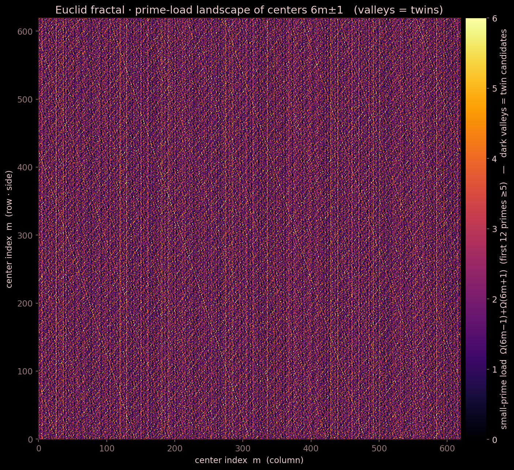

# Euclid's engine: the impossibility of perpetual descent

<!--navtop-->
[← 00. Overview](00_Overview.md) · [Table of contents](00_Overview.md) · [02. Carrier of two →](02_Carrier.md)
<!--/navtop-->

> Lean source: `EuclidsPath/Engine/EPMI.lean`, `EuclidsPath/Engine/Irreversibility.lean`.

## Where we are

In the overview we reduced the twin-prime conjecture to a question about the behaviour of a single dynamical object — a chain of self-similar Euclidean equations, which we called *Euclid's engine*. The overview gave the map; the present chapter introduces the central object of that map and proves its defining property: the engine cannot run forever. The entire remaining edifice — the carrier of two, the conservation laws, the reduction to twins — rests on this single fact, so we state it with full rigour and with the exact names of the machine-verified theorems.

## Motivation: a counterexample as a perpetual engine

Let us begin with the intuition. Suppose there are only finitely many twin primes. Then, from some scale onward, every pair `(6m−1, 6m+1)` must contain a composite side, and its factorisation contains an active divisor whose removal produces a structurally identical Euclidean equation with a smaller centre. Repeating the removal, we obtain an infinite chain of descents that never leaves the "clean" core (clean-core) at any step. Such an eternally running chain is naturally called a perpetual engine: it performs the nontrivial work of descent forever, losing nothing along the way.

Our task is to show that such an engine is impossible. This is exactly Fermat's infinite descent, restated in the language of centres of Euclidean pairs. The key observation is that the state of the engine is entirely described by a single natural number — its *height* — and that one successful descent step decreases this height strictly and *multiplicatively*. From there on it is not physics that does the work but the arithmetic of the natural numbers.

*The fractal of Euclid's path · **the descent landscape**: the height of each centre as terrain — the engine rolls down
along it and must reach the bottom in a finite number of steps. The full gallery of six views is
in [`tools/fractal/`](https://github.com/elamaunt/Euclids-path/tree/main/tools/fractal).*

> **Generation algorithm (Figure 1.1).** Source: `tools/fractal/euclid_fractal.py::descent_landscape`. For every centre $m = 0, 1, \dots, S^2-1$ laid on an $S\times S$ raster ($S = 620$, row-major in $m$), compute the *small-prime load*
> $$L(m) \;=\; \Omega_B(6m-1) + \Omega_B(6m+1),$$
> where $\Omega_B(x)$ is the number of prime factors of $x$, counted with multiplicity and restricted to the first $B = 12$ primes $\ge 5$ (that is, $5, 7, 11, \dots, 41$). Colour each cell by $L(m)$ (palette `inferno`, clipped at the 99th percentile). Twin centres — where both sides $6m\pm1$ are prime — have $L(m) = 0$ and appear as the dark valleys; the self-similar relief is the Chinese-remainder periodicity of the small primes.

## Defining the descent step and the height

Let us abstract away the arithmetic filling and keep only what the impossibility proof needs. The state of the engine carries a single numerical characteristic — the height `h ∈ ℕ`; substantively, this is the centre `m` of the pair `(6m−1, 6m+1)`.

**Definition 1.1** (descent step). Let `A ∈ ℕ` be a fixed scale threshold (a lower bound on the active factors). One successful clean descent from height `h` to height `h'` is the inequality
$$\mathrm{DescentStep}\,A\,h\,h' \;:=\; A\cdot h' < h. \tag{1.1}$$

In Lean this is literally `def DescentStep (A h h' : Nat) : Prop := A * h' < h`. The definition fixes not just any decrease but a **multiplicative** one: the new height is not merely smaller than the old — it is smaller by a factor of `A` (up to strictness of the inequality). It is the factor `A`, not the difference, that sets the speed of descent and makes termination inevitable within a finite number of steps.

> **Note.** The height is the engine's reservoir of "fuel". In the substantive picture of the programme its role is played by the harmonic height of a state, $H(C,D) = CD/(C+D)$, whose monotonicity along a run follows from the determinant law of transition; but for the impossibility proof its discrete abstraction — the natural index of the centre — suffices. We deliberately work on the bare Lean 4 kernel, without mathlib, so that `no_infinite_descent` checks quickly and with no external dependencies.

The first thing we notice: for `A ≥ 1` the multiplicative step implies ordinary strict decrease.

**Theorem 1.2** (`descent_strict`). *If `1 ≤ A` and `DescentStep A h h'` holds, then `h' < h`.*

The proof is one step long: from `1 ≤ A` we get `h' ≤ A·h'` (multiplying by a positive factor does not decrease), and `A·h' < h` holds by the definition of the step; transitivity gives `h' < h`. Why this matters as a separate statement: it separates the *direction* of the descent (the height falls) from its *speed* (it falls by a factor of `A`). The direction will be needed in the second chapter, on irreversibility; the speed is needed right now, for finiteness.

## The impossibility of infinite descent

Now the central result in its pure, abstract form.

**Theorem 1.3** (`no_infinite_descent`). *Let `1 ≤ A`. There is no sequence of heights `H : ℕ → ℕ` for which every step is a successful `A`-descent, that is,*
$$\forall\, t,\quad \mathrm{DescentStep}\,A\,(H\,t)\,(H\,(t+1)). \tag{1.2}$$
*From the existence of such a sequence, `False` is derived.*

**Why this is true.** The idea of the proof is elementary and fully constructive. Consider the quantity `H t + t`. At each step the height `H t` falls by at least `1` (by Theorem 1.2, `descent_strict`), while the counter `t` grows by `1`; hence the sum `H t + t` does not increase, and by induction
$$\forall\, t,\qquad H\,t + t \;\le\; H\,0. \tag{1.3}$$
Formally, the induction step uses two facts: `A·H(n+1) < H n` (a link of the chain) and `H(n+1) ≤ A·H(n+1)` (positivity of `A`), whence `H(n+1) + (n+1) ≤ H n + n ≤ H 0`. Now substitute `t = H 0 + 1`:
$$H\,(H\,0 + 1) + (H\,0 + 1) \;\le\; H\,0. \tag{1.4}$$
The left-hand side is strictly greater than `H 0` (it already contains the summand `H 0 + 1`), yet it must be at most `H 0` — a contradiction. In Lean this entire argument is closed by induction and the `omega` tactic; `#print axioms` confirms that the theorem *depends on no axioms whatsoever* — it is fully constructive and free of `sorry`.

**What this means.** The multiplicative decrease $H_t < H_0/A^{t}$ drives the height below `1` in a finite number of steps, and a positive integer cannot be less than `1`. In other words, the natural numbers have a bottom, and a discrete descent is bound to reach that bottom. Note that for the contradiction itself even `A = 1` suffices (the well-orderedness of `ℕ`); the factor `A ≥ 1` merely supplies a quantitative estimate of the speed, to which we return below.

> **Note (stronger than the second law of thermodynamics).** The physical second law speaks of the *asymptotic* growth of entropy: a system tends toward equilibrium but may formally approach it for infinitely long. Our discrete analogue is stronger. Since the height is an integer with a strict bottom, the descent does not merely "die down" — it **halts in a finite number of steps**: no more than `H 0` of them (see Theorem 1.11, `turned_engine_halts`, in the chapter on irreversibility). The discreteness of the bottom turns an asymptotic statement into hard finiteness: the engine does not slow down to zero, it switches off.

## The structural form: state and boundary-exit

The abstract theorem speaks of a sequence of numbers. To connect it to the substantive picture, let us introduce an explicit state and a step operator that distinguishes the two outcomes of removing an active factor.

**Definition 1.4** (state). `structure State where height : Nat` — the state of the engine with a single height field; substantively, this is the centre `m` of the current Euclidean pair.

**Definition 1.5** (step with two outcomes). The partial clean-descent operator `D_a` over a state `s` yields one of two results, encoded in Lean by an inductive type
$$\mathrm{Step}\,A\,s \;=\; \begin{cases} \texttt{clean}\ s'\ (A\cdot s'.\mathrm{height} < s.\mathrm{height}), & \text{a successful descent into a clean state},\\[2pt] \texttt{boundary}, & \text{the absorbing exit } \bot. \end{cases}$$
The `clean` branch carries a witness of the multiplicative decrease of the height; the `boundary` branch records the exit of the descended centre from the clean core onto the boundary, from which there is no return.

With this definition, the central theorem is restated in the language of state trajectories.

**Theorem 1.6** (`no_perpetual_engine`). *Let `1 ≤ A`. There is no trajectory `run : ℕ → State` in which every step is a successful clean descent, that is, `A·(run (t+1)).height < (run t).height` for all `t`.*

The proof is a direct reduction to the abstract form: take the sequence of heights `t ↦ (run t).height` and apply Theorem 1.3 (`no_infinite_descent`). This is precisely "there is no perpetual engine of Euclid": an infinite chain of successful clean descents does not exist.

Finally, let us record that a step has no outcomes other than the two named ones.

**Theorem 1.7** (`boundary_dichotomy`). *For any step `st : Step A s`, exactly one of two things holds: either `st` is `clean s' h` for some `s'` and some witness `h`, or `st = boundary`:*
$$\bigl(\exists\, s'\,h,\ st = \texttt{clean}\ s'\ h\bigr)\ \lor\ \bigl(st = \texttt{boundary}\bigr).$$

The proof is a case analysis over the constructors of the inductive type. Substantively, this is the type-level fixation of the dichotomy from the boundary-exit law: a descended centre either stays clean (and then the height strictly fell by a factor of `A`), or exits onto the absorbing boundary `⊥`. From `boundary` there is no clean continuation of the same branch — such a continuation would require a successful `clean` step, which `boundary` by construction is not. The boundary absorbs: `⊥ ↛ S`.

## Irreversibility and the asymmetry of directions

Theorem 1.3 (`no_infinite_descent`) answers the question "does the engine always halt?". The second natural question — "can it turn back?" — is closed in the neighbouring module `Irreversibility.lean`, which supplies a complete discrete analogue of the second law of thermodynamics for the engine. We briefly record its results, since they rest directly on the definitions introduced above.

**Theorem 1.8** (`engine_never_returns`). *If every step is a successful `A`-descent (`A ≥ 1`), then the height is strictly antitone: `s < t ⟹ H t < H s`.* The engine never returns to an earlier (higher) state. The proof assembles the stepwise decrease `descent_strict` into a global `StrictAnti` via `strictAnti_nat_of_succ_lt`.

Together, Theorem 1.8 (`engine_never_returns`, "it will not turn back") and Theorem 1.3 (`no_infinite_descent`, "it always halts") constitute the whole second law: wherever the engine goes, it will not turn back and it will halt. To this is added a directed asymmetry of the resource.

**Theorem 1.9** (`no_infinite_engine_descent`). *Any strictly decreasing `f : ℕ → ℕ` yields `False`* — downward, the engine cannot ride forever (this is exactly `no_infinite_descent` at `A = 1`).

**Theorem 1.10** (`fuel_ascent_strictMono`). *The map `n ↦ n+1` is strictly increasing* — upward, toward larger centres, there is always enough fuel: the engine rides without stopping. The asymmetry is sharp: infinite motion is possible in **only** one direction — upward.

**Theorem 1.11** (`turned_engine_halts`). *If the engine has turned into a descent and made `k` strict steps downward (`H(t+1) < H(t)` for `t < k`), then `k ≤ H 0`.* This is the quantitative form of finiteness: any turn downward is a finite path of length at most the initial height. It is precisely this bound that makes our result stronger than the asymptotic second law: the exact number of steps to the halt is given.

## Its role in the framework, and the open node

Let us gather the meaning of the chapter. We introduced the central object of the programme — Euclid's engine as a chain of clean descents — and proved, machine-checked and axiom-free, that it cannot run forever (Theorems 1.3, 1.6), does not turn back (Theorem 1.8), and, once it has turned downward, halts in a finite number of steps (Theorem 1.11). The dichotomy of Theorem 1.7 records that the only alternative to continuing the descent is the absorbing exit onto the boundary.

Let us honestly draw the boundary of what has been proven. Everything listed is the impossibility of an infinite *local* clean descent along a single branch. From this the global non-covering result does **not** follow automatically.

> **Conjecture and closure plan.** Combinatorially, one can imagine a finite tree of bounded depth, each branch of which honestly terminates in an absorbing boundary-leaf — and which nevertheless covers all centres. The local impossibility of the engine does not by itself rule out such a scenario. The observation is that the prohibition of perpetual descent must be lifted from a single branch to the entire tree. The closure plan: recast the front as a multi-rank non-cover with a rank reduction (4→3→2→1) to the rank-1 neighbour obstruction, where counting arguments are forbidden by construction. This single remaining node is taken apart in the later chapters (see [10. NonCover](10_NonCover.md), [18. SNOL](18_SNOL.md)); the engine, for its part, supplies the local law of finiteness on which the whole reduction stands.

## Bridge to the next chapter

We have established that the descent cannot continue forever, but we have said nothing yet about *what exactly* is carried along the descent and keeps the pairs "held apart". The answer is the number `2`: the sides `6m−1` and `6m+1` differ by exactly two, and this two is a carrier preserved at every move of the engine. To it — the common divisor of the sides, dividing their difference — we turn in the next chapter, on the carrier of two.

<!--navbot-->

---

[← 00. Overview](00_Overview.md) · [Table of contents](00_Overview.md) · [02. Carrier of two →](02_Carrier.md)
<!--/navbot-->
