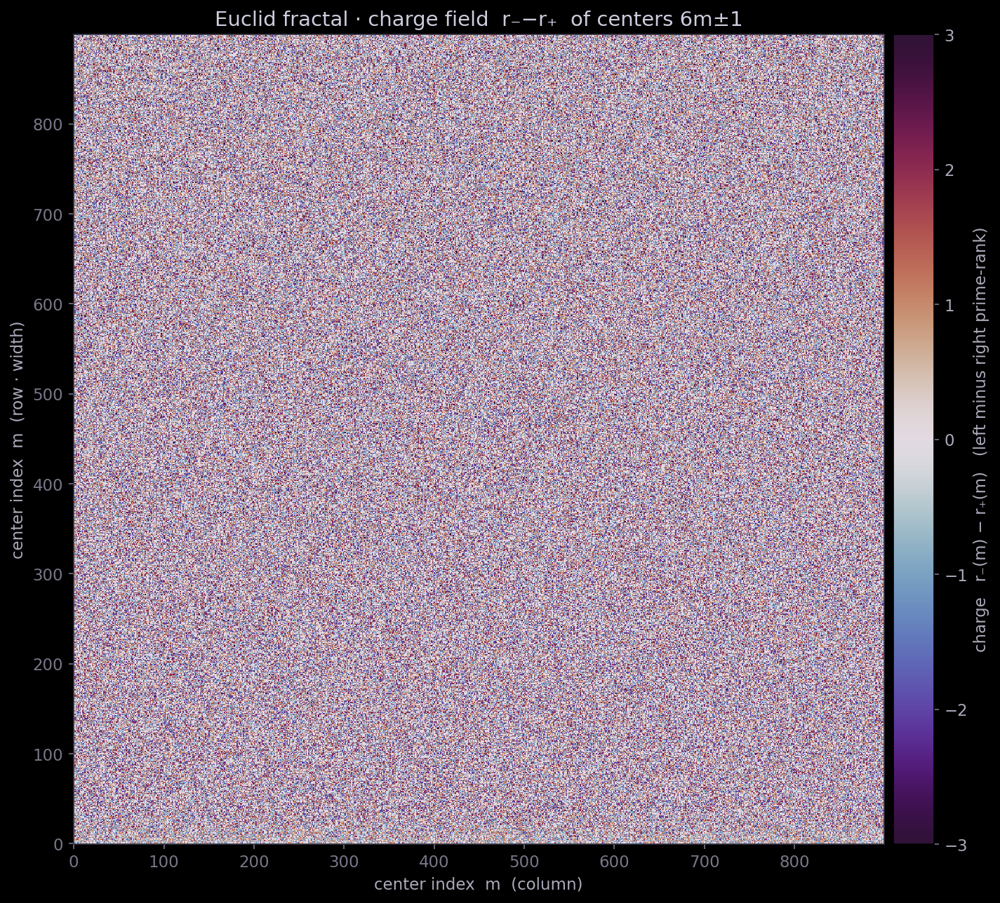

# 13. Фрактальный слой и модельный four-corner

<!--navtop-->
[← 12. Four-corner](12_FourCorner.md) · [Оглавление](00_Overview.md) · [14. Декомпозиция остатка →](14_RealFourCorner.md)
<!--/navtop-->


> Lean-источник: `Engine/ModelFourCorner.lean` (`four_corner_binom`, `four_corner_binom_strict`, `model_four_corner`). Файл компилируется; `#print axioms` показывает лишь `[propext, Classical.choice, Quot.sound]`.

В предыдущей главе [12](12_FourCorner.md) мы свели утверждение о твин-центрах к неравенству **four-corner** $N_{00}N_{33}\le N_{03}N_{30}$ и показали, что его знак укоренён не в плотности простых, а в *эксклюзивности двойки*: простой $p>2$ не делит обе стороны $6m\pm1$ одновременно (`Engine/Carrier.no_large_shared_divisor`, `shared gcd ∣ 2`). Там мы работали с абстрактными ранговыми счётами $N_{ij}$ и оставили открытым вопрос: *откуда берутся сами эти счёта и почему у произведения по простым нет перекрёстного члена $xy$*. Настоящая глава закрывает этот вопрос на уровне **модели**: мы выписываем производящую функцию рангов как самоподобное произведение, извлекаем из неё точные биномиальные счёта и доказываем модельный four-corner — элементарно, без распределения простых, полностью в Lean.



*Фрактал пути Евклида · **поле ранга**: ранг `lexRank` каждого центра, раскрашенный по слоям — та
самая самоподобная производящая функция, из которой вырастает four-corner. Самоподобие здесь
**стягивающее**, а не разбегающееся: узор повторяется на всё более мелких масштабах при движении к
центру, а не ветвится вовне (подробнее — в [коде, глава 50](50_Coda.md)).*

## Фрактальная производящая функция ранга

Начнём с наблюдения о структуре ранга. Рангом центра $m$ мы называем пару $(r_-,r_+)$, где $r_-$ — число простых делителей нижней стороны $6m-1$, а $r_+$ — верхней стороны $6m+1$ (в рассматриваемом слое $A$). Каждый простой $p$ из слоя вносит в ранг вклад **независимо** по CRT, и этот вклад подчинён двум структурным законам, которые мы установили ранее.

**Закон $\pm$-симметрии.** Вес простого на нижнюю и верхнюю стороны одинаков: вероятность попасть в класс, где $p\mid 6m-1$, равна вероятности класса $p\mid 6m+1$. Это ровно та зеркальность, которую даёт замена $m\mapsto -m$ (перестановка сторон), — из интуиции двигателя обе стороны равноправны, никакая не выделена.

**Закон эксклюзивности.** Ни один $p>2$ не делит обе стороны: классы $p\mid 6m-1$ и $p\mid 6m+1$ несовместны. Это `no_large_shared_divisor` из [12](12_FourCorner.md).

Отсюда естественно предположить, что вклад простого $p$ в производящую функцию ранга — это множитель
$$
G_p(x,y)\;=\;c_p + a_p\,x + b_p\,y,\qquad a_p=b_p\ (\text{$\pm$-симметрия}),\ \textbf{без члена } xy\ (\text{эксклюзивность}),
$$
где $x$ помечает делитель нижней стороны, $y$ — верхней, а отсутствие $xy$ — прямое отражение того, что «оба сразу» невозможно. Полная производящая функция — произведение по простым слоя:
$$
G(x,y)\;=\;\prod_{p}\bigl(c_p + a_p x + a_p y\bigr).
$$

> **Примечание.** Именно отсутствие $xy$-члена — сердцевина всего аргумента. В общей (неэксклюзивной) модели множитель был бы $c+ax+by+dxy$, и знак four-corner не был бы форсирован. Эксклюзивность зануляет $d$ на *каждом* простом, а не в среднем; это диофантово, а не статистическое свойство.

Ключевое **самоподобие**: множитель $G_p$ зависит от $x$ и $y$ только через симметричную комбинацию, поэтому произведение $G(x,y)$ — функция от одной переменной $s=x+y$. В равновесной (гомогенной) модели, где все $n$ простых слоя имеют общий вес $w$ и общий свободный член, нормированный к единице, это даёт
$$
G(x,y)\;=\;\prod_{k=1}^{n}\bigl(1 + w(x+y)\bigr)\;=\;\bigl(1+w\,s\bigr)^{n},\qquad s=x+y.
$$
Разложение по $s$ — бином Маклорена:
$$
(1+ws)^n=\sum_{k\ge0}\binom{n}{k}w^k\,s^k .
$$

## От производящей функции к счётам

Счёт $N_{ij}$ — коэффициент при $x^i y^j$ — извлекается из коэффициента $Q_k$ при $s^k$ распределением показателей между $x$ и $y$:
$$
N_{ij}\;=\;Q_{i+j}\cdot\binom{i+j}{i},\qquad Q_k=\binom{n}{k}w^k .
$$
Множитель $\binom{i+j}{i}$ — число способов раскидать $i+j$ выбранных простых на $i$ нижних и $j$ верхних позиций; это и есть тождество «выбор-в-выборе», которое ниже станет ядром Lean-доказательства. Подставляя нужные углы прямоугольника $\{0,3\}\times\{0,3\}$, получаем
$$
\begin{aligned}
N_{00}&=Q_0\binom{0}{0}=1,\\
N_{03}=N_{30}&=Q_3\binom{3}{0}=\binom{n}{3}w^3,\\
N_{33}&=Q_6\binom{6}{3}=20\,\binom{n}{6}\,w^6,
\end{aligned}
$$
где $\binom{6}{3}=20$ — та самая константа, которую в [12](12_FourCorner.md) мы обозначили $R_{\mathrm{CRT}}=20\,e_6/e_3^2$. Four-corner $N_{00}N_{33}\le N_{03}N_{30}$ превращается в
$$
1\cdot\bigl(20\,\tbinom{n}{6}w^6\bigr)\;\le\;\bigl(\tbinom{n}{3}w^3\bigr)^2,
$$
и после сокращения $w^6$ — в чисто биномиальное неравенство
$$
\boxed{\,20\,\binom{n}{6}\le\binom{n}{3}^2\,.}
$$

## Биномиальный four-corner: `four_corner_binom`

**Определение (модельный four-corner).** Модельным four-corner называем неравенство
$$
20\,\binom{n}{6}\le\binom{n}{3}^2\qquad\text{для всех }n\in\mathbb N,
$$
понимаемое над $\mathbb N$ (при $n<6$ левая часть равна нулю тривиально).

Оно доказано как `four_corner_binom`:
```
theorem four_corner_binom (n : ℕ) : 20 * n.choose 6 ≤ (n.choose 3) ^ 2
```

Доказательство элементарно и держится на **тождестве «выбор-в-выборе»**. В Mathlib это `Nat.choose_mul`:
$$
\binom{n}{6}\binom{6}{3}=\binom{n}{3}\binom{n-3}{3}.
$$
Слева мы выбираем $6$ простых из $n$, затем $3$ из этих шести (на верхнюю сторону); справа — сразу $3$ из $n$, затем ещё $3$ из оставшихся $n-3$. Оба способа считают одно и то же — упорядоченную пару непересекающихся троек, — поэтому равны. Подставляя $\binom{6}{3}=20$ (в Lean `decide`) и $6-3=3$, получаем
$$
20\,\binom{n}{6}=\binom{n}{3}\binom{n-3}{3}.
$$
Осталась **монотонность** биномиального коэффициента по верхнему аргументу, `Nat.choose_le_choose`:
$$
\binom{n-3}{3}\le\binom{n}{3}\quad(\text{ибо }n-3\le n),
$$
откуда
$$
20\,\binom{n}{6}=\binom{n}{3}\binom{n-3}{3}\le\binom{n}{3}\binom{n}{3}=\binom{n}{3}^2.
$$
В Lean переход `_ ≤ _` замыкается тактикой `gcongr` (монотонность умножения), финальные равенства — `ring`.

> **Примечание.** Что *значит* это неравенство. Углы $N_{00}$ и $N_{33}$ (оба ранга минимальны / оба максимальны) вместе не могут перевесить смешанные углы $N_{03},N_{30}$. Это в точности **отрицательная ассоциация** рангов: высокая делимость одной стороны отталкивает высокую делимость другой. Причина — эксклюзивность: тройка делителей, «занятая» верхней стороной, недоступна нижней, что и выражает переход $\binom{n}{3}\to\binom{n-3}{3}$ (у второй стороны на три кандидата меньше). Мы ничего не предполагали о том, *как часто* простые делят стороны, — только что делят взаимоисключающе.

## Модельный four-corner в исходных координатах: `model_four_corner`

Чтобы не терять связь с ранговыми счётами (в которых остаётся вес $w$), то же неравенство доказано и до сокращения $w^6$, как `model_four_corner`:
```
theorem model_four_corner (n w : ℕ) :
    1 * (20 * n.choose 6 * w ^ 6) ≤ (n.choose 3 * w ^ 3) * (n.choose 3 * w ^ 3)
```
Здесь левая часть — $N_{00}\cdot N_{33}$, правая — $N_{03}\cdot N_{30}$ буквально в форме модельных счётов. Доказательство — прямое следствие `four_corner_binom`: умножаем неравенство $20\binom{n}{6}\le\binom{n}{3}^2$ на $w^6\ge0$ (снова `gcongr`) и перегруппировываем множители (`ring`). Содержательно это подтверждает, что вес $w$ — общий положительный множитель, не влияющий на *направление* four-corner; знак несёт исключительно биномиальная часть.

## Строгая положительность и недостижимая сингулярность: `four_corner_binom_strict`

Неравенство $20\binom{n}{6}\le\binom{n}{3}^2$ нестрого, и равенство действительно достигается — но лишь в вырожденных случаях $n\le6$, когда левая часть зануляется. Содержательный вопрос: строго ли неравенство на *нетривиальном* слое, где ранги реально могут доходить до трёх с обеих сторон, то есть при $n\ge7$. Ответ утвердительный — `four_corner_binom_strict`:
```
theorem four_corner_binom_strict {n : ℕ} (hn : 7 ≤ n) :
    20 * n.choose 6 < (n.choose 3) ^ 2
```
Доказательство усиливает монотонность до **строгого неравенства** через тождество Паскаля `Nat.choose_succ_succ`:
$$
\binom{n}{3}=\binom{n-1}{2}+\binom{n-1}{3}.
$$
При $n\ge7$ имеем $\binom{n-1}{2}>0$ (`Nat.choose_pos`), поэтому вместе с монотонностью $\binom{n-3}{3}\le\binom{n-1}{3}$ получаем
$$
\binom{n-3}{3}\le\binom{n-1}{3}<\binom{n-1}{2}+\binom{n-1}{3}=\binom{n}{3}.
$$
Учитывая $\binom{n}{3}>0$ при $n\ge7$, домножение строгого неравенства $\binom{n-3}{3}<\binom{n}{3}$ на $\binom{n}{3}$ (`mul_lt_mul_of_pos_left`) даёт
$$
20\,\binom{n}{6}=\binom{n}{3}\binom{n-3}{3}<\binom{n}{3}^2 .
$$

> **Примечание (недостижимая сингулярность).** Обозначим дефект $D=\binom{n}{3}^2-20\binom{n}{6}\ge0$. Равенство $D=0$ означало бы точное равновесие $N_{00}N_{33}=N_{03}N_{30}$ — ранговую *независимость* сторон, в терминах двигателя «холостой ход». Строгость `four_corner_binom_strict` говорит: как только слой нетривиален ($n\ge7$), система не может сесть на эту сингулярность — $D>0$ форсировано. Это и есть та строгая положительность, которая в [12](12_FourCorner.md) даёт не просто $N_{33}\le N_{00}$, а строгое $N_{33}<N_{00}$, а значит — гарантированного выжившего.

## Что доказано, а что нет

Подытожим честно. Мы доказали — машинно, элементарно, distribution-free — что в **равновесной симметричной эксклюзивной модели** (произведение множителей $1+w(x+y)$) четырёхугольное неравенство держится всегда (`four_corner_binom`, `model_four_corner`) и строго на нетривиальных слоях (`four_corner_binom_strict`). Знак форсирован единственной структурной причиной — отсутствием $xy$-члена, то есть эксклюзивностью двойки; ни плотность простых, ни решето, ни parity сюда не вошли.

> **Гипотеза (модель $\to$ реальность).** Реальные CRT-счёта рангов совпадают с модельным произведением $\prod_p(1+w_p(x+y))$ *с точностью до остатка, не переворачивающего знак four-corner*. План закрытия: выписать реальные множители $G_p$ по CRT, показать их $\pm$-симметрию и эксклюзивность на каждом $p$ (первое — из зеркальности $m\mapsto-m$, второе — уже доказанный `no_large_shared_divisor`), и оценить накопленный остаток продукта. Это не переупаковка гипотезы: направление $R_{\mathrm{fc}}\le1$ уже наблюдается численно на всех блоках, открыт лишь контроль остатка.

Модельный слой — фрактальный «скелет»: самоподобное произведение, дающее точную биномиальную комбинаторику углов. Реальность отличается от скелета остатком $e_{ij}$, и именно его точная декомпозиция — тема следующей главы [14 RealFourCorner]: реальные счёта раскладываются как *модель плюс остаток*, four-corner для реальности сводится к тому, что остаток не меняет знак модельного, — и там, где остаток разбухает при тающем зазоре, линия впервые упирается в чётность.


<!--navbot-->

---

[← 12. Four-corner](12_FourCorner.md) · [Оглавление](00_Overview.md) · [14. Декомпозиция остатка →](14_RealFourCorner.md)
<!--/navbot-->
