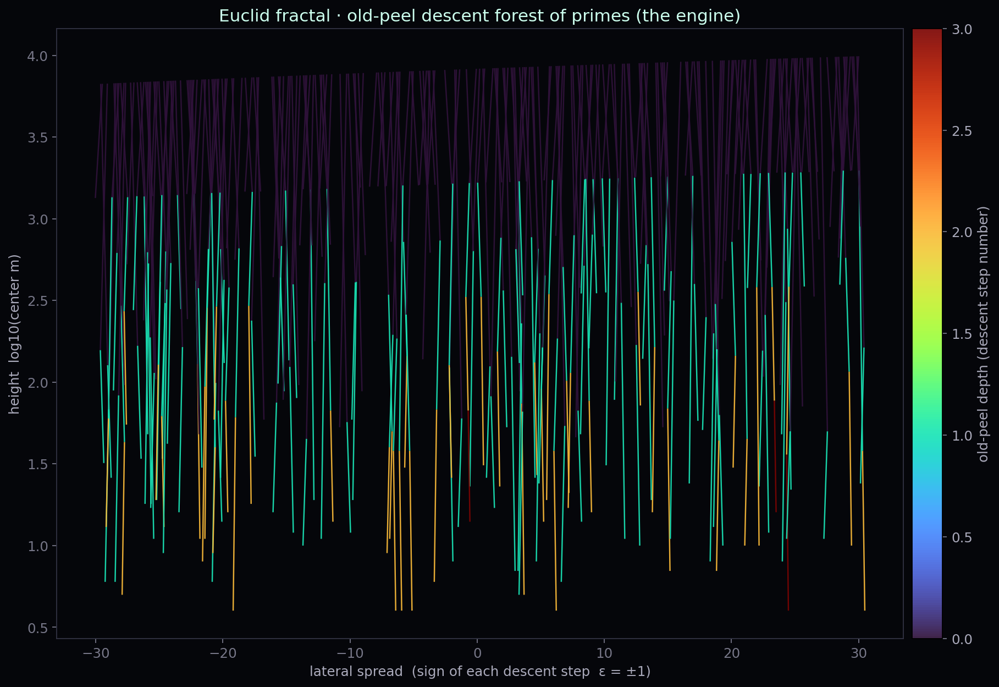

# Old-peel: catch as a step of descent

<!--navtop-->
[← 18. SNOL](18_SNOL.md) · [Table of contents](00_Overview.md) · [20. NOPSL →](20_NOPSL.md)
<!--/navtop-->

> Lean source: `EuclidsPath/Engine/OldPeel.lean` (theorems `catch_is_opposite`, `old_peel_sign`,
> `old_peel_height_drop`, `no_infinite_old_peel`, `old_peel_terminates`). Numbers:
> `tools/RESULTS_oldpeel.md` (3000 real rank-1 catches, `A=200`).

## Where we are

In chapter [18 SNOL](18_SNOL.md) the whole programme was reduced to a single machine-fixed node —
the **terminal shifted-neighbour obstruction** at the carrier scale: if the twins are finite, then for
an active prime `a > A` the neighbouring side `a-2\varepsilon` is systematically caught by a small
prime `p \le A`, which is written as the divisibility
$$p \mid a - 2\varepsilon,\qquad p \le A.$$

SNOL stopped precisely at the word *terminal*: the node was an honest reduction, yet it looked like a
dead end — the divisibility is there, but what to do with it remained open. The present chapter closes
this question.

We will show that the catch is **not a terminal but a step of descent**: it unfolds algebraically,
gives birth to a new smaller centre and strictly lowers the height. Thereby the final SNOL node closes
onto the impossibility of Euclid's engine already proven in [EPMI / Irreversibility] — *with no
counting and no distribution theory whatsoever*.

*Fractal of Euclid's path · **the old-peel forest**: a tree of descents in which every catch is a step
down along a branch. The branches do not sprawl outward but converge to the root: every branch is
finite and breaks against the bottom — this is `no_infinite_descent` in a picture.*

> **Generation algorithm (Figure 19.1).** Source: `tools/fractal/euclid_fractal.py::old_peel_tree`.
> Fix $A=200$ and sieve all primes up to $4A^2$; let the caught-prime pool be the primes $p$ with
> $3 < p \le A$. Seed a horizontal row of $460$ roots at abscissae $x$ evenly spaced over $[-30,30]$,
> the $i$-th root carrying centre $n = \lfloor A^2/6\rfloor + 7i$. From each root run the recursive
> descent $\mathrm{peel}(n,\varepsilon,d,x)$ for both signs $\varepsilon=\pm1$: it stops when depth
> $d>7$ or $n<2$; it requires the side $a=6n+\varepsilon$ to be a prime with $a>A$; it takes the
> opposite side $6n-\varepsilon$, finds the first pool prime $p$ dividing it, forms the quotient
> $q=(6n-\varepsilon)/p$, reads its sign $\delta$ from $q\bmod 6$ ($\delta=+1$ if $q\equiv1$,
> $\delta=-1$ if $q\equiv5$, and aborts otherwise), and sets the child centre $t=(q-\delta)/6$
> (aborting if $t\le0$). The step draws a segment from $(x,\ \log_{10}(n+1))$ to
> $(x+\varepsilon\cdot 0.55/(d+1),\ \log_{10}(t+1))$, then recurses into $t$ with both signs at depth
> $d+1$. Vertical axis is height $\log_{10}(\text{centre})$; horizontal offset encodes the descent sign
> $\varepsilon$. Segments are drawn as a line collection coloured by descent depth $d$ through the
> turbo colour map, on a near-black background.

## The catch is the other side of the wedge

We begin with an elementary observation that translates the SNOL divisibility into the language of the
engine. The active prime comes from a wedge centre `n`: one side of the wedge is the prime itself,
$$6n + \varepsilon = a,\qquad \varepsilon \in \{\pm 1\}.$$
The opposite side of the same centre is `6n - \varepsilon`. A direct computation gives

**Definition 19.1** (carrying the two). For a centre `n` with side `a = 6n+\varepsilon` the opposite side
equals
$$6n - \varepsilon = (6n+\varepsilon) - 2\varepsilon = a - 2\varepsilon.$$

This carrying is recorded formally as follows.

**Theorem 19.2** (`catch_is_opposite`). For integers $n,a,\varepsilon$, if $6n+\varepsilon = a$ then
$6n-\varepsilon = a - 2\varepsilon$ (in Lean — a single `omega` step). Hence the SNOL divisibility
`p \mid a - 2\varepsilon` is *literally* the divisibility of the opposite side of the wedge:
$$p \mid a - 2\varepsilon \iff p \mid 6n - \varepsilon.$$

> **Note.** From here one sees at once *why* SNOL cannot be refuted by counting (as was already noted
> in [18](18_SNOL.md)): `p \mid 6n - \varepsilon` is not a rare coincidence but the norm for the composite side of
> the wedge. Catching a neighbour is business as usual; what must carry the substance is not the
> *hit* but what happens *after* it. Below we extract structure, not probability, from the hit.

## Unfolding the catch into old-peel

Since `p` divides `6n - \varepsilon`, the quotient can be written in the same wedge form `6t + \delta`.
This is the central notation of the chapter.

**Definition 19.3** (old-peel). The *old-peel* of an active centre `n` along a caught prime `p` is the
decomposition of the opposite side
$$6n - \varepsilon = p\,(6t + \delta),\qquad p \le A,\ \varepsilon,\delta \in \{\pm 1\},$$
producing a **new centre** `t` (the quotient centre) and its sign `\delta`. The prime `p` here is
*old* (already present in the ledger — the bookkeeping of the programme's flows, see the [glossary](GLOSSARY.md); `p \le A`); hence the name old-peel: we "peel off" the old
layer `p` and expose beneath it the smaller centre `t`.

Thus the divisibility ceases to be a dead end: it itself supplies the object of descent — the centre
`t`, smaller than `n`. It remains to prove three things: that the notation is sign-consistent
(the sign law), that it is genuinely *smaller* (the height drop), and that a flow of such steps cannot
be infinite (termination).

## The sign law: δ = −π·ε

The sign of the new centre is not arbitrary — it is rigidly determined by the signs of the input. Let
`p \equiv \pi \pmod 6`, `\pi \in \{\pm 1\}` (every prime `> 3` gives `\pi = \pm 1`).

**Theorem 19.4** (`old_peel_sign`). If `6n - \varepsilon = p(6t+\delta)`, `p \equiv \pi \pmod 6` and
`\varepsilon,\delta,\pi \in \{\pm 1\}`, then
$$\boxed{\ \delta = -\,\pi\,\varepsilon\ }.\tag{19.1}$$

*Why.* Reduce the decomposition modulo 6. From `p \equiv \pi` we write `p = \pi + 6k`, whence
$$p(6t+\delta) = \pi\delta + 6\big(\pi t + k(6t+\delta)\big) \equiv \pi\delta \pmod 6.$$
On the other hand `6n - \varepsilon \equiv -\varepsilon \pmod 6`. Hence `-\varepsilon \equiv
\pi\delta \pmod 6`, and since all three signs lie in `\{\pm 1\}`, the congruence modulo 6 turns into
the equality `\delta = -\pi\varepsilon`. This is exactly how the Lean proof is arranged: the
substitution `p = \pi + 6k`, extraction of the factor 6 (`hexp`), reduction modulo 6 (`hmod6`) and a
case sweep over the eight sign combinations via `omega`.

> **Note.** The sign law is no cosmetics. It says that the new centre `t` is born with a
> *predictable* orientation, consistent with the orientation of its parent and with the class of `p`
> modulo 6. This makes old-peel a *deterministic* step of the ledger rather than a random
> factorisation: the next node "knows" in advance which side of the wedge it occupies. Numerically the
> law holds on **3000/3000 = 100%** of real catches (`RESULTS_oldpeel.md`).

## The height drop: t < n

Now the key point — that old-peel *lowers* the height. As the height of a centre it is natural to take
`n` itself (the order of the wedge).

**Theorem 19.5** (`old_peel_height_drop`). If `6n - \varepsilon = p(6t+\delta)` with `p \ge 5`,
`\varepsilon,\delta \in \{\pm 1\}`, `t \ge 1` and `n \ge 2`, then
$$t < n.\tag{19.2}$$

*Why.* Every prime `p \le A` caught at the carrier scale is a prime `> 3`, hence `p \ge 5`.
Then `6t + \delta = (6n - \varepsilon)/p \le (6n+1)/5`, from which, for `n \ge 2`, immediately `t < n`.
In Lean this is a sweep over the signs `\varepsilon,\delta` followed by `nlinarith` on the
inequalities `p \ge 5`, `t \ge 1`, `n \ge 2` and the decomposition `hpeel` itself.

Numerically the descent is even sharper than the statement of the theorem: the harness yields `t < n/5`
on **3000/3000 = 100%** (the factor `p \ge 5` eats away at least a fifth of the height in a single
step). The theorem proves the soft, reliable bound `t < n`; the observation `t < n/5` is its empirical
strengthening.

> **Note.** Here is where the terminal turns into a descent. The SNOL divisibility `p \mid
> a - 2\varepsilon` is not a "wall" against which the active prime shatters, but a *step downward*:
> every catch sends us to a strictly smaller centre `t`. The regeneration of the flow (that `t > 0`,
> the flow continues rather than collapsing to zero) is likewise confirmed on **3000/3000 = 100%**.

## Why the descent is a contradiction: the old engine

Let us assemble the three laws into a single dynamical conclusion. Suppose, contrary to SNOL, that
there is *no* terminal, i.e. for every active centre its catch unfolds by an old-peel (`regenerate` —
see [20](20_NOPSL.md)). Then from any starting point one builds a sequence of centres
$$z_0 > z_1 > z_2 > \cdots,\qquad z_{k+1} = t\big(z_k\big),$$
where every inequality `z_{k+1} < z_k` is given by Theorem 19.5 (`old_peel_height_drop`). This is an **infinite
strictly descending chain of natural heights** — and that we have already forbidden in Euclid's
engine.

**Theorem 19.6** (`no_infinite_old_peel`). For any `z : \mathbb{N} \to \mathbb{N}` with the property
`StrictAnti z`, `False` follows. In Lean this is literally `no_infinite_engine_descent z hdesc` —
the old-peel height is used as the very same Lyapunov chain that drives the engine's downward motion
into contradiction.

**Theorem 19.7** (`old_peel_terminates`). If `\forall k,\ z(k+1) < z(k)`, then `False`
(via `strictAnti_nat_of_succ_lt` and Theorem 19.6 (`no_infinite_old_peel`)).

*What is proven and what it means.* Machine-verified is the *closure core*: any infinite strictly
descending old-peel chain of centres yields `False`. The contraposition reads directly: an old-peel
flow *must* stop somewhere — run into a twin sink or return to the ledger by a clean return. Otherwise
it would ride downward forever, which is impossible in `\mathbb{N}` and forbidden by the already
proven impossibility of the engine (`no_infinite_engine_descent`, [EPMI / Irreversibility]).

**Conclusion.** The final SNOL node
closes **not onto a new distribution theorem but onto the old engine** — this is the whole gain of the
chapter.

## Honest audit: where the input remains

Proven in Lean:
- the entire **old-peel algebra** — carrying the two `catch_is_opposite`, the sign law `old_peel_sign`,
  the height drop `old_peel_height_drop`;
- the **closure core** — infinite strict descent ⟹ `False` (`no_infinite_old_peel`,
  `old_peel_terminates`).

Numerically, on 3000 real rank-1 catches all three empirical laws hold at 100%: the sign law
`\delta = -\pi\varepsilon`, the height drop `t < n/5`, the regeneration `t > 0`. Old-peel is a real
mechanism, not a hypothesis: it is observed at every checked node.

What remains open is **one structural** (not counting-theoretic) input — in the programme's terms a
gate: an honestly named unproven statement still missing on the way to the goal (see the [glossary](GLOSSARY.md)).
To turn the contraposition into a complete
proof, one needs to know that the quotient centre `t` is *always* classified — falls into one of the
permitted categories rather than into a hidden "unclassifiable terminal":

**Conjecture 19.8** (old-peel regeneration, NOPSL). For every non-sink centre `t` its catch unfolds into a
correct old-peel successor, i.e. `t` belongs to one of the categories:
> 1. clean return (`t \in \Omega_A`; for `t < A^2` — a twin sink);
> 2. the next old-peel (`t \notin \Omega_A \Rightarrow \exists\, q \le A,\ q \mid 6t + \eta`);
> 3. fan-in / Hall (several lineages converge into a single `t`);
> 4. an already classified defect.

**Closure plan.** Show that the extended rigid-ledger is *closed under old-peel quotients*: applying
old-peel does not take a centre outside the classification and does not introduce a hidden cycle at
the `t`-node (the central point of the audit). This is in principle **not a counting** input — unlike
the former four-corner `H`, it calls neither Mertens nor the distribution of shift divisors, but lies
within the same logic of the engine's impossibility: "the flow has nowhere to go but down or into a
twin".

## Bridge to the next chapter

We have unfolded the final node of [18 SNOL](18_SNOL.md) into a strict descent and closed its core onto the proven
engine. Exactly one premise remains — the regeneration `regenerate`: that the old-peel flow cannot
forever evade a correct sink. In chapter [20 NOPSL](20_NOPSL.md) we formalise this premise by the abstract
structure `OldPeelLedger` (height, sink, step, `step_drops`, `regenerate`) and machine-prove the full
closure `OldPeelLedger \Rightarrow \mathrm{TwinLowers.Infinite}` through the same strict-descent
logic — thereby carrying the entire SNOL/NOPSL reduction from prose into verified deduction.

<!--navbot-->

---

[← 18. SNOL](18_SNOL.md) · [Table of contents](00_Overview.md) · [20. NOPSL →](20_NOPSL.md)
<!--/navbot-->
