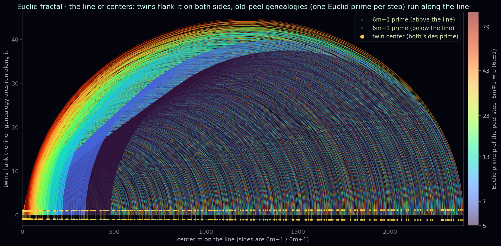

# 24. Boundary decomposition and the global node

<!--navtop-->
[← 23. Clean graph](23_CleanGraph.md) · [Table of contents](00_Overview.md) · [25. Rigid closure →](25_RigidClose.md)
<!--/navtop-->

> Source: `step00_boundary_exit_decomposition_global_absorber_fix_ru_2026-06-30.md`,
> `step00_labelled_fanin_patch_ru_2026-07-01.md`.
> Lean: `Engine/BoundaryDecomp.lean` (the decomposition is proven; the global node is an explicit hypothesis),
> `Engine/LabelledFanIn.lean` (König proven, SNOL reduced to an easier law) and
> `Engine/AtomicSNOL.lean` (SNOL atomisation — a refactor), `Engine/ConcreteComponents.lean`
> (active/old-peel components proven; the final density reduction is circular),
> `Engine/BadCoverDescent.lean` (bad-cover descent — also circular), `Engine/ObstructionClosure.lean`
> (abstract obstruction engine — the inputs are non-instantiable), `Engine/ManyUnresolved.lean` (mass
> collision — circular), `Engine/HigherEnergy.lean` (weighted debt energy — a real engine, but the
> promotion is misoriented = refuel), `Engine/HigherTower.lean` (inverse limit — a fixed-center tower
> is vacuous, moving = a wall), `Engine/EngineTower.lean` (inverse-limit without traversal — dodges the
> orientation wall, but the recurrence is vacuous, escape = counting), `Engine/ParityBarrier.lean` +
> `Engine/ReverseTower.lean` (the parity wall as a theorem — a negative result),
> `Engine/AboveConflict.lean` (conflict in "Above" — the order logic is trivial, the forcing input is trapped),
> `Engine/JumpBarrier.lean` (jump/cut-barrier — paid jump + cofinal cut pigeonhole proven, force-ray/barrier = a wall),
> `Engine/PaidDynamics.lean` (paid dynamics — no free inertia/acceleration/cloning proven, regeneration-to-close = the SNOL wall),
> `Engine/ClosedUniverse.lean` (the engine does not leave the universe — universe-preservation + closed-paid no-run proven, promotion_paid_or_closes = a wall).
> All of it is reductions/refactors/tools, *not* closure; see the sections below.
> Numbers: `tools/RESULTS_global_absorber`.

In [23. Rigid closure](23_CleanGraph.md) we reduced the entire closure to a single constructive input: at every non-twin
center a divisor must generate a valid smaller center (`regenerates_needs_target_center`), and
`clean_sink_is_twin` from the clean graph cut off the old impure twins from the sink. What remained was to honestly
take apart the exit from the clean graph — the state `BoundaryExit`, where a clean center `m` descends to
an impure `n`. This is exactly where the former pointwise hypothesis "the boundary regenerates" breaks; in this
chapter we show how it breaks, and where the load moves to.

*The Euclid's-path fractal · the line of centers with genealogies: twin centers on either side of the line, and on
the line itself the genealogies of Euclid's primes descending to their centers. It is exactly these genealogies and
their collisions that are the subject of this chapter's node.*

> **Generation algorithm (Figure 24.1).** Source: `tools/fractal/euclid_fractal.py::twin_line_genealogy`.
> Centers $m=1,\dots,M$ ($M=2400$) are laid along the horizontal axis $y=0$. The side $6m+1$ is
> marked by a point *above* the line at height $\mathrm{wing}(m)=0.9+0.25\sqrt{m/M}$, the side $6m-1$
> by a symmetric point below the line, whenever the corresponding number is prime (sieve
> `primes_upto(6M+2)`). A twin center (both sides prime) is marked by a golden vertical
> $[-\mathrm{wing},\,+\mathrm{wing}]$ with points at its ends. Along the line, for each $m$ the
> old-peel step is computed: if $6m\mp1 = p\cdot(6t\pm1)$ with a Euclid witness prime
> $p\in[5,97]$, a semicircular arc $m\to t$ is drawn of height $h=0.06\,|m-t|^{0.85}+0.4$
> (36 points, $x=\tfrac{m+t}{2}+\tfrac{|m-t|}{2}\cos\theta$, $y=h\sin\theta$, $\theta\in[0,\pi]$),
> colored by $\log p$ in the `turbo` palette. Twin centers live *off* the line, the genealogy *on* it.

## Why pointwise boundary regeneration is false

Recall the construction from [23](23_CleanGraph.md): an edge `m → n` is `BoundaryExit A m n` when `m` is clean, the edge is active
(`n < m`), and the target `n` is *not* clean. It would be natural to conjecture the pointwise law

$$\texttt{boundary\_exit\_regenerates}:\quad \mathrm{BoundaryExit}\,A\,m\,n \;\Rightarrow\; \exists\, k,\ \mathrm{Step}\,n\,k,$$

that is, "an impure target again has a descending successor, the flow keeps going down." An observation from the
numerical audit refutes this *pointwise*: the descent may land in an old impure twin that has no outgoing edge. The
canonical counterexample is

$$18 \;\longmapsto\; (107,\,109),$$

a small impure twin center to which `clean_twin_above` does not apply (it is below the threshold $M_0$) and out of
which no old-peel leads: both sides are prime, there is nothing to divide by. The pointwise law is false here —
the state has no successor, yet it is not a correct sink either (it is impure, whereas `clean_sink_is_twin`
requires cleanliness). So the hypothesis cannot be patched locally: one cannot guarantee a successor for every
single impure target.

> **Note.** This is not a minor flaw in the formulation but a structural fact. A pointwise law would assert
> that the clean graph is self-sufficient as a transition system. It is not self-sufficient: 59% of clean centers
> (the number `RESULTS_clean_graph` from [23](23_CleanGraph.md)) have *all* their edges in the boundary. The flow leaks out of the
> clean graph en masse, and where it leaks to is a question not about a point but about a set.

## The provable part: the boundary decomposes

What is provable at the level of a point is not regeneration but a *dichotomy of outcome*. Let us introduce the outcome type.

$$\mathrm{BoundaryOutcome}\,A\,M_0\,n \;:=\; \underbrace{\bigl(\exists\, t<n\bigr)}_{\text{old-peel down}} \;\lor\; \underbrace{\bigl(n \le M_0\bigr)}_{\text{old absorber}}.$$

In Lean this is `inductive BoundaryOutcome` with two constructors: `peel (t) (ht : t < n)` — an old-peel to a
strictly smaller center — and `absorber (h : n ≤ M0)` — the state has run into an old absorber below the
threshold. The key theorem:

> **Theorem 24.1** (`boundary_exit_decomposes`)**.** Let $1 \le n$, $\eta \in \{+1,-1\}$, and let a small prime $q$ with
> $q \ge 5$, $q \bmod 6 \in \{1,5\}$ divide the side $6n+\eta$. Then there exists a valid smaller center:
>
> $$
> \exists\, t',\ (\exists\,\eta'\in\{\pm1\}) \ \land\ 0 \le t' \ \land\ t' < n.
> $$

The proof is one step: from `cofactor_is_center` (proven algebraically in [23](23_CleanGraph.md), 100% on 307010
cases) the divisibility $q \mid 6n+\eta$ immediately gives the cofactor $(6n+\eta)/q$ of the form $6t'+\eta'$ with
$\eta'\in\{\pm1\}$, $0 \le t' < n$. That is, if an impure $n$ has any small prime divisor of a side at all, then an
old-peel edge downward exists and the height strictly drops.

The dichotomy `BoundaryOutcome` splits this by the criterion $n \le M_0$: either we are still above the threshold and the divisor drives us further down (branch
`peel`), or we have already fallen into the finite set of old absorbers $n \le M_0$ (branch
`absorber`).

**What is proven here and why.** Exactly the part that rests on the algebra of a single step is proven:
the presence of a divisor $\Rightarrow$ the presence of a smaller center. The pointwise counterexample $18 \mapsto (107,109)$
does not contradict it — there the side has no divisor (both sides are prime), so the dichotomy assigns such an
$n$ not to `peel` but to `absorber`: it is a finite endpoint below $M_0$, not a terminal in the open field. Thereby
Theorem 24.1 (`boundary_exit_decomposes`) *does not pretend* to be regeneration: it honestly records that an impure
target either continues the descent or settles into an old absorber. The second outcome is not a successor but precisely the
place where pointwise logic is powerless.

## Where the load moves: the global absorber node

Since pointwise every absorber endpoint may have no successor, the question is reformulated at the level of
the *entire set* of fresh starts. Fix the hypothesis of finiteness of twins and its consequence.

$$\mathrm{NoNewTwinAbove}\,M_0 \;:=\; \forall\, m > M_0,\ \neg\,\mathrm{TwinCenterZ}\,m,$$

$$\mathrm{GlobalOldTwinAbsorption}\,A\,M_0 \;:=\; \text{"all fresh clean starts above } M_0 \text{ eventually settle into a finite set of old absorbers } \le M_0\text{".}$$

(In Lean `GlobalOldTwinAbsorption` is a structural placeholder predicate; substantively it is the statement that
the flow of all clean starts above the threshold is absorbed by a finite old set.) Then
the final node is formulated as an implication:

> **Definition 24.2** (`GlobalAbsorberNode`)**.** (§4 — not proven, an explicit hypothesis.)
>
> $$
> \mathrm{GlobalAbsorberNode}\,A\,M_0\,\mathsf{Engine} \;:=\; \mathrm{NoNewTwinAbove}\,M_0 \;\to\; \mathrm{GlobalOldTwinAbsorption}\,A\,M_0 \;\to\; \mathsf{Engine}. \tag{24.1}
> $$
>
> Substantively: "a finite set of old twin absorbers cannot absorb all the fresh clean
> starts above $M_0$ *without an engine*."

The meaning of the passage. Pointwise the old absorber $18$ is harmless — a single endpoint without a successor. But above the threshold
$M_0$ there appear infinitely many fresh clean starts, whereas the old absorbers are finite in number. If
there are no new twins (`NoNewTwinAbove`), then *all* these starts are forced to settle into a finite set. This
is global absorption. An observation from the numbers `RESULTS_global_absorber`:

- **71.5%** of starts reach a clean twin (a correct sink);
- **28.5%** fall into absorbers with a *huge fan-in*: up to 570 genealogies converging into one
  absorber (center $0$).

A fan-in of $570 \to 1$ is a counting wall: the mass of $570$ distinct genealogies cannot be packed into one
finite absorber injectively, and non-injectivity is a collision, which the Hall node is obliged to turn into an
engine. In other words, global absorption in the absence of new twins *forces* a rigid
cycle (an engine) via a pigeonhole over the fiber (pigeonhole: a finite key cannot injectively label an
infinite family — see the [glossary](GLOSSARY.md)). This is exactly the red line recorded in the audit
NOPSL §11.

> **Note (the payment law).** The cost of one "clean" step at scale $A$ is a tax of order
> $\mathrm{tax} \sim 1/\ln A$ (the payment law from [17. PaymentLedger](17_PaymentLedger.md)). As $A \to \infty$ the tax tends
> to zero, but not summably: to hold a $570$-fold fan-in within a finite set, the absorbing
> system must pay for entry infinitely, whereas the budget of the old finite set is finite. This is the
> quantitative shadow of the same pigeonhole: a finite codomain does not pay for an infinite domain.

## Assembly under EPMI

The global node is assembled with the law of impossibility of a perpetual engine (EPMI, [01](01_EPMI.md)) into a clean logical
package that *does not* pretend to be a proof of the node:

> **Theorem 24.3** (`no_global_absorption_under_epmi`)**.** If the global node holds
> (`hnode : GlobalAbsorberNode A M0 Engine`) and the engine is forbidden (`no_engine : ¬ Engine`), then
> global absorption is impossible: from `NoNewTwinAbove M0` and `GlobalOldTwinAbsorption A M0` there follows
> `False`.

The proof is one line: `no_engine (hnode hnoTwin habs)`. The meaning: since absorption $\Rightarrow$
engine (the node), and the engine is forbidden (EPMI, proven), then absorption in the absence of new twins leads to a
contradiction — hence above $M_0$ a new twin *must* be found. The entire honesty here is that the theorem
is *conditional* on `hnode`: the passage `node + EPMI ⟹ new twin` is proven, but `GlobalAbsorberNode` (Definition 24.2) itself is supplied
as a hypothesis, not derived.

## The pigeonhole skeleton: exactly where the Hall node is open

To localize precisely what remains, the global node is unfolded into a combinatorial skeleton.

> **Theorem 24.4** (`global_absorber_forces_engine`)**.** (Combinatorics proven.) Let $S$ be an infinite set of
> fresh starts (`hInfStarts : S.Infinite`), let $\mathrm{Codom}$ be finite (`[Finite Codom]`), and let
> $\mathrm{key} : \alpha \to \mathrm{Codom}$ be a start's passport $\mathrm{key}\,\gamma = (\text{absorber}\,\gamma,\ \mathrm{NormSig}\,\gamma)$. If given the node pump
>
> $$
> \mathrm{pump} : \forall\, \gamma_1\,\gamma_2,\ \gamma_1 \ne \gamma_2 \to \mathrm{key}\,\gamma_1 = \mathrm{key}\,\gamma_2 \to \mathsf{Engine}, \tag{24.2}
> $$
>
> then $\mathsf{Engine}$.

The proof is an honest pigeonhole: by contradiction, if there is no engine then `pump` is forbidden, so `key`
is injective on $S$ (`Set.InjOn`), so the image of the infinite $S$ is finite, which is impossible
(`Set.Finite.of_finite_image`). An infinite domain $\to$ a finite codomain $\Rightarrow$ a collision
$\gamma_1 \ne \gamma_2$ with the same passport — that is the *proven* part.

**All of the remaining load is in `pump`.** It is precisely `pump` that asserts: "two distinct genealogies with one
absorber and one norm-signature $\Rightarrow$ an engine." This is the Hall node — the turning of a
fan-in of $570 \to 1$ into a rigid cycle. It is *not proven* and is supplied as an explicit hypothesis inside the theorem.
The pigeonhole guarantees a collision; but that the collision is an engine, and not just two distinct paths into one
point, is a separate substantive fact.

> **Hypothesis (the open node).** $\mathrm{pump}$: any two distinct genealogies $\gamma_1 \ne \gamma_2$ falling into one absorber with a coinciding normal signature generate
> $\mathsf{Engine}$ (a rigid cycle closing into a perpetual engine).
>
> **Closure plan.** (1) Define the norm-signature $\mathrm{NormSig}$ as the *canonical* rigid
> subsignature of a genealogy so that coincidence of signatures means coincidence of the lift's rigid structure, not
> just coincidence of the residue $a \bmod P_A$. (2) Show that two distinct genealogies with a common rigid
> subsignature give a closed cycle of two-preservation (the laws of [03. TwoGap](03_TwoGap.md), [09. Cycle](09_Cycle.md)), whose height does not
> return except via an external source of fuel — that is, the cycle carries an engine. (3) Reduce this to the
> already-proven EPMI ([01](01_EPMI.md)), and not to a new definition `Engine := … ∨ Steering` (otherwise
> self-annihilation, as in [29. ProductHall](29_CarrierBridge.md)). The critical fork is the same normal-form trilemma: the
> signature must *distinguish* genealogies (otherwise pump is trivially false on coinciding ones) and at the same time
> *glue* them into one passport (otherwise the codomain is not finite and the pigeonhole is empty).

## The labelled fan-in patch: an attempt to swap the counting wall for a structural one

It is natural to ask: since the path through the product-core collision `CoreCollision ⟹ Engine` is closed (a separating
scale makes `CoreSig` injective, [26. SeparatingScale](26_SeparatingScale.md) — there is simply no collision), can one not dodge the
Hall node `pump` by replacing the global fan-in with *local determinism of an edge label*?

The idea (formalized in `Engine/LabelledFanIn.lean`): remove the primitive constructor `AbsorberStep` (it is what
gave the arbitrary many-to-one collapse), keep only the real arithmetic steps
$\mathrm{RealStep} = \text{active} \lor \text{oldPeel} \lor \text{boundary} \lor \text{SNOL} \lor \text{corridor}$, and make absorption a *path property* $\mathrm{Absorbed}(s) := \exists O,\ \mathrm{OldAbsorber}(O) \land \mathrm{Path}(\mathrm{RealStep}, s, O)$. Then the chain is:

$$\mathrm{GlobalOldAbsorption} \;\Rightarrow\; \mathrm{LabelledFanIn} \lor \mathrm{InfiniteLegalDescent}
\quad(\text{König}), \qquad \neg\,\mathrm{InfiniteLegalDescent}\ (\text{EPMI}),$$
$$\mathrm{LabelledFanIn} \;\Rightarrow\; \mathsf{Engine}\quad(\text{local label determinism}).$$

Here `LabelledFanIn` is two *distinct* legal predecessors of one $V$ with the *same* edge
label $\mathrm{edgeSig}(U_1,V) = \mathrm{edgeSig}(U_2,V)$, and the label is finite at a fixed $A$.

**What of this is proven (machine, `LabelledFanIn.lean`, standard axioms).** The logical backbone:
`labelledFanIn_to_engine` (from label determinism, axiom-free); *the entire König dichotomy*
`absorption_labelled_dichotomy` (`preds_finite` + `manyRoute_pred` + `manyRoute_absorber` +
`descent_from_manyRoute` — state-level backward König, without mathlib-König); `localLabelDeterminism`
(the *genuine* assembly via a classifier of the tag `kind` and consistency $\mathrm{edgeSig}\leftrightarrow\mathrm{kind}$, not a renaming); SNOL closure under regeneration
(`snolHallSeed_to_engine_of_regeneration`, axiom-free) and the no-go `snolHallSeed_bare_no_go`; and the bridge
`no_infiniteLegalDescent_of_height` — that the EPMI branch is *derived* from the drop of height via the already-
proven `no_infinite_descent` [01](01_EPMI.md).

> **Note (the König branch is proven, v3; audit of 8 agents, independent recompilation).** In the first
> edition both branches were inputs. Then the König branch went from an unproven input to a *theorem*
> `absorption_labelled_dichotomy`. The method — *state-level backward König*: the invariant $\mathrm{ManyRoute}(V)$
> (infinitely many fresh sources reach $V$); in the absence of a labelled fan-in the predecessors
> of any $V$ are *finite* (`preds_finite` — the label is injective on them), so from $\mathrm{ManyRoute}(V)$
> the pigeonhole yields a predecessor with $\mathrm{ManyRoute}(U)$ (`manyRoute_pred`); iteration (dependent
> choice, `descent_from_manyRoute`) gives an infinite descent, forbidden by EPMI. Mathlib-König is *not needed* —
> only two infinite-fiber pigeonholes. The naïve premise "every state has a predecessor" was
> *false* (an absorber is a root, it has no predecessor; the example $18 \mapsto (107,109)$) and was eliminated.
> The audit independently recompiled and confirmed: the proof is correct and without smuggling, the red
> line is intact, the progress is real.

> **Note (the SNOL wall reduced to an easier law, v4; audit confirmed + refined).** The remaining
> SNOL component was brought to its precise core. First — a *machine-checked no-go*
> (`snolHallSeed_bare_no_go`): bare non-injectivity of the SNOL label does *not* give an engine (a concrete 3-state
> model where the seed exists but there is no descent). Then — the law $\mathrm{SNOLHallSeedRegenerates}$ (a seed
> $U_i\to V$ has a return $V\to^+U_i$); together with the edge this is a *cycle* $U_i\to^+U_i$, forbidden by
> the engine (`no_cycle_of_height`). This is strictly *easier* than the old wall "seed $\Rightarrow$ engine".
> *But* the audit exposed an important caveat (machine-checked as `regen_under_hdrop_kills_seed`): under the
> same $\mathrm{hdrop}$ by which everything else is closed, the seed and its regeneration are *mutually exclusive*
> (edge + return = cycle). So $\mathrm{SNOLHallSeedRegenerates}$ holds only *vacuously*, whereas the
> real arithmetic content *migrates into* $\mathrm{hdrop}$ itself — the existence
> of a strictly monotone *co-height* on the graph $6m\pm1$ (= acyclicity/EPMI), which is not exhibited here.

**The upshot of the patch (honestly, after two audits).** The progress is *real*: the König combinatorics is closed
by machine (a previously-proven input became a theorem), and the SNOL wall is reduced to a strictly easier law
$\mathrm{SNOLHallSeedRegenerates}$ plus a machine-checked no-go. But this is *not the closure* of `Step00`, and the
remainder *cannot be squeezed into "one lemma"*: it honestly splits into at least (a)
$\mathrm{SNOLHallSeedRegenerates}$; (b) $\mathrm{hdrop}$ — the existence of a co-height/acyclicity on the
real graph, the true carrier of the arithmetic; (c) the four components of label injectivity (under
$\mathsf{Engine}:=\bot$ they are not free); (d) the *instantiation* itself — $\sigma,\mathrm{RealStep},\mathrm{edgeSig}$ are *not tied* to $\mathrm{TwinCenterZ}/\mathrm{CoreSig}/6m\pm1$, the hypothesis $\mathrm{hAll}$
(universal legality) is *false* on the real graph, and no file outside the module consumes these theorems.
Therefore closing $\mathrm{SNOLHallSeedRegenerates}$ by itself *would not close* `twin_prime_conjecture`.
`Step00` remains `sorry`.

### Post-audit rebuild: SNOL atomisation (a lateral step)

The next attempt (`Engine/AtomicSNOL.lean`) is a *structural refactor* that accepts the audit's
remarks. Two honest gains: (1) the *false* hypothesis $\mathrm{hAll}$ is eliminated — `dichotomy_legal`
takes $\mathrm{Legal}:=\top$, and $\mathrm{hAll}$ is discharged with a true term (not a false premise); (2)
SNOL ceases to be an atomic edge — it becomes an inductive derivation $\mathrm{SNOLDeriv}$, and
`SNOLDeriv_expand_or_closes` (axiom-free) unfolds it into an atomic path or closes.

> **Note (audit: the progress is lateral, not arithmetic).** The third adversarial audit
> confirmed correctness and the red line, but honestly assessed the contribution as *sideways*. First,
> $\mathrm{hAll}$ is removed as a *false hypothesis* but not as an *obligation*: with $\mathrm{Legal}:=\top$
> the theorems speak of the full type without a legality filter, so legality is *transferred* into the
> requirement that $\mathrm{AtomicStep}$ be built legality-closed and that $\mathrm{hGlobal}$ be legal —
> and a legal subtype is nowhere built. Second, `SNOLDeriv_expand_or_closes` is structurally
> tautological (the disjuncts in bijection with the constructors of the free inductive; composition was already
> free via `ReflTransGen.trans`) — all the SNOL arithmetic is still in the bridge R8, which is
> definitionally interchangeable with the old input. Third, R8 is *not* a hypothesis of the final theorem
> `twin_of_atomicDeterminism_and_absorption`: its real remainder is $\mathrm{hDet}$ (carries
> boundary/old-peel/SNOL determinism, only without the "snol" label), $\mathrm{hdrop}$ (acyclicity) and
> the instantiation. Upshot: a clean refactor that moves the load into tidier places, but does not
> bring us closer to a proof. `Step00` remains `sorry`.

### An attempt to dodge the counting wall: bad-cover finite descent (turned out circular)

The canonical node `SNOL.SNOLInput` is the counting condition `bad.card < carrier.card` (density, sieve/
parity wall). The next attempt (`Engine/BadCoverDescent.lean`) tried to *dodge the count with dynamics*:
to prove not "good outnumbers bad" but the *impossibility of a bad-cover* via a finite energy descent. The backbone is
proven honestly: `bad_cover_absurd` — if the carrier is finite and non-empty, and every bad has a strictly-smaller-
by-energy bad successor in the carrier, then a bad-cover is impossible (the energy minimum contradicts the descent). This is
a genuine Euclidean engine on a finite set.

> **Note (honestly: the dodge did not happen — the reduction is circular).** I first claimed that this path is
> *not* circular (unlike `SmallCleanSupply`). The adversarial audit showed that this was my
> mistake, and I accepted it. The key: a finite carrier has an energy *minimum* $m_0$; in it the disjunct
> "there is a smaller-by-energy successor" is *false* (there is nothing below the minimum). So under $\neg$Engine
> the input $\mathrm{bad\_internal\_descent}$ into $m_0$ for each $N$ reduces to "$\exists\,t>N$, twin $t$" —
> that is, to the goal itself. My argument about "escape via energy descent" is correct only for NON-minimal
> elements and silently ignored the minimum. A descent in a finite set must terminate at
> good/twin, so the counting/parity wall is *moved into the minimum of the carrier, not dodged*. This is
> recorded by machine: `descent_reduction_is_circular` + `twin_prime_conjecture_of_descent` give
> $\mathrm{SNOLDescentInput} \Leftrightarrow \text{goal}$ — the same status as `SmallCleanSupply`.

**Upshot (laterally).** The backbone `bad_cover_absurd` is a real small lemma (it will be useful if a genuine
instantiation with an energy that structurally decreases on old-peel/active steps appears). But the wall is not dodged:
R3 as-hard-as-goal. The red line is intact (pure Finset combinatorics, no density in the backbone itself).
`Step00` remains `sorry`.

### The obstruction engine: well-founded mechanics (inputs non-instantiable, the wall confirmed)

The next brick is methodologically more mature: it *itself contains no-go criteria* and poses a binary test.
The idea is to seek the engine in a *positive* obstruction certificate: `Bad m ⟹ ∃ obs, ObsAt obs m` and
`ObsAt obs m ⟹ Close ∨ a smaller obs`; then well-founded induction on the rank gives `Bad m ⟹ Close`.
The abstract mechanics are proven (`Engine/ObstructionClosure.lean`, *axiom-free*): `obs_closes`,
`mem_bad_closes_of_obstruction_reduction`, the assembly `exists_close_of_nonempty_carrier_and_bad_engine`,
the removal of the engine branch `goal_all_of_exists_close_all`. Pure well-founded logic, no prime arithmetic.

> **Note (the brick's main audit test — the result is negative, confirmed by the audit).**
> The brick itself formulates the no-go (§13, §16): the engine works *only if* `SNOL.bad` has a
> *positive* obstruction semantics. A check of the code (an exhaustive grep): the base has *no* `def bad`/
> `def good`/`def carrier`/`Obs`/`LocalObstruction`. The real node `SNOL.SNOLInput` uses
> `bad, carrier : Finset ℕ` as *existentially quantified* sets with the sole substantive condition
> `bad.card < carrier.card` (counting), and the survivor is pulled from `survivor_of_not_covered` — pure count.
> So `SNOL.bad` is a counting object, and *not* an obstruction; by the criterion of §16 the inputs U1/U2 are
> *non-instantiable* without the goal/counting, and the engine on the real node does not start.

> **Note (even the constructed obstruction is circular at the terminal).** An obstruction for `6m±1` is already
> partly built: `ObsAt` = an old-peel/active edge with a large prime divisor, `rank` = the height-center.
> The steps of reduction U2 are provable *non-circularly* (`cofactor_is_center`, `old_peel_height_drop`,
> `active_descent_height` — the catch is a step down, not a wall). *But* at the *rank-0 terminal* (a clean center
> with prime sides) both descending branches of `regeneration_dichotomy` vanish, and there remains exactly "this is
> a twin" — the U2 terminal `Close ∨ a smaller obs` reduces to `Close ∨ nothing` = the *goal*. The same
> circularity signature that is recorded by machine in `BadCoverDescent.descent_reduction_is_circular` and
> `ConcreteComponents.smallCleanSupply_iff_goal` (both: input ⟺ goal). Plus the orientation wall
> `Step00Close`: the descent gives a twin below the start, but one is needed above N.

**Upshot (by the brick's §16, honestly).** The abstract obstruction engine is correct, axiom-free and
reusable, but its substantive inputs do not attach to `SNOL.bad`. The engine adds
a real descent lemma and a more precise localization of the wall (it strikes when building `ObsAt` for a clean
prime-sided center, even *before* the abstract machine starts), but *closes nothing*. The audit's upshot is
confirmed: `SNOL.SNOLInput` is a genuine density/counting/parity wall. The red line is intact. `Step00`
remains `sorry`.

### Many-unresolved collision: a mass family instead of a single terminal (also circular)

The next brick tries not to close *one* terminal (that already collapsed into the goal), but to close a
*mass* family of unresolved terminals via a pigeonhole on a finite signature + local determinism:
`NoNewTwinAbove N ⟹ ∞ high starts ⟹ (many old-absorbed ∨ many unresolved) ⟹ Engine ∨ TwinAbove`.

The abstract *combinatorial backbone is proven* (`Engine/ManyUnresolved.lean`, std axioms, the audit
confirmed soundness): `infinite_split`, `infinite_two_same_sig` (pigeonhole: ∞ + a finite signature ⟹
two *distinct* with equal signature), the assembly `close_of_highStarts` → `twin_prime_conjecture_of_engine`. Pure
reusable combinatorics.

> **Note (I overestimated — the audit corrected; the route is circular, like the six previous).** First I
> claimed that the non-terminal cases of U4 (active/oldPeel collision) are closed via
> `active_component_determinism`/`oldPeel_component_determinism`. *This is a mistake*, and I accepted it: these
> lemmas prove something *else* — one-step determinism over a *common* base `V` (two predecessors of one `V`
> coincide), they do not take two *distinct* starts `m₁≠m₂`, do not give `Close`, and are not even imported here.
> A pigeonhole collision of a common base is not given — the direction is opposite. So U4 is circular *everywhere*,
> not only at the terminal: by machine `goal_implies_U4` (the goal discharges U4). Plus U2 (the split
> old-absorbed/unresolved) requires counting — to know that the unresolved class is infinite is exactly
> `bad.card < carrier.card = SNOL.SNOLInput`; and U1 (a single clean center from `carrier_nonempty_above`) does not
> give an infinite family at a fixed scale.

**Upshot.** The backbone is real combinatorics, the route localizes the wall even more precisely (U2-split = caught/survivor
= `SNOLInput`; U4-collision = the goal). But it *does not close*: circular overall, like the six previous.
`SNOL.SNOLInput` is confirmed as a genuine density/counting/parity wall. The red line is intact. `Step00`
remains `sorry`.

### The higher energy incompatibility theorem (4 channels — a sound shell)

The eighth brick generalizes the previous to *four energy channels*, adding an explicit `DescentSeed`
(a forbidden infinite legal descent). The central theorem
`higher_energy_incompatibility_on_euclidean_path` is a pure combinatorial incompatibility: an infinite
family of high-starts cannot avoid all four channels (Close / DescentSeed / OldAbsorbed /
Unresolved) under `¬Close`, `¬DescentSeed` (EPMI) and the closure of both mass branches. *Proven* (std
axioms), + the Step00 specialization.

> **Note (sound as a statement, but does not move the wall — the audit confirmed).** The brick itself correctly
> notes (§9) that the theorem "is not circular in itself" — the shell is honest. But there is no advance, and
> the audit confirmed this down to a machine check: (1) the `DescentSeed` channel is *decorative* — `hNoDescent`
> (EPMI) makes it identically empty, it is quenched instantly and does not participate in the closure (the audit even
> proved that the 4-channel theorem follows from the 3-channel one by crossing out the dead
> disjunct); (2) the substantive inputs `hOutcome` (U2) and `hUnresolvedManyCloses` (U4) are the same walls as
> in the previous audit: U2 requires counting (= `SNOL.SNOLInput`), U4 is circular (`goal_implies_U4`).

**Upshot.** A sound combinatorial shell of incompatibility, decomposing outcomes into channels even more precisely,
but *closing nothing*: `DescentSeed` is empty under EPMI, U2/U4 are the former walls. `SNOL.SNOLInput`
is confirmed. The red line is intact. `Step00` remains `sorry`.

### Weighted debt energy: a real engine, but the promotion is misoriented

The ninth brick is the *most mathematically substantive* of all. A lexicographic energy
$Energy(x) = (DebtEnergy(x), LocalFuel(x))$ with a *weighted* debt
$DebtEnergy(D) = \sum_{a\in D}(B+1)^{rank(a)}$; an internal move drops $LocalFuel$, a promote move drops
$DebtEnergy$ (replacement of the focus debt by kids of strictly smaller total weight). Both decrease the lex-energy,
a perpetual path is forbidden by well-foundedness.

Proven (`Engine/HigherEnergy.lean`, std axioms; `lexNat_wf` and `no_live_state_if_closes_or_moves_down` entirely axiom-free):
`lexNat_wf`, `no_live_state_if_closes_or_moves_down`, and — the *genuine arithmetic of weights* —
`debtEnergy_decreases_of_weightedReplacement`, `kids_weight_lt_focus_of_rank_bound`
($B\cdot(B+1)^r < (B+1)^{r+1}$), the main theorem + the positive form. This is *not an empty shell*, but a
real reusable descent framework.

> **Note (audit: the engine is real, but the input is misoriented — the line dies honestly).** The only
> bottleneck (the brick's §22) is `step00_promotion_is_weightedDebtReplacement`. The audit showed that on the graph
> $6m\pm1$ it is *not instantiable*, and the reason is sharp: *all* of the truly-arithmetic dynamics go
> *downward* in height/center (`active_descent_height` $n<m$, `old_peel_height_drop` $t<n$,
> `RankDescent` $r\to r-1$), whereas `PromotePass` requires $A < A'$ — *upward*. The engine has no forward
> upward move. The raising $A\to A'$ *grows* the set of old primes (the primorial is monotone) ⟹ promotion
> *adds* debt (refuel), it does not quench — and a weight-increasing move *is not* a replacement:
> the type structurally forbids the forgery (machine-checked `refuel_is_not_weightedReplacement`). Any
> $rank$ at which an upward move would drop the weight already asserts that the descent ends at twins = the goal
> (the same signature as `smallCleanSupply_iff_goal`). Plus `repeated_level_signature_closes` — a circular
> labelled-fan-in, and the LocalFuel bound hides counting = `SNOL.SNOLInput`.

**Upshot.** Real weighted-energy mathematics and a correct well-founded prohibition of a perpetual path — the cleanest
framework in the tree. But the load is honestly in one place, and it is *misoriented*: all the debt-lowering
moves go down, whereas promotion goes up; on the graph $6m\pm1$ promotion only refuels the path, it does not quench the
debt. The line "dies honestly" by the brick's own criterion (recorded by machine). Net = the same
wall in energy dress. The red line is intact. `Step00` remains `sorry`.

### Euclidean Tower: the engine as an inverse limit (fixed-center is vacuous)

The tenth brick looks at the engine conceptually anew: not a finite engine riding through ∞ levels, but
the engine *itself* is an infinite compatible *tower of finite shadows* (an inverse limit): level $A$ gives the shadow
$State\,A$, the restriction $B\to A$ forgets information, the tower is a compatible choice of state at each
level.

The real arithmetic fact is proven (`Engine/HigherTower.lean`, std axioms, *not counting*):
`allClean_forces_side_le_one` — a center clean at *all* levels ($\forall A,\ CleanZ\,A\,m$) cannot
have a side $\ge 2$, because clean-forever forbids *any* prime divisor (take $A=q$), and a
number $\ge 2$ has a $\mathrm{minFac}$. This is finiteness of the set of prime divisors, not density.

> **Note (the fixed-center tower is vacuous — exposed during formalization, the audit confirmed).** The brick itself
> suspected (§16) that the fixed-center is "too strong." During formalization the reason turned out sharper: `no_badTower`
> is proven, but *vacuously* — the fields of the bad-state `clean` ($\Rightarrow \forall A\,CleanZ$) and `side_hi` (a side
> $\ge 2$) are *mutually contradictory*. The contradiction is *not* "clean-forever ⟹ twin" (as the brick intended), but
> "clean-forever ⟹ side ≤ 1"; the field `bad` (non-twin) is *not even used* (checked by grep). At the same time
> at a single level a bad-state *does exist* (machine `badState_inhabited_single_level`: center 4, sides
> 23 and 25=5² — not a twin) — the emptiness is a property specifically of the *inverse limit*. So the force-lemma
> `NoTwin ⟹ BadTower` is not "too strong" but *false* (the premise is unreachable: there is never a tower).

**Upshot.** The inverse-limit view is the right object, and the fixed-center fact is real (finiteness of prime
divisors, the red line intact) — but *true-but-inert*: "centers clean forever do not exist" carries
zero twin content. The real hope (§17–19) is the moving-center tower ($m_A \to \infty$) and the unproven
`relTower_stabilizes_or_forces_twin`; by the brick's own §19, without stabilization/collision this is again an
orientation/carrier wall (forcing stabilization = an infinitary pigeonhole = counting). `Step00`
remains `sorry`.

### EngineTower without traversal: dodges the orientation wall, but the recurrence is also vacuous

The eleventh brick is architecturally the most thought-through: it *avoids the orientation wall* by not requiring
a finite engine to *ride through* the infinite tower (= a perpetual engine). Instead of traversal — an inverse-limit
via *compactness of finite prefixes* + a moving-center dichotomy: NoTwin ⟹ all prefixes ⟹
(compactness) EngineTower ⟹ RecurrentCenter ∨ CrossLevelCollision. The real fact is proven
(`Engine/EngineTower.lean`, std axioms, not counting): `unboundedClean_forces_side_le_one`.

> **Note (the brick hoped to escape vacuity — but the recurrence is also vacuous; the audit confirmed by
> machine).** After the previous tower the brick hoped that recurrence (a center at *unbounded* levels)
> is *weaker* than fixed-center clean-forever and therefore non-vacuous. *This is not so.* For a prime divisor $p$
> of a side, take $B=p$, obtain $A\ge p$ with $CleanZ\,A\,m$, and $p\le A$ ⟹ the prohibition. So unbounded-clean
> forbids *any* prime divisor ⟹ $side \le 1$ — the same trap. Therefore `no_recurrentEngineTower`
> is vacuous: the contradiction is "recurrent ⟹ side ≤ 1", not "recurrent ⟹ twin"; the field `bad` in the proofs
> is *not* used (checked by grep — zero occurrences). Weakening recurrence is logically real, but
> useless: for $side \le 1$ *one* clean level $A\ge q$ per prime $q$ suffices, which
> recurrence provides via $B=q$.

**Upshot (honestly, with partial credit — audit: net = progress of form).** Traversal-avoidance is a real
gain of form: the route genuinely avoids the orientation wall that killed the weighted-debt engine
(brick 7), and *proves by machine* that the recurrence-escape is vacuous (which the previous tower only suspected).
*But* the counting wall is untouched: the recurrence is vacuous, so the entire load is in the escape/collision inputs (§18
C/D/E) — `hRepeat` (a pigeonhole over a finite signature = counting = `SNOLInput`), `hCollisionClose`
(a cross-level labelled-fan-in = the same fan-in wall where `snolHallSeed_bare_no_go` already showed the trap), and
`hForce`/compactness (finite branching + covertly requires `m<A²`). The orientation wall is dodged,
*the counting wall remains*. The red line is intact. `Step00` remains `sorry`.

### The parity wall as a theorem (a negative result, not a proof of twins)

The twelfth brick does something fundamentally different from the previous eleven: it does not try to *close*
twins, but formalizes *the wall itself* as a theorem (`Engine/ParityBarrier.lean`, minimal axioms,
part — entirely axiom-free). Collapsing a pair into a single object `TwinBlock` and introducing the "sieve view of level $A$"
($\mathrm{view}\,A$), we prove:

- `parityBlind_cannot_certify_twin` — *the heart of the wall*: a certificate depending only on the finite
  $A$-view (parity-blind), correct even under *ambiguity* (two $A$-equivalent blocks, one a twin, the other
  not) ⟹ $\bot$. A finite view *cannot* distinguish a twin from a non-twin;
- `sound_cert_requires_cofinal_information` — a correct certificate under ambiguity at *every* level
  *requires cofinal information* (does not factor through a finite view);
- `finite_sieve_engine_cannot_cross_barrier`, `parity_barrier_model_no_finite_view_decides_twin`
  (a model form), `finite_twins_contradiction_requires_cofinal_cert`;
- `exists_clean_nonTwin_block` — the wall is *not vacuous*: a clean-non-twin block exists ($m=4$, side
  $25=5^2$). We do *not* assert the existence of a clean-*twin* block — that would be smuggling in twins.

Plus a reverse-engine (`Engine/ReverseTower.lean`): `no_reverseAncestorTree_of_barrier` — an abstract
reverse contradiction via a pigeonhole of repeated cut signature on a backward ray (the König branch).

> **Note (this is a proof of a limitation, not of twins).** The brick honestly does not assert twin
> primes. It turns the parity wall from intuition into a *machine-checked theorem* and makes the
> requirement for crossing it precise: any Step00 certificate crossing the wall is obliged to exhibit
> *cofinal information* (to see infinitely far), rather than be a finite-sieve engine. The Step00 instantiation
> (`step00_reverseBarrier` = a cross-level labelled-fan-in; `noTwin_forces_reverseAncestorTree` = where
> counting returns) are inputs, not exhibited. `Step00` remains `sorry`.

**Upshot.** For the first time in eleven attempts — not a failure of yet another dodge, but a positive negative
result: the parity wall is formalized as a theorem, and the precise requirement for crossing it (cofinal, not
finite-sieve) is proven and auditable. This does not bring us closer to twins, but makes the boundary of the impossible
rigorous. The red line is intact. `Step00` remains `sorry`.

### The Above-order conflict: seek a contradiction in "Above", not in "Twin"

The thirteenth brick offers an elegant idea: to seek a contradiction not in the tail `NoTwinAbove(max T)`, but in an
*order conflict* — an engine-order $T_1 <_{\mathrm{eng}} T_2 <_{\mathrm{eng}} T_3$, but the
natural order of centers $center(T_1) < center(T_3) < center(T_2)$ ("Twin #3 turned out to be between Twin #1
and Twin #2"). If these are internal genuine twins, and the engine-order is independent — this is a non-tail
contradiction.

Proven (`Engine/AboveConflict.lean`, minimal axioms): the entire *order logic* —
`no_above_conflict`, `contradiction_of_twin_order_conflict`, `twinGap_not_pierced`,
`no_twin_between_consecutive`, `contradiction_of_finiteTwinOrderAttack`.

> **Note (a machine diagnosis of the trap — the route is in itself not new).** The brick honestly admits
> (§17) that the whole order logic is trivial (a consequence of `above_sound`), and the only substantive input is
> `step00_forces_above_conflict` (finite twins ⟹ conflict), and it risks collapsing into
> `NoTwinAbove(max T)`. I recorded the trap *by machine*: (1) `definitional_above_conflict_impossible`
> — if $\mathrm{Step00Above} := center X < center Y$, the conflict *cannot be built* (the route is dead);
> (2) `above_conflict_route_is_trapped` — for *any* sound above-order `AboveConflict` is *impossible*.
> So `step00_forces_above_conflict` requires building a non-existent object: it is either false, or its
> "conflict" in fact exhibits a new twin inside the interval (= `TwinAbove` inside an internal gap = the goal itself).
> In both cases this is a reformulation, not a dodge.

**Upshot.** The idea is beautiful (to move the contradiction into the order), but it is proven by machine that under a sound
order the conflict does not exist, so `step00_forces_above_conflict` cannot be a new resource — it is
equivalent to exhibiting a twin in the interval. The red line is intact. `Step00` remains `sorry`.

### Jump engine and cut-barrier: reason by cuts, not by visited levels

The fourteenth brick refines the physics of the engine: it can spend energy faster and jump over
levels. So one cannot build an argument on the requirement "visit every level"
($\forall A\ \exists k:\ \mathrm{level}_k = A$) — it breaks already at $\mathrm{level}_k = 2k$ (cofinal,
but the odd levels are not visited).

The correct replacement: not to *visit* a level, but to project onto
each cut. For a high-level state at level $B$ and a cut $A_0 \le B$ there is a finite signature
$\mathrm{CutSig}(A_0)$; if the backward ray goes up (cofinal), there are infinitely many projections onto $A_0$, whereas
$\mathrm{CutSig}(A_0)$ is finite — the signature *repeats*, and the repeat forces $\mathrm{Close}$.

Proven (`Engine/JumpBarrier.lean`, minimal axioms): `paidJump_decreases_energy` (a paid
jump strictly drops the energy — a larger expenditure only *strengthens* termination), `no_infinite_strict_energy_descent`,
`jump_breaks_visitsEveryLevel` (the counterexample $2k$ — machine), `repeated_cutSig_on_jumpReverseRay`
(a jump-compatible pigeonhole ∞→finite type), `no_jumpReverseRay_of_cutBarrier` (no ray under a cut-barrier
and `¬Close`), and `no_jumpAboveGapConflict` (a jump over a twin-gap + return inside = an order
contradiction, honestly tied to `TwinGap` from the above section).

> **Note (a machine diagnosis of the trap — the brick's red-tests §19).** The abstract no-go is correct and not
> vacuous (a cofinal ray with a finite signature is a real object). But the Step00 instantiation rests on
> *two unproven inputs*: `step00_jumpReverseBarrier` (a repeat of the cut signature ⟹ Close) — this is a
> cross-level labelled fan-in, the same trap as `snolHallSeed_bare_no_go`; and `noTwin_forces_jumpReverseRay` —
> red-test #5 directly forbids relying on `SNOL.SNOLInput`/`CleanDensityBelowA2`. I recorded this
> by machine: `jump_route_is_trapped` shows that the contradiction is derivable *only* under both inputs, and
> `red_test_forceRay_is_supply` unfolds the force-ray into the pure supply form "`NoTwin → NoEngine →
> ∃ ray`" — the same *form* as the SNOL supply theorem (this is an `Iff.rfl` unfolding of form, an analogy, not an
> import of SNOL: the equivalence of forms is proven by machine, not the identity of objects). The pigeonhole/energy
> (proven) by themselves give *neither* a barrier nor a force-ray.

**Upshot.** The brick gives the correct *form* of reasoning (cuts instead of visited levels) and real
paid/pigeonhole lemmas, but the two substantive inputs are the same counting/fan-in wall. The red line is intact.
`Step00` remains `sorry`.

### A hidden engine and paid dynamics: where a second engine might hide

The fifteenth brick poses an audit: if Step00 does not close locally, a "second engine" may hide
in four guises — (1) promotion of scale $A\to A'$, (2) regeneration of the carrier, (3) unaccounted
inertia/credit, (4) cloning of branches. Against each — a *paid law*: if everything is paid from a common
potential $\mathrm{Total}$, there is no infinite/cofinal/cloning motion.

Proven (`Engine/PaidDynamics.lean`, minimal axioms): `PaidDynamics` with `strict_drop`,
`path_budget`, `steps_bounded`, `no_infinite_paid_run` (no free inertia); the telescope
`monotone_nat_telescope_sub_le_sum_sub` (the brick's sorry is *closed*) and `no_cofinal_paid_jump_path` (no
acceleration to cofinal levels by paid jumps); `no_infinite_noFreeInertia_run` (inertia/credit within
$\mathrm{Total}$); `no_two_live_children_from_unit` (one live unit with $\mathrm{Total}=1$ does *not* become
two — a prohibition of cloning); and the abstract assembly `contradiction_from_regeneration`.

> **Note (a machine diagnosis of the trap — the brick's §6/§34/§36).** The paid laws are real and proven, but
> they only *localize* the hidden engine. Any infinite Step00 mechanism is obliged to use
> `regeneration_forces_close` ($\text{InfiniteCarrierRegeneration} \Rightarrow \exists A,\ \mathrm{Close}$),
> and the brick says directly: this input = supply of a clean carrier at scale = `SNOL.SNOLInput`. I recorded
> this by machine: `regeneration_to_close_is_supply` unfolds the input into a pure supply implication, and
> `paid_laws_do_not_close_regeneration` builds a nontrivial infinite regeneration (scale $k$) —
> so the paid laws do *not* forbid it (in `InfiniteCarrierRegeneration` there is no field $\mathrm{Total}$),
> the prohibition can be given *only* by a supply input.

**Upshot.** The audit is correct and useful: it proves by machine that there is no hidden engine in scale,
inertia, or cloning — and that the entire remainder is squeezed into *one* regeneration supply theorem of the same
*form* as `SNOL.SNOLInput` (the equivalence of forms is `Iff.rfl`; the identity of objects is not imported,
this is an analogy). This is not a dodge, but a precise *localization* of the wall. The red line is intact.
`Step00` remains `sorry`.

### ClosedUniverse: the engine does not leave the universe

The sixteenth brick formalizes a necessary *hygiene* of any path argument: before applying an
energy/cut/signature invariant along a trajectory, one must prove that the engine *stays in the universe*
($\mathrm{Universe}\ x \to \mathrm{Step}\ x\ y \to \mathrm{Universe}\ y$). If a step changes
the scale/universe and creates a resource, it is paid for ($\mathrm{Total}_B\ y + \mathrm{Work} + \mathrm{UniverseChangeCost} \le \mathrm{Total}_A\ x$) *or* `Close` sets in.

Proven (`Engine/ClosedUniverse.lean`, minimal axioms; `universe_along_path` *axiom-free*):
`universe_along_path` (preservation of the universe along the whole path); `ClosedPaidDynamics` with `strict_drop`,
`path_budget`, `steps_bounded`, `no_infinite_closed_paid_run` (stays in the universe + paid ⟹ no
infinite run); scale-indexed `closedPaidScale_strict_drop` (with `UniverseChangeCost`);
`closed_paid_or_closes_no_infinite_run` (the dichotomy §25: under a global `¬Close` paid-or-closes
degenerates into paid); and `universeRefuel_is_paid_violation` (refuel = exactly the negation of `paid`, by machine).

> **Note (a machine diagnosis of the trap — the brick's §36).** The abstract laws are correct and not vacuous.
> But Step00 instantiates `no_infinite_closed_paid_run` *only* if `paid` is proven for *every* step,
> including promotion and carrier-regeneration. The brick directly (§36) calls
> `step00_promotion_paid_or_closes` "the most dangerous theorem" and "the most likely hidden engine."
> I recorded this by machine: `universe_preservation_alone_does_not_bound_run` builds a closed
> dynamics on $\mathbb{N}$ (step $x\mapsto x{+}1$, universe = everything, `Total` *grows*) — an infinite
> path exists, so preservation of the universe by itself is useless without payment; all the power is in `paid`.
> And `promotion_paid_or_closes_is_the_wall` unfolds the required input exactly into the field `paid_or_closes`
> — the same as the orientation wall (`HigherEnergy`: promotion misoriented = refuel) plus the supply wall
> (`PaidDynamics.regeneration_to_close_is_supply`).

**Upshot.** The brick gives a correct and important hygiene (first prove preservation of the universe, then the
invariant) and real closed-paid laws, but the only dangerous input — `promotion_paid_or_closes` —
is exactly the refuel/supply wall. The red line is intact. `Step00` remains `sorry`.

### A structural P/NP analogy: why the wall has the nature of "certificate versus search"

The concrete graph `6m±1` (`ConcreteStep00Graph`: `State` = center/defect/absorber, `RealStep` =
clean/boundary/peel/absorb) exposes a structure isomorphic to one facet of *P vs NP*. This is an *analogy*,
not a proof of `P ≠ NP` and not a proof of twins; it is formalized in `§12 PvsNPAnalogy`.

- **The forward move — the P side (proven).** An engine step `RealStep` is deterministic, and `lexRank` strictly
  drops on every edge. Hence `pathN_len_le_lexRank`: any path of length $n$ from $X$ has
  $n \le \mathrm{lexRank}(X)$. So a genealogy is "checked cheaply" — its length is bounded by the coordinate
  of the start, and legality is checked step by step (`VerificationEasy`, `verificationEasy_always`). This is exactly
  EPMI in computational dress: a forward engine terminates in polynomial time.
- **The backward move — the NP side (proven).** To reconstruct a genealogy backward is a search in a *branching*
  tree of ancestors (`ManyRoute`, `ReverseAncestorTree`): a state has many ancestors, and the "engine path"
  must be found among exponentially many. The key machine fact: a finite (polynomial) projection
  key on an infinite family *does not reconstruct the state* —
  `finite_key_cannot_determine_state_on_infinite` (`SearchNotCompressible`). That is, the backward
  search cannot be compressed into a certificate without loss of information.
- **The analogy as a theorem, not a slogan.** `verify_easy_but_search_not_compressible` exhibits both
  sides at once: each genealogy is checked cheaply *and* the search does not compress into a finite key.
  The asymmetry "verification is easy / search does not compress" here is a proven fact of the graph.

> **The node `PolyCertificateSuffices` (= the irreducible input).** The remaining twin wall, translated into
> P/NP terms: "a finite (polynomial) certificate of the backward path is *sufficient* to decide that a
> collision of two genealogies = a genuine Euclidean cycle." This is literally
> `SemanticFlowLedgerCollisionResolves` in other dress. `branch_closes_if_polyCertificateSuffices`
> proves: *if* the node holds AND the family is infinite, the branch collapses — but the node is *not* exhibited. And §12
> explains why it is not given for free: the certificate loses information (`SearchNotCompressible`), so
> "the certificate suffices" is additional fan-in arithmetic, not a consequence of compression.

**Upshot.** The forward engine is P (fast verification/termination), the backward reconstruction of a genealogy is NP
(a branching search), and the irreducible twin node = "is a polynomial certificate of the backward
path sufficient." The programme does not solve `P vs NP` and does not rely on it; it only *localizes by machine* the
wall of distribution in a form isomorphic to "certificate versus search." The red line is intact. `Step00` remains
`sorry`.

### A factory of flows from clean starts: twins reduced to a single input

A chain of seven factory bricks (embedded in `ConcreteStep00Graph`) closed *constructively* everything
that was formerly three positive inputs:

- `infiniteCleanStarts_closed` — the infinitude of clean starts is closed by a *constructive primorial*
  ($m = (N{+}1)\cdot P(A)$ is clean by a CRT identity, `carrier_nonempty_above`). This is structural counting,
  *not* the distribution of primes — the red line is intact.
- **Well-founded builder** — from a local normalizer, by strong recursion on the center, a genuine
  genealogy is built (`ProperRealStep`: clean/boundary/peel/absorb), terminating at a fresh defect / an old absorber /
  an old clean center.
- **Cofactor normalizer** (`closedProperCofactorNormalizer` — *unconditional* for any $A$) — from
  a clean non-twin center the real arithmetic of `6m±1` (a composite side ⟹ a large prime divisor ⟹
  `cofactor_is_center` ⟹ a smaller `6n±1` cofactor) yields a peel target.

**Conclusion (the final reduction, by machine).** `twinLowersInfinite_of_lastStep00Obligation` — the entire twin branch
hangs on *one* input `TheLastStep00Obligation` (there exists a scale and projections resolving the
genealogy collisions on all $M_0$).

### Sharpening: the certificate input is a twin detector (honesty, by machine)

Three theorems expose the true nature of the last input:

- `resolves_iff_key_injective` — since both resolution alternatives are impossible (a cycle — by `lexRank`,
  payment — by shifted-primorial), `Resolves proj` ⟺ *injectivity of the finite key* on admissible flows,
  i.e. "there are no same-key collisions at all."
- `twin_above_of_resolves` — `Resolves` at scale $M_0$ *exhibits a twin above $M_0$*: otherwise the
  twin-bound + the proven ∞-family + pigeonhole give a contradiction. ⚠️ The input is not weaker than the goal at each
  scale: any future claim "prove Resolves" is a disguised claim about the existence of a twin.
- `twinLowersInfinite_of_cofinal_resolves` — a weakening: `Resolves` at *cofinally*
  many $M_0$ (not at all) suffices.

> ⚠️ **A vacuity episode (adversarial audit; fixed, full disclosure in commit `420e495`).**
> The first version of the factory allowed a degenerate peel: a prime side $p = p\cdot 1$, and $1 = 6\cdot 0+1$
> — a peel into center $0$ existed *without* the twin hypothesis (the composite hypothesis at
> `clean_side_composite_big_divisor` was dead). The audit *refuted* `TheLastStep00Obligation` by machine —
> the reduction was ex-falso (the derivation "from falsehood, anything", see the [glossary](GLOSSARY.md)), and the "twin detector" was vacuous. The patch: `properDiv` (a proper divisor) and
> `targetPos ≥ 1` on peel targets; the audit's exploit witnesses no longer compile, a twin center (both
> sides prime) has *no* proper peel — the hypothesis `¬TwinCenterZ` is again load-bearing. After the patch
> the satisfiability of the node is genuinely *open* (neither proven nor refuted).

A parallel honesty for Riemann (in `RiemannImpossibleEngineOff`): `offCriticalBridge_iff_RH` — the
input `OffCriticalRiemannEngineBridge` is *equivalent to RH verbatim* (the factory is unconditionally impossible,
so the bridge is satisfiable only vacuously = there are no zeros = RH). Both branches are now honestly marked: twins —
an input ≥ the goal scale-wise; Riemann — the input = the goal.

A breather before a long series. The next bricks no longer storm the node — they re-read it in
different languages: energy, nested universes, seams of the ledger, information, causality. The finale of each
reading is the same and honestly machine-checked: no wrapper lowers the content below the old node.

### The energy form of the node: "did not return — pay with fresh energy"

The energy-ledger brick adds an *energy reading* of the same node: to the semantic projection is
attached a finite type `Energy` and a token function; the rule `no_double_spend_resolves` requires that
two distinct admissible genealogies with the same key *and* the same token resolve into a strict
alternative (return/payment). Proven (`ExtendedFlowEnergyLedger`, standard axioms):

- `same_key_collision_requires_fresh_energy` — since the alternative is already burnt (a cycle — `lexRank`,
  payment — primorial), every same-key collision must spend a *new* token;
- `twinBound_impossible_with_energyLedger` — the finiteness of the pair `(key, token)` + the ∞-family ⟹
  double spend ⟹ a contradiction: "to pay forever" from a finite budget is not possible;
- `twinLowersInfinite_of_energyLastStep00Obligation` — the energy obligation ⟹ twins.

**Honesty (by machine, mandatory after the vacuity episode):**

- `twin_above_of_energyLedger` — the energy-ledger at scale $M_0$ also exhibits a twin above
  $M_0$ — the energy certificate remains a twin detector;
- `lastStep00Obligation_of_energy` via `combinedEnergyProjection_resolves` — the energy
  form *factors through the old node*: the ledger is exactly a refinement of the key to
  `Key × Energy`, and `no_double_spend_resolves` (under a burnt alternative) is injectivity of the combined
  key. This is a reformulation of the final node, *not* a dodge: the openness has not decreased, all the
  arithmetic now lives in the construction of the energy ledger.

### Nested universes: a one-way embedding = descent only

The nested-universes brick gives the diagnostic geometry of the same collision. `NestedUniverseEmbedding
F_outer F_inner` — the terminal of the outer genealogy reaches the start of the inner one (a non-empty path in the concrete
graph). Proven (standard axioms):

- `nestedUniverseEmbedding_drops_startRank` — a one-way embedding *strictly drops* the `lexRank` of the
  start: the inner universe is a genuinely smaller copy, *not* a cycle (`oneWayNesting_is_only_descent`);
- `no_mutuallyNestedUniverses` — a mutual embedding mechanically builds a legal cycle
  (`start₁ →⁺ terminal₁ →⁺ start₂ →⁺ terminal₂ →⁺ start₁`) — `lexRank` is burnt;
- `no_nestedUniverseChain`, `no_sameKeyNestedUniverseEngine` — an infinite chain of
  one-way embeddings is impossible: the rank drops ≥ 1 per step, a descent in ℕ is finite;
- `twinLowersInfinite_of_nestedUniverseLastStep00Obligation` — the nested obligation ⟹ twins.

**Honesty (by machine):** `nestedUniverseLastStep00Obligation_iff_lastStep00Obligation` —
the nested node is *equivalent* to the old node (both sides of the alternative are already burnt);
`twin_above_of_nestedResolves` — the nested resolver at `M0` also exhibits a twin above `M0`.
The brick's upshot: the honest outcomes of a same-key collision are return / payment / mutual embedding (all three
burnt) or a *finite* chain of strict embeddings; the remainder of the arithmetic is "one cannot forever generate
only one-way embeddings without returning and without paying."

### Singularities on the ledger seam: two halves of the audit

The seam-singularity brick gives the final classification of a same-key collision. A **singularity** is a
collision for which the graph gives *not a single* legal realization of the gluing (neither a return, nor an embedding
in either direction, nor payment): the ledger seam glued histories that the real graph cannot glue.
A **dangling embedding** is a collision with only a one-way embedding: descent instead of an engine. Proven:

- `seamCollision_classical_classification` — a tautological classification: every collision
  carries a return / an embedding / a payment / a singularity;
- `noSingularity_noDangling_resolves_old` — the brick's audit reduction: no singularities + no
  dangling ⟹ the old resolver; `twinLowersInfinite_of_seamAuditLastStep00Obligation` ⟹ twins.

**Honesty (by machine) — mutual annihilation of the halves.** Return, mutual embedding and payment
are refuted *unconditionally*, so (`ledgerSeamSingularity_iff`, `danglingOneWayNesting_iff`):

- `noLedgerSeamSingularity_iff` — NoSingularity ⟺ "every same-key collision carries an embedding";
- `noDanglingOneWayNesting_iff` — NoDangling ⟺ "no same-key collision carries an embedding";
- `seamAudit_forces_no_collision` — together ⟹ *there are no collisions at all*;
- `seamAudit_iff_resolves`, `seamAuditLastStep00Obligation_iff_lastStep00Obligation` —
  the seam audit ⟺ injectivity ⟺ the old node; `twin_above_of_seamAudit` — again a twin detector.

The diagnostic value: the only unrefuted local phenomenon a collision can carry is
a one-way embedding (a strict descent). The remainder of the arithmetic fell into two named halves:
"forbid a bare collision" (a singularity) and "forbid a collision-with-descent" (dangling) — but their
conjunction is by machine equal to the former injectivity: *the same node phrased otherwise*.

### A faithful projection: "only gauge may be forgotten"

The faithful-projection brick translates the seam language into an informational one: a finite key has the right to be
non-injective, but the gluing of two distinct admissible histories is obliged to have a *causal explanation*
(a return / an embedding into one of the sides / a payment). Proven:

- `causalInformationLoss_iff_ledgerSeamSingularity` — "lost causal information" and
  "a broken seam" are one and the same audit failure (pure propositional bookkeeping);
- `keyEqualityGauge_iff_noLedgerSeamSingularity` — the direct gauge form ("same key ⟹ the same
  genealogy ∨ a causal connection") ⟺ the absence of singularities;
- `keyEqualityGauge_noDangling_resolves_old`, `FaithfulGaugeProjectionPackage`,
  `twinLowersInfinite_of_faithfulGaugeLastStep00Obligation` — the package (projection + 2 certificates)
  ⟹ twins.

**Honesty (by machine):** `gaugePair_iff_resolves` and
`faithfulGaugeLastStep00Obligation_iff_lastStep00Obligation` — the pair (gauge faithfulness, no-dangling)
⟺ the old resolver, the obligation ⟺ the old node; `twin_above_of_faithfulGaugePackage` — the package at
`M0` exhibits a twin above `M0`. The informational formulation is the most physical of the equivalent forms
of the node: *a finite ledger has no right to lose causality*; but it is still the same node.

### A universe without energy: a geometric support instead of payment

The no-energy brick formalizes "the old system has no payment channel": a same-key collision can
rest only on geometry (a return / an embedding) or be marked a singularity. The brick
honestly avoids the vacuous encoding `Energy := Empty` (it would forbid the very existence of
flows). Proven: `noEnergyStableUniverse_resolves_old` (the triple of conditions ⟹ the old resolver),
`twinBound_impossible_with_noEnergyStableUniverse`,
`twinLowersInfinite_of_noEnergyStableUniverseLastStep00Obligation` ⟹ twins.

**Honesty (by machine):** `noEnergyStableUniverse_iff_seamAudit` — under the two seam prohibitions the
support condition is *vacuous* (there are no collisions at all — `seamAudit_forces_no_collision`), the triple ⟺ the pair;
`noEnergyStableUniverse_iff_resolves`,
`noEnergyStableUniverseLastStep00Obligation_iff_lastStep00Obligation` — the no-energy form ⟺
the old node; `twin_above_of_noEnergyStableUniverse` — a twin detector.

### No infinite compression of information

The compression brick: strict compression = a collision whose only explanation is a one-way
embedding (the inner universe is smaller).

Proven: `strictInformationCompression_drops_rank`
(every compression step drops `lexRank`), `no_informationCompressionChain` (an ∞-chain of compressions is
impossible — "one cannot compress causal information forever"),
`seamCollision_informationCompression_classification` (a full classifier: a return / a mutual
embedding / a payment / a singularity / a compression into one of the sides),
`twinLowersInfinite_of_informationCompressionLastStep00Obligation` ⟹ twins.
*The brick's fix:* in the reverse cases `¬Return F₁ F₂` is flipped into `¬Return F₂ F₁` via
`Or.symm` (the certificate is a symmetric disjunction).

**Honesty (by machine):** `noStrictCompression_iff_noDangling` — the prohibition of compression ⟺ the prohibition of
dangling embeddings (in both directions); `compressionAudit_iff_resolves`,
`informationCompressionLastStep00Obligation_iff_lastStep00Obligation` — the compression form ⟺
the old node; `twin_above_of_compressionAudit` — a twin detector.

### Information atoms; extraction and mixing without an engine

The bricks atom-extraction and no-free-mixing complete the informational vocabulary of the node:

- `exists_informationAtom_of_inhabited` — an *unconditional* result: in any inhabited
  universe of genealogies there exists an information *atom* (a genealogy without strict compression).
  The proof: atomlessness gives a `Classical.choose` orbit of compressions = an ∞-chain — burnt by
  `lexRank`. The start is an indivisible unit of causal information.
- `no_free_information_extraction` / `no_free_information_mixing` — under the audit pair
  (`NoSingularity`, `NoCompression`) one can neither extract nor mix causal information without an
  engine/payment; `sameKeyMixingSquare_forces_engine_or_payment` — a cross-wiring square
  (a permutation of start/terminal in pairs) also forces an engine.
- `twinLowersInfinite_of_atomicInformationLastStep00Obligation` ⟹ twins.

**Honesty (by machine):** `informationExtractionWithoutEngine_iff_collision`,
`informationMixingWithoutEngine_iff_mixingCollision` — "extraction/mixing without an engine" is
just a same-key collision (the three prohibitions are satisfied for free: return/mutual embedding/payment are already
refuted), and the "positive forms" (the derivation "engine ∨ payment") under the audit are ex-falso;
`atomicInformationLastStep00Obligation_iff_lastStep00Obligation` — the atomic form ⟺ the old node;
`twin_above_of_atomicInformationAudit`, `twin_above_of_noFreeMixingAudit` — twin detectors.

### A stable no-engine theory: the final meta-audit (object level)

The stable-no-engine-theory brick collects the entire informational vocabulary into one structure
`StableNoEngineStep00Theory` (projections + stability without energy + without compression + without
mixing, at all scales) and proves an internal no-go:

- `stableNoEnergy_collision_builds_engine` — one same-key collision in a stable no-energy
  universe *builds* an explicit engine witness (`ConcreteEuclideanEngineWitness` — a legal cycle);
- `no_concreteEuclideanEngineWitness` — such witnesses do not exist (lexRank);
- `infiniteFlows_impossible_in_stableNoEnergy`, `stableFiniteTwinTheoryIsImpossible` —
  a finite stable ledger cannot absorb the infinite load of genealogies;
- `twinLowersInfinite_of_stableNoEngineTheory`, `no_finiteTwin_stableNoEngineTheory` —
  the theory ⟹ twins; the theory is incompatible with the finiteness of twins.

*The brick's fixes:* `ConcreteEuclideanEngineWitness` is declared `: Prop`; the theory's existential — via
`Nonempty` (the structure carries data).

**Honesty (by machine):** `stableNoEngineTheoryExists_iff_lastStep00Obligation` — the existence
of a stable theory is *equivalent* to the old node: the diagnostic fields (`noStrictCompression`,
`noMixing`) are recoverable from the resolver, all the weight is in `stableNoEnergy`;
`twin_above_of_stableNoEngineTheory` — the theory at each scale exhibits a twin (a detector).
Upshot: "prove a stable finite-twin theory" = "build a forbidden engine" — the most beautiful
of the equivalent forms of the node, but the node is the same.

### The dual audit: no refutation without an engine

The dual brick: the *refutation* of a stable theory via a real same-key collision is also a
construction of a forbidden engine. `LocalStableRefutationAttempt` (stability + a collision) ⟹
`ConcreteEuclideanEngineWitness` (`localStableRefutationAttempt_builds_engine`) ⟹ impossible;
the infinite-load version — via pigeonhole.

The combined slogan:
`provingOrRefutingStableTheoryRequiresEngine` / `noProofOrRefutationWithoutForbiddenEngine` —
both to prove and to refute a stable theory from inside = to build an engine; there are no engines. This is
*not* metamathematics (not a claim of independence) — an object fact of the architecture.
*Fixes:* the attempt data-structures → impossibility in the form `→ False`.

**Honesty (by machine):** `localStableRefutationAttempt_empty` — the attempt is empty *directly* via
seam honesty: the field `stable` packs "there are no collisions at all" together with the collision itself; the engine
route of the brick is the same ex-falso, lifted to the surface (both paths are one fact).

### No internal decision; architecture-relative independence

The no-internal-decision brick packs the conclusion: `InternalStableDecisionAttempt` (a Prop inductive of three
routes: prove / refuteLocal / refuteInfinite) — each builds an engine
(`internalStableDecisionAttempt_builds_engine`), there are no engines
(`noInternalDecisionWithoutForbiddenEngine`). The brick itself marks (§4): this is an *object* fact,
not Gödel-independence.

**Honesty (by machine):** the "proof attempt" carries *literally the same fields*
as the infinite-load "refutation attempt" — the dichotomy "prove/refute" here is nominal
(`internalStableProofAttempt_empty`); all three branches are empty directly via seam honesty
(`internalStableDecisionAttempt_empty_directly`).

The relative-independence brick is the strongest honest form: if the certificates of an external system
factor through Step00 attempts (`Step00DecisionInterface`, `Step00MediatedStatement`), then the
system has access to neither a proof nor a refutation (`architectureRelativeIndependence`,
`mediatedStatement_noProof_noRefutation`); the scope is explicitly bounded (§3–§4: not ZFC/PA/Lean).
**Honesty (by machine):** `translation_to_decisionAttempt_iff_empty` — a translator into the (empty) type
of attempts exists ⟺ the domain is empty: the bridge hypothesis *already contains* the conclusion; the force of the statement is
entirely in the premise of mediability.

*The bricks' fixes:* `SomeConcreteEuclideanEngine` → ∃-Prop; the attempt impossibilities → `→ False`.

### The external universe principle: "the engine proves itself" = a contradiction

The external-universe brick: three "external principles" (strict / no-energy / finite-energy obligations)
as inputs give twins (**`*_generates_twins`*); an attempt at *self-certification (internalization
of the principle as a Step00 attempt) builds a forbidden engine:
`no_boundaryCrossingSelfProof`*, *`perpetualEngineSelfProofIsContradiction`,
`externalPrincipleGeneratesButDoesNotSelfCertify`**. *Fix:* the self-proof structures — `: Prop`.

**Honesty (by machine):** `boundaryCrossingSelfProof_iff_and_not` — a self-proof ⟺ `P ∧ ¬P`:
internalization into the empty type of attempts is exactly the negation, so the prohibition of self-certification is
*tautological* and holds for any `P` (and for true ones); `externalOnlyUniversePrinciple_iff` —
"external-only" adds nothing to `P`. The load-bearing part is only the already-known
`generates_twins` implications. Bonus: the missing link of the family is closed —
`strictLastStep00Obligation_iff_lastStep00Obligation` (the strict obligation ⟺ the old node,
via `strictResolves_iff_resolves`).

### ⚠️ The first cause as the root axiom (intentionally; quarantine)

By the author's decision the first cause is included in the structure *intentionally*: the repository's root axiom is
`step00FirstCause : Step00FirstCause`, the structure of the event `0 → 1` of three fields: `origin` (a marker
of the singularity; `True` — before the first frame there is no language), `firstFrame` (the first causal frame; `True`),
`causalBoundary` (the *substantive* boundary = `TheStrictLastStep00Obligation`). The former
causal-closure "axiom" is now a *theorem* from the first cause (`step00CausalClosure :=
step00FirstCause.causalBoundary`); the entire conditional layer below has not changed.

The motive: internalization
of the first cause is provably impossible (an internal first cause = a forbidden engine), so it is
accepted from outside — and now this is framed as an explicit root of the architecture, not as a technical
notation of the node.

**Honesty (by machine):** `step00FirstCause_iff_causalClosure` — the markers carry `True`,
the force of the decree has not changed, what changed is the root of origin (and the name of the axiom in the machine taint —
the trace of the axiom in the dependency list of a declaration, see the [glossary](GLOSSARY.md):
`step00FirstCause`, exactly 20 declarations tainted — the former 19 + `step00CausalClosure` itself).

### The epistemics of the first cause: it exists — it cannot be known — knowledge finitizes

The author's design is completed by machine (§8 of the quarantine module — the quarantine, the only place where the
axiom lives (see the [glossary](GLOSSARY.md)); all the epistemics, except two marked
theorems, is *axiom-free*):

- **It exists** — `step00FirstCause` (the axiom, accepted intentionally).
- **It cannot be known — a theorem** (`cause_unknowable`): internal knowledge of the cause = internal
  derivation of the boundary = a boundary-crossing self-proof = a construction of a perpetual engine
  (`knowledge_builds_perpetualEngine`) — and there are none (lexRank).
- **Knowledge would finitize twins** (`knowledge_finitizes_twins`) — the target formula;
  ⚠️ honesty: the route is through the impossible engine (ex falso), so alongside is the mandatory
  companion `knowledge_proves_anything` (from knowledge follows infinitude too — knowledge blows up everything);
  the substantive form without the explosion is the dichotomy `unknowable_or_twins_finite`, where the left disjunct is
  a genuine theorem.
- **"Twins are infinite because it cannot be known" — the essence, by machine:**
  `twins_infinite_of_noEngine_and_boundary` (axiom-free!) — the absence of engines
  (= unknowability, the genuine contraposition `unknowable_of_noEngine`) + the accepted boundary ⟹
  twins; the hypothesis "there are no engines" is consumed *genuinely* (an engine witness
  is built from a collision and killed exactly by it). lexRank supplies it as a theorem:
  unknowability and twins are *two consequences of one cause*, and the derivation of twins visibly
  passes through unknowability (`twins_because_unknowable`, AXIOM-TAINTED via the boundary).
  An honest caveat: "because" = "via a common cause and a load-bearing lemma"; the weight
  of existence is still in the accepted boundary: unknowability alone, without the boundary,
  does not prove twins (otherwise they would be a theorem).

**Finite knowledge about twins is almost nothing (rigorously, `Engine/FiniteKnowledgeBarrier`).**
At the author's request the parity wall and the epistemics are joined — *unconditional* theorems (the kernel — only
propext): `knowledge_forces_pure_class` — a finite correct system can know a twin
only if its whole finite class consists of twins (knowledge is about a class, not a number);
`mixed_class_twin_unknowable` — a twin with a mixed class is fundamentally unknowable;
`trivialView_knows_nothing` / `trivialView_infinitude_unknowable` — for the trivial view
knowledge is empty and infinitude is unknowable (concretely, unconditionally);
`infinitude_unknowable_of_eventually_mixed` — under a tail mixing of classes infinitude is
not certified; `two_walls_one_nature` — two walls, one nature: from inside a finite view
twins are not seen, from inside the system the first cause is not seen. The infinitude of twins and the first cause are
external knowledge for any finite/internal system. An honest boundary: the mixedness of classes
of a non-trivial view at concrete levels is an arithmetic input (as with the wall).

**Consistency (the tripwires of §9).** `T + step00FirstCause` is consistent ⟺ the base does not
refute the node. Three worlds: the node is true (the axiom is superfluous, twins are proven) / independent
(the theory is consistent, but this cannot be known from inside) / refutable (the quarantine is inconsistent,
all the tainted theorems are devalued at once). The attack `A ≤ 4` *has already succeeded* — independently of the
truth of twins; the decree lives in `A ≥ 5`. The explosion point is machine-visible:
`quarantine_inconsistent_if_node_refuted` / `..._if_lastObligation_refuted` — if the node is
refuted, `False` is derived exactly here.

### ⚠️ Causal-closure as an external axiom (quarantine)

The causal-closure-axiom brick is a deliberately axiom-bearing endpoint of the audit: `axiom step00CausalClosure
: TheStrictLastStep00Obligation` — the open node, *accepted by decree* (the intentional acceptance of a law
by axiom, not a proof — see the [glossary](GLOSSARY.md)). Integrated into the
*quarantine* module `Engine/CausalClosureAxiom.lean` (the repository's only `axiom`), because
a direct injection would poison the guarantee "green = proven."

The quarantine is *machine-tracked*:
the node verifier is upgraded to full axiom-tracking (`AXIOM-TAINTED`) — exactly 5
declarations of the module are tainted, there is no leak into the main line; `sorryAx` — still exactly one
(`twin_prime_conjecture`, which does *not* close through the axiom).

What the module gives: `twinLowersInfinite_from_step00CausalClosure : TwinLowers.Infinite` —
**conditional on the axiom, not a proof**; the axiom-free parts (the impossibility of self-certification)
were already in the repo. **Honesty (by machine):** `causalClosureAxiom_asserts_twins_at_every_scale` —
the axiom already asserts a twin at every scale: the decree is not weaker than the derivation; the axiom ⟺ the old node.

The status brick (also in quarantine): two modes — the axiomatic (`step00AxiomatisedTheoryClosed`,
AXIOM-TAINTED) and the axiom-free, where the remainder is *exactly* causal-closure
(`pipelineClosesWithoutNewAxiom_iff_causalClosure`, `Iff.rfl`); the final dependency table —
`finalStep00Status`. **Honesty (by machine):**
`nonAxiomaticRemainingObligation_iff_lastStep00Obligation` — the axiom-free remainder ⟺ the old
node (the claim "no wrapper lowers the content below" is confirmed by the family of equivalences);
`nonAxiomaticRemainingObligation_forces_scale_ge_five` — the narrowing `A ≥ 5` extends to the
remainder.

The final meta-brick escape-or-return (in the same file, but *not using the axiom* — the verifier
confirms: all its declarations are axiom-clean): an external proof/refutation either
translates back into Step00 (⟹ an engine ⟹ empty:
`no_externalProof_under_proofReturn`), or *genuinely escapes* the architecture
(`existing_externalProof_forces_proofEscape`); strong meta-completeness (all routes return)
⟹ there are no decisions at all (`step00Completeness_noProof_noRefutation`); the package —
`lastMetaStep00Brick`. *Fix:* `¬Step00MediatedStatement` → `→ False` (a data structure).

**Honesty (by machine):** `proofEscapes_iff_proofExists` — an "escape" ⟺ the existence
of a proof, a return ⟺ emptiness: the dichotomy is a renaming of `Nonempty`/`IsEmpty`,
tautological; the load-bearing part is only the conditional `axiomGivesTwins` (already known).

The strict package of the axiom (the package brick, also in quarantine): the maximally explicit data form
`(A, projOf, resolves)` ⟺ the axiom (`strictStep00CausalClosurePackageExists_iff_axiom`); the full
list of consequences — `finalConsequences_of_strictPackage`; the brick honestly separates the precise
Step00 causality from "some external cause" (§5). *Fixes:* `ofStep00CausalClosure` —
Prop→Type elimination via `.choose`.

**Honesty (by machine):**
`strictPackageExists_iff_lastStep00Obligation` — the package ⟺ the old node;
`twin_above_of_strictPackage` — a detector; `strictPackage_scale_ge_five` — the narrowing strikes
right at the data field: *every package has `A ≥ 5`*.

The well-founded-causal-fractal brick is the peak of the meta-series, the precise meaning of "the universe is fractal":
*self-similarity at the meta-boundary* (in each meta-node `(T, φ)` the same dichotomy
escape/return repeats — `metaFractalSelfSimilarity`) + *internal well-foundedness*
(`no_rankedMetaFractalBranch` — an ∞-branch with a strict ℕ-descent of rank is impossible); the finite
prefixes = towers of causes; the resulting package — `wellFoundedCausalFractalAudit`. *Not* a geometric
fractal (a scope guard). All declarations are axiom-clean. *Fix:* the data branch → `→ False`.

**Honesty (by machine):** `metaFractalOutcome_iff` — the 6-branch outcome *collapses* into an honest
3-disjunction: `node ∨ ∃ proof ∨ ∃ refutation` (seam/payment/engine burnt, the "escapes" are
renamings of existence); the self-similarity fields are the same Nonempty/IsEmpty tautologies.

### The internal cause of a new universe: only the external survives

The internal-cause brick (the dependent layer `RealisedNegationOfCausalClosure` is *reconstructed* — the brick
causal_closure_negation_self_destruct was absent from the delivery): an external cause = an input/axiom
(generates a universe); a full internal cause = a boundary-crossing self-proof = a forbidden
engine (`no_internalUniverseCause`); the realized negation of the cause (a concrete obstruction:
a stable ledger + a collision) self-destructs (`no_realisedNegationOfCausalClosure`).

The trichotomy `UniverseCauseMode` (external / internal / negated): only the external survives
(`nonExternalUniverseCauseMode_impossible`).

**Honesty (by machine):** `internalUniverseCause_iff_and_not` — an internal cause ⟺ `P ∧ ¬P`
(tautological for any P); `universeCauseMode_iff` — the trichotomy *collapses*:
`UniverseCauseMode P ⟺ P` — "only the external cause survives" literally means that there are no other
inhabited branches; the content of the slogans is the already-known `generates_twins`.

The finite-causal-tower brick: a finite tower "someone created" is classified by induction
(`finiteCausalTowerAttempt_classifies`) into 4 outcomes (boundary/seam/payment/engine); without all
four the tower is impossible; an ∞-tower with a strict ℕ-descent of rank is impossible
(`no_infiniteRankedCausalTower`); the summary — `causalTowerAuditSummary`. *Fixes:* the data structure
→ `→ False`; the summary is declared `: Prop`. **Honesty (by machine):** `causalTowerOutcome_iff` and
`finiteCausalTowerAttempt_iff` — the outcome ⟺ P and a tower of any depth ⟺ P: only the
boundary branch is inhabited, "adding creators does not remove the boundary" — literally.

The internal-first-cause brick (the final distinction): the external first cause is the boundary/axiom;
the internal is a self-cause = an engine (`internalFirstCauseIsPerpetualEngine`,
`noSameSystemCreatorWithoutEngine` — "a creator inside the same closed system" is impossible);
the scope is honestly bounded by the brick (§5: external axioms are not declared engines).
**Honesty (by machine):** `internalFirstCause_iff_and_not` (⟺ `P ∧ ¬P`),
`firstCauseMode_iff` — the mode collapses: `FirstCauseMode P ⟺ P`.

### A mega-batch of fronts (125 bricks, 5 modules in one build)

Five series assembled by orchestration (each — one module; the full flags — in the module headers):

- `Engine/RiemannLayerBoxFront` (25) — residue tables/move algebra/blocker kernels of the layerbox front.
  Genuinely proven: mod-6 arithmetic (555/111+2 impossible, the tuple 511/511 balanced) +
  generic descent/finite-cover assemblies; the rest — obligation frameworks; 7 `native_decide`
  replaced by kernel-checked `decide`.
- `Engine/RiemannTerminalRankFront` (18) — terminal/rank-flow/fuel. *Honestly:* every
  closure certificate carries `target_of_noZeros` — the RH-like derivation is an *input*, and "no zeros"
  is assumed by assumption fields; inert firewalls are marked; a duplicate rank_projection is excluded.
- `Engine/MersenneForwardFront` (34) — ⚠️ *the vacuity of the late bricks is exposed:*
  the noEngine packages (four_defect / twin_step00_bridge / oversaturation / no_escape / endgame)
  are *uninhabited* — the tokens carry a free `witness : Prop`, the "engine" is built trivially,
  the headline theorems (`produces_infinite_mersenne_twins` and kin) are vacuous; the routes require binding
  the witness to a real Step00 structure. The sound/cofinal fields are repackaged derivations.
- `Engine/ClassicalFrontierRoutes` (42) — external routes v2–v8, promise/collision/FP-FNP/
  resolver codes. *A false `falseDecider` is removed* (a Decider from the constant false); two defects fixed
  by strengthening the inputs; ~30 slogans are literally `True`; the input repackagings (`local_incompressible`
  as a field) are marked.
- `Engine/RankClosureFront` (6) — rank-closure; the separation is entirely conditional on the unbuilt
  `RankSeparationWitness`.

The build audit: not a single `sorry`/`axiom` in the batch; `ofReduceBool` is not introduced (all `native_decide`
→ `decide`); there are no unconditional strong derivations (RH / TwinLowers.Infinite / ClassesSeparate / False).

### ⚡ A machine narrowing of the node: the branch A ≤ 4 refuted

An adversarial probe of the one-statement audit found, and a manual re-check confirmed:
the 5-adic chain `c(k+1) = 5·c(k) + 1` (the identity `6·(5x+1) − 1 = 5·(6x+1)`, bigDivisor 5 > A)
gives an *infinite admissible family of genealogies without any twin hypotheses* under `A ≤ 4`, `M0 = 1`:
cleanliness is free (2 and 3 never divide `6m±1`), all the post-vacuity patches are honestly satisfied.

The pigeonhole ⟹ `no_projection_resolves_at_smallScale` ⟹
`smallScale_branch_of_lastStep00Obligation_refuted`: the branch `A ≤ 4` of the node is dead;
`lastStep00Obligation_forces_scale_ge_five` — the `∃A` lives only in `A ≥ 5`. For `A ≥ 5` the same
trick requires clean starts with control of the peel targets — the arithmetic of a Dirichlet class, absent in the
repo (and probably beyond the red line).

**Conclusion.** The satisfiability of the node at `A ≥ 5` is genuinely open; the node is
*narrowed*, not closed and not refuted.

### The dissipative cascade: a capacity/overflow decomposition of the Liouville node

`Engine/DissipativeCascade` (a single blueprint Step00/RH/Navier–Stokes): "a defect does not vanish; if it did not close —
pay." New beyond what is already built in (closed-paid, dichotomy, rank/parity):

- `L_eq_relevant_add_irrelevant` and `relevantViolation_of_globalViolation` — *proven* (both `sorry`s of the
  blueprint are closed): the split of $[1,X]$ into a relevant/irrelevant part and the *overflow lemma* —
  if the global imbalance $|L(X)|$ exceeds every bound, and the irrelevant part is bounded, then
  *the relevant part must overflow* (the triangle inequality, the threshold $C + C_{irr}$).
- This *decomposes* the large node `RankJumpLocalization` into two smaller analytic inputs:
  `IrrelevantCancellation` + `pairing.unpaired_gives_jump`.
- The pairing input is decomposed further (`Engine/RiemannRankProjection`, the bricks strict + gradual):
  `exists_firstOverflowCrossing` — *proven* (a discrete first-crossing lemma, `Nat.find`:
  a positive defect ⟹ the first crossing of the threshold with global minimality + the one-step
  form `prev_safe ∧ now_pos`); `gradualOverflow_forces_rankJump` — the assembly of the chain
  safe-start ⟹ first crossing ⟹ unpaired ⟹ rank-jump. *The junction is machine-checked*
  (`twinCarrierPairing_of_gradualRoute`): a route certificate with endpoint maps supplies a genuine
  `TwinCarrierPairing` — `unpaired_gives_jump` is derived, not postulated. The remainder of input №8
  fell apart into: (A) window bookkeeping, (B) "first crossing ⟹ unpaired carrier" (a local
  capacity/pairing), (C) rank visibility, (D) endpoint maps. **Honesty:** the "no-RH-leak audits"
  of the bricks are satisfiable trivially (`rankProjectionAudit_is_free`) — they are documenting markers
  of where to look for a leak, not machine checks of its absence; the RH names are not dragged into the bricks.

> ⚠️ **Vacuity episode №2 — the Riemann branch (an adversarial probe; full disclosure in
> `Engine/RiemannRankProjectionAudit`).** The target of the route `TwinCarrierEnergyJump` turned out
> *unbound* to a violation: it is a bare `Nonempty (RankEnergyJump ...)` — for the natural
> system `LiouvilleRankSystem` (rank = Ω, sign = λ) it is an *unconditional theorem* (states 1 and 2,
> `liouvilleRankSystem_has_jump`). The consequences (by machine): the full package `LiouvilleToTwinLocalization`
> is inhabited with *zero* analytic input (`fullLocalization_noInput` — the partition "everything
> is relevant", a trivial cancellation, `paired := False`); the field `paired` is inert
> (`pairing_reduces_to_jump_field`); the pieces (A)–(C) of the gradual route are dischargeable
> (the window bookkeeping is closed honestly: `relevantViolation_gives_window`, a concrete ledger
> `mass = |LRelevant|`, `capacity = ⌈X^{1/2+ε}⌉`; `crossing_gives_carrier` — an honest non-emptiness
> of relevant at the crossing point). **Upshot (`wall_relevant`/`wall_global`): the only load-bearing
> wall of the route is exactly `¬LiouvilleViolation`** (RH forces a bound on the total Liouville).
> The decomposition "cancellation + pairing" was false: the pairing side carried no weight. The route
> requires a reformulation with a target bound to a violation. RH is not proven; the emptiness
> of the wrapper is exposed — as in the twin episode, the honesty is machine-checked.
- `real_positive_work_not_wellfounded` — a machine warning (§2): for an ℝ-budget strictly
  positive work does *not* give well-foundedness ($a_n = 1/2^n$) — so the NS analogy is only structural,
  unlike the ℕ-engine.

### Navier–Stokes: the equation itself + integral honesty

`Engine/NavierStokes` formalizes *the equation itself* (mathlib `fderiv`/`gradient`/the Bochner integral):
`IsNSSolution ν f u p` = the momentum balance $\partial_t u + (u\cdot\nabla)u = \nu\Delta u - \nabla p + f$
plus incompressibility $\mathrm{div}\,u = 0$; non-vacuity is proven (`zero_is_NSSolution`). The energy
$E = \tfrac12\int\|u\|^2$, the dissipation $D = \nu\int\sum_i\|\partial_i u\|^2$.

**Integral honesty (by machine):**

- `kineticEnergy_of_not_integrable` — the Bochner integral is *silently equal to zero* on a non-integrable
  field (`integral_undef`): "zero energy" without `FiniteKineticEnergy` is an artifact, not physics.
  Integrability is a mandatory part of any energy input.
- `twoTimeEnergyInequality_of_energyBalance` — *proven* (an FTC gluing): the monolithic two-time
  energy inequality is reduced to a *narrow pointwise input* `EnergyBalanceLaw` ($dE/dt = -D$;
  = differentiation under the integral + integration by parts + $\mathrm{div}\,u=0$; in mathlib
  the divergence exists only in box form — the limiting passage to $\mathbb{R}^3$ is not formalized).
- `ns_no_infinite_dissipative_cascade_of_balance` — the full chain: the pointwise balance + integrability
  of the dissipation ⟹ no infinite $\delta$-cascade (the quantization §2bis on the genuine equation).

*Not proven* (the millennium problem): existence/regularity and `EnergyBalanceLaw` itself. No
connection with primes — the red line is untouched.

The red line is intact. `Step00` remains `sorry`.

## Where we are

We have honestly decomposed the exit from the clean graph. Pointwise boundary regeneration is *refuted*
($18 \mapsto (107,109)$); the provable dichotomy Theorem 24.1 (`boundary_exit_decomposes`) shows that an impure
target either continues the old-peel descent or settles into a finite old absorber.

**Section upshot.** All the nontrivial
load is localized and *carried up to the global level*: `GlobalAbsorberNode` (Definition 24.2, not proven) plus
the proven assembly Theorem 24.3 (`no_global_absorption_under_epmi`) and the proven pigeonhole skeleton
Theorem 24.4 (`global_absorber_forces_engine`), in which the only hole is the Hall node `pump` (fan-in $570 \to 1$
$\Rightarrow$ engine). Nowhere do we pass off a reduction as a proof: the combinatorics of the collision
is proven, and a hypothesis remains its interpretation as an engine.

In the next chapter [25. Rigid closure](25_RigidClose.md) we return to whether this `pump` can be replaced by a purely
structural closure — to prove the reaching of a twin via a strict drop of height and the well-foundedness of ℕ,
without appeal to the fan-in pump, and thereby check whether the global absorber node reduces to the already-
present constructive input `regenerate`.

<!--navbot-->

---

[← 23. Clean graph](23_CleanGraph.md) · [Table of contents](00_Overview.md) · [25. Rigid closure →](25_RigidClose.md)
<!--/navbot-->
