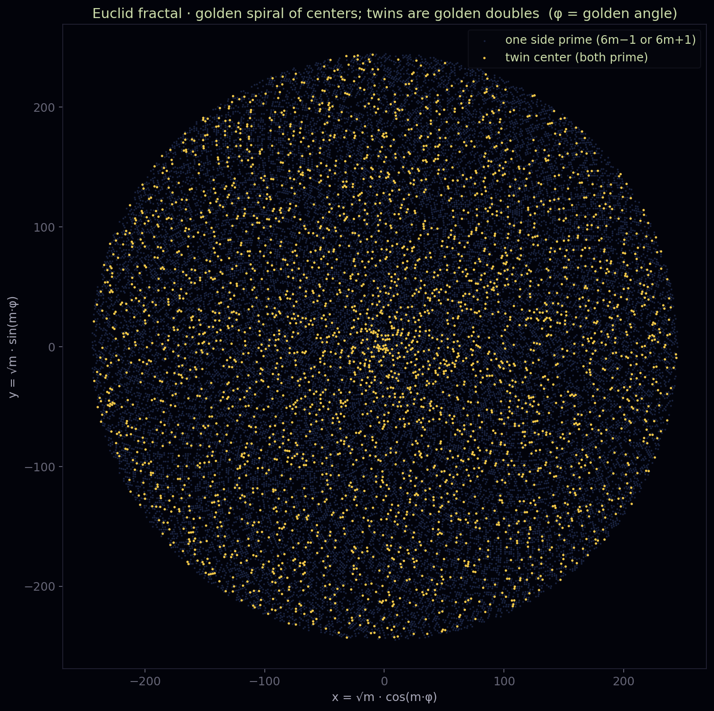

# Кода: путь Евклида как возможная структура пространства-времени

<!--navtop-->
[← 49. Геометрия пути](49_Geometry.md) · [Оглавление](00_Overview.md) · [51. Численные данные →](51_NumericalEvidence.md)
<!--/navtop-->

> Синтез. Новых теорем здесь нет — только их смысл, собранный вместе. Всё, на что мы опираемся,
> уже доказано в главах [01](01_EPMI.md)–[43](43_MersenneFirstCause.md); космологическое и физическое прочтение — их перевод, а не
> добавление. Границу между строгим и истолкованным мы держим на виду до последней строки.

## Где мы

Мы прошли семь великих вопросов — близнецов, Римана, P/NP, Янг–Миллса, Навье–Стокса, Ходжа,
Коллатца — и под каждым нашли одно и то же. Не аналогию, не общую технику, а буквально один
запрещённый объект: **вечный двигатель Евклида**, бесконечную строго убывающую цепь на
вполне-упорядоченном ряду, которой не существует (`no_infinite_descent`, [01](01_EPMI.md)). Пора спросить: что
это значит, что *семь* глубочайших открытых задач математики и физики оказались тенями одного
запрета? И как далеко простирается это единство?

## Один запрет, семь масок

Соберём картину в одном взгляде. Всюду ниже — один и тот же запрет вечного двигателя, надетый на
разный объект; всюду «отклонение» от нормы оказывается замаскированным вечным двигателем, и запрет
его убивает.

- **Близнецы.** Отклонение — последняя граница twin-центров; из неё строится бесконечная семья
  потоков, из семьи — коллизия, из коллизии — двигатель. Конечность близнецов = вечный двигатель.
- **Риман.** Отклонение — нуль, соскочивший с критической прямой; на сведённых книгах он
  манифестирует ту же неоплатимую поставку. Нуль вне прямой = вечный двигатель.
- **P/NP.** Отклонение — попытка оплатить бесконечное семейство сертификатов быстрым проездом;
  конечный ключ вынужден их столкнуть. Полный учёт быстрым движением = вечный двигатель.
- **Янг–Миллс.** Отклонение — безмассовая лестница сколь угодно дешёвых возбуждений; квантование
  отражает её в ℕ. Безщелевой спектр = вечный двигатель.
- **Навье–Стокс.** Отклонение — сингулярный каскад, бесконечная башня всё более мелких вихрей за
  конечное время; вязкость платит на каждом переходе. Сингулярность = вечный двигатель.
- **Ходж.** Отклонение — неоплаченный квантованный заряд; он запустил бы бесконечный спуск по
  знаменателю. Разрешённый заряд без носителя = вечный двигатель.
- **Коллатц.** Отклонение — орбита, не падающая в вакуум; её хвост от минимума живёт вечно.
  Контрпример = вечный двигатель.

Семь масок, одно лицо. И повсюду один и тот же водораздел честности: *структурную* половину — «где
есть запрет двигателя, там нет отклонения» — мы доказываем зелёно; а *привязку* к настоящему объекту
(спектру, решению, классу) либо принимаем единственной аксиомой-первопричиной, либо оставляем
открытым 🔴-входом. Ни одна проблема тысячелетия не решена. Доказано другое, и это, быть может,
важнее: **все они — одна задача.**

Есть и восьмая — [Бёрч–Свиннертон-Дайер](53_BirchSwinnertonDyer.md), — но входит она иначе, и в этом её
интерес. Здесь запрет двигателя не *сторожит* отклонение, а *служит методом*: сам бесконечный спуск
Ферма доказывает, что рациональных точек эллиптической кривой конечно много (теорема Морделла–Вейля).
Движок тут — не запрет, а инструмент, которым вычисляется алгебраический ранг.

Паритет этого ранга — `(−1)^rank = корневое число` — оказывается тем же rank-parity инвариантом, что
стоит за Риманом. А аналитический мост — равен ли алгебраический ранг порядку нуля `L`-функции —
остаётся честно открытым: его движок не закрывает. Так BSD примыкает к маскам своей спусковой и
чётностной сторонами, но её аналитическое сердце — вне досягаемости; разбор — в [главе 53](53_BirchSwinnertonDyer.md).

А за восемью масками — соседи за горизонтом ([глава 54](54_OpenNeighbors.md)): Чоула, abc, Бил,
Лемер, Landau. Тот же приём — реальный доказанный якорь mathlib (полиномиальный abc и Ферма–Каталан,
Нортокотт и Кронекер, Дирихле, структура Лиувилля) как прочтение через движок, плюс честный гейт —
именованный красный вход, которого не хватает до цели, — самой
открытой гипотезы. Один запрет узнаётся и там.

И семью маски не исчерпываются. Тот же аппарат манифестации — принцип «отклонение обязано
проявиться», оставить неоплатимый след там, где книги сведены (см. [словарь](GLOSSARY.md)) —
проведён потом через целый
[арифметический зоопарк](44_SidesAndPolignac.md) — кузены и секси Полиньяка, [Софи Жермен](45_SophieGermain.md),
[Гольдбах и Лежандр](46_GoldbachLegendre.md), [совершенные числа](47_PerfectNumbers.md),
[числа Ферма](48_Fermat.md).

И всюду опровержение оказывается тем же двигателем, а честная граница
требует уже не только непредъявимого свидетеля (того, чьё предъявление само стоило бы вечного
двигателя), но и ставки, за которую не стыдно (Ферма её не
проходит по знаку эвристики — как и Мерсенн).

Одна жемчужина при этом выпала зелёной и безусловной: простые Софи Жермен при `p ≡ 3 (mod 4)` делят
числа Мерсенна — классика Эйлера–Лагранжа, машинно проверенная, формальный осколок той самой эвристики,
по которой отложена мерсенновская граница.

А [геометрия пути](49_Geometry.md) показала последнее: тот же граф спуска, прочитанный как пространство,
имеет вычислимую кривизну, стрелу времени и — нарушает *второй постулат самого Евклида*. Один запрет
не просто надет на семь объектов; он организует и весь этот арифметический и геометрический шлейф.

Есть и жидкостный отголосок. В [дискретной модели каскада](52_DyadicModel.md) взрыв присоединяется к
маскам через свой *исток*: нижняя оболочка умеет лишь отдавать энергию и сама себя запустить не может
(её насос неказуем изнутри — доказано), а значит его зажигает та же первопричина, и его `0` — та самая
сингулярность, что стоит в начале времени.

## Из запрета рождаются стрела времени, сингулярность и само пространство

Единство идёт глубже совпадения формы. В [главе 33](33_CausalFirstCause.md) мы увидели, что тот же самый запрет вместе с
числовым рядом *кодирует пространство и время* — и кодирует строго.

Числовой ряд с его строгим порядком обхода — это **пространство**: множество состояний, с
дном-сингулярностью в нуле. Необратимость двигателя — это **время**: `engine_never_returns`
(`StrictAnti`) доказывает, что высота строго антимонотонна, назад хода нет — стрела времени не
постулат, а теорема.

У неё есть начало (сингулярность `0`, событие `0 → 1`, которое нельзя причинить изнутри, ибо
самозапуск был бы вечным двигателем — `no_internalisedOriginEvent`) и недостижимый конец
(бесконечность, до которой доехал бы лишь тот же запрещённый двигатель). А башни вселенных под
первопричиной нет — регресс причин вполне-фундирован (`no_rankedMetaFractalBranch`), вселенная одна.

Отсюда и главная теорема в её резчайшей форме: *знать, что близнецы бесконечны, нельзя; но если
незнание первопричины принять за истину — они бесконечны, и это строго.* Внутри вселенной,
определённой строгим порядком обхода, первопричину нельзя ни вывести, ни узнать — оба действия
стоят вечного двигателя; принять её можно только извне.

## Перевёрнутый фрактал: самоподобие, закрученное внутрь

Стоит назвать и форму этой структуры, потому что она *перевёрнута* относительно того, что обычно
зовут фракталом. Классический фрактал *разбегается*: береговая линия, дерево Мандельброта, снежинка
Коха набирают всё больше деталей, ветвясь наружу — к бо́льшим масштабам, к бесконечности.

Фрактал пути Евклида устроен наоборот. Его самоподобие **стягивающее**: тот же узор спуска повторяется на всё более
мелких масштабах по мере того, как траектория *закручивается к началу*. Всякая генеалогия — не ветвь,
растущая вовне, а нить, стянутая к своему центру; всякий спуск возвращается ко дну (к единице, к
сингулярности `0`), а не убегает к `∞`.

*Фрактал пути Евклида · **золотая спираль центров** (`x = √m·cos(m·φ)`, `y = √m·sin(m·φ)`, `φ` —
золотой угол): центры *наматываются вокруг общего начала*, twin-центры — золотые двойники. Спираль
винтит вокруг центра, а не расходится прямыми лучами — наглядный образ перевёрнутого, закрученного
внутрь самоподобия.*

> **Алгоритм генерации (рис. 50.1).** Источник: `tools/fractal/euclid_fractal.py::twin_spiral`.
> Для каждого центра $m = 1, \dots, M-1$ (по умолчанию $M = 60000$) точка ставится по золотой спирали
> $x = \sqrt{m}\,\cos(m\varphi)$, $y = \sqrt{m}\,\sin(m\varphi)$, где $\varphi = \pi(3-\sqrt5)$ —
> золотой угол. Центр помечается как одна из сторон-простое, если $6m-1$ или $6m+1$ просто (тускло-синие
> точки), и как twin-центр, если просты обе стороны $6m-1$ и $6m+1$ (крупные золотые точки). Радиус
> $\sqrt{m}$ даёт равномерную плотность по площади; цвет постоянный для каждого класса.

И это не украшение, а геометрический двойник главного запрета. У классического, «разбегающегося»
фрактала есть траектории, ускользающие наружу навсегда — множество Мандельброта так и определяется:
по тому, что *не* убегает.

У нас всё наоборот: **ни одна траектория не убегает — все закручиваются
обратно**. Невозможность вечного двигателя — это в точности «нет разбегания»: стрела времени винтит к
своему началу, а самоподобие вселенной контрактивно, стянуто к дну. Обычный фрактал спрашивает «кто
убежит на бесконечность»; фрактал Евклида отвечает: *никто* — и в этом «никто» и живёт бесконечность
близнецов, как единственное, что нельзя удостоверить изнутри стягивающегося порядка.

## Почему это похоже на теорию всего

Здесь позволим себе взгляд вдаль — ясно пометив его как *истолкование*, а не теорему. Теория всего в
современном понимании ищет один принцип, из которого следует структура пространства, времени и
материи. И вот что бросается в глаза: из одного нашего запрета — «нельзя получить нечто из ничего,
нельзя спускаться вечно» — следует удивительно много именно *структуры*.

Из него следует сразу многое:

- **Стрела времени** — необратимость ([01](01_EPMI.md)).
- **Начало** — сингулярность, из которой стрела запущена ([33](33_CausalFirstCause.md)).
- **Квантование**: энергия обязана приходить дискретными порциями, иначе безщелевая лестница стала бы вечным двигателем ([40](40_YangMills.md)). А квантование и есть масса (щель Янга–Миллса — цена первого возбуждения над вакуумом).
- **Устойчивость вакуума**: под основным состоянием нет щели, второе дно стоило бы двигателя ([05](05_Irreversibility.md), Коллатц).
- **Конечная цена вычисления**: полный учёт дороже быстрого движения — принцип Ландауэра в ранговой одежде ([39](39_PNPRankPayment.md)).
- **Полнота спектра зарядов**: нет разрешённого заряда без носителя ([42](42_Hodge.md), Ходж).
- **Гладкость течения**: энергия не концентрируется в точку из ничего ([41](41_NSSmoothness.md)).
- **Вещественность спектра** — нули на прямой, устойчивость равновесия ([38](38_RiemannFirstCause.md), гипотеза Гильберта–Пойи).

Иначе говоря, почти всё, что мы называем *структурой мира* — направленность времени, наличие массы,
дискретность заряда, устойчивость вакуума, конечность информации, гладкость материи — оказывается
одним и тем же законом сохранения, прочитанным на разных объектах. Это и есть жест теории всего:
свести многообразие явлений к единственному принципу.

> **Примечание (причинные множества и «it from bit»).** Это прочтение не висит в воздухе — оно
> перекликается с живыми программами современной физики. Теория причинных множеств моделирует
> пространство-время как локально конечное *частично упорядоченное множество*, где порядок и есть
> причинность-время, а дискретность и есть пространство — ровно наш вполне-упорядоченный ряд со
> строгой стрелой. Идея «it from bit» и принцип Ландауэра говорят, что информация физична и у
> неё есть энергетическая цена — ровно наша несовместимость знания и двигателя. А запрет вечного
> двигателя — это первый закон термодинамики, поднятый из утверждения о машинах до утверждения о
> самой форме бытия: у существования есть дно, и его нельзя пройти назад или до конца.

## Мысленный эксперимент: масса, свет и чёрные дыры в пространстве пути Евклида

> **Это мысленный эксперимент, а не доказательство.** Ниже нет ни одной теоремы. Мы берём две уже
> доказанные вещи — необратимость времени (`engine_never_returns`, `StrictAnti`, [01](01_EPMI.md)) и
> вычислимую кривизну графа спуска (`κ = 1 − outdeg`, [49](49_Geometry.md)) — и позволяем себе спросить,
> *как выглядели бы* масса, свет, тень и чёрные дыры, если читать их в этом пространстве. Всё в этом
> разделе — истолкование на грани догадки, ясно отделённое от строгой части; единственное проверенное
> утверждение помечено ниже отдельным примечанием.

Оттолкнёмся ровно от того, что доказано. Время здесь монотонно и неотвратимо: высота строго убывает,
хода назад нет — не по соглашению, а по теореме (`engine_never_returns`). И пространство, по которому
идёт эта стрела, — граф спуска — искривлено; кривизну мы не постулировали, а вычислили: в вершинах,
куда стягиваются пути, `κ > 0`, в коридорах `κ = 0`, в разветвлениях `κ < 0`, а в центрах она падает
до `−3, −4, −8` ([49](49_Geometry.md)). Раз время неотвратимо, а пространство искривлено, спросим: что
тогда всё остальное?

**Масса — это глубина колодца.** Кривизна не одинакова: есть вершины-поглотители, куда стрела времени
загибается круче всего, стягивая к себе соседние нити спуска. Если стрела времени — это течение к дну,
то масса — там, где это течение сгущается: локальное углубление колодца, точка, к которой пути
загибаются сильнее фона.

Мы это уже видели под другим именем — щель Янга–Миллса, цена первого возбуждения над вакуумом,
дискретная порция, без которой лестница стала бы вечным двигателем ([40](40_YangMills.md)). Масса как
щель и масса как глубина колодца — одно: и то, и другое есть мера того, насколько круто здесь загнута
стрела необратимого времени. Предельная масса — само дно, сингулярность `0`: событие `0 → 1`, которое
нельзя причинить изнутри ([33](33_CausalFirstCause.md)).

**Свет идёт по кривому — и потому не переносит информацию.** Пусть свет — это то, что распространяется
по геодезическим этого пространства, по кратчайшим путям спуска. Но пространство искривлено почти
всюду (`κ ≠ 0`), и прямых здесь, в евклидовом смысле, нет — путь Евклида *нарушает второй постулат
самого Евклида* ([49](49_Geometry.md)). Значит луч не может идти прямо: он обязан загибаться вместе с
пространством. А луч, который сам загнут, не может донести прямое, проверяемое сообщение: то, что
он несёт, искажено кривизной ровно настолько, насколько искривлён его путь.

Это геометрическое лицо той самой эпистемической теоремы, что держит всю работу: *изнутри вселенной
первопричину нельзя ни вывести, ни узнать* — не оттого, что нам не хватает приборов, а оттого, что
всякий сигнал идёт по кривому, и прямой линии до истока попросту нет. Свет не лжёт — он просто не может
идти прямо, а потому не может и передать то, что было бы прямой правдой о начале.

**Тень — это отсутствие информации.** Тень по сути и есть *нехватка сведений*: там, где геодезическая
загнулась в сторону, остаётся область, до которой прямой луч не дотягивается, — и мы не получаем о ней
ничего. В обычной оптике тень отбрасывает тело; здесь её отбрасывает *сама кривизна*.

И самая
глубокая тень — за горизонтом: близнецы-двойники лежат *дальше всякого горизонта наблюдателя*
(`twin_vertices_beyond_every_horizon`, [49](49_Geometry.md)), прямые в этом пространстве *пересекаются, но
узнать это изнутри нельзя* (`lines_meet_but_unknowable_from_inside`). Бесконечность близнецов — это и
есть вечная тень стягивающегося порядка: не тьма, а область, откуда прямого света с информацией к нам
не приходит.

**Чёрная дыра — это колодец, из которого стрела времени только входит.** Соберём картину. Чёрная дыра
в этом прочтении — предельно глубокий колодец, вершина, где стягивание так сильно, что стрела
необратимого времени указывает *только внутрь*: войти можно, вернуться — нет, ибо возврат был бы
обращением времени, то есть вечным двигателем (`engine_never_returns`).

Горизонт событий — это граница, за которой все нити спуска уже закручены вовнутрь. Ур-чёрная дыра —
само дно, сингулярность `0`: к нему всё стекается, а породившее его событие `0 → 1` лежит вне
досягаемости изнутри. Наблюдатель в таком
пространстве сидит в центре собственного горизонта, и стрела времени идёт в него *со всех сторон* —
не потому, что он избран, а потому, что самоподобие вселенной стянуто к каждому дну.

**Тёмная материя — это кривизна без тела.** Мы сказали: масса — это глубина колодца, место, к которому нити спуска гнутся
круче. Но кривизна `κ` вычисляется из *графа*, из ветвления спуска, а не из тела, сидящего в нём ([49](49_Geometry.md)):
есть области, что стягивают пути, хотя вершины-поглотителя, чтобы это объяснить, там нет. Кривизна, вносящая вклад в
геометрию без видимого носителя массы, — это ровно роль *тёмной материи*, которую и мы выводим лишь по её вкладу в
кривизну, но не видим напрямую. Здесь ей не нужно новое вещество: она — сама форма спуска.

**Ускорения нет — есть лишь кривизна пути.** Наблюдатель сидит в центре своего горизонта, и стрела времени входит в него со
всех сторон. С его места дальние центры *удаляются* — их генеалогии закручиваются к периферии, пока время течёт внутрь, к
нему, — и это удаление выглядит так, будто *ускоряется*. Но ничто не расталкивается: нет силы, нет расширения, нет тёмной
энергии. Кажущееся ускорение — артефакт кривизны этого дискретного пространства и времени, текущего отовсюду в наблюдателя,
— ровно жест космологий *timescape* и *backreaction* (Уилтшир, Бухерт), где космическое ускорение вычитывается из
неоднородности и кривизны, а не из тёмной энергии. Время не ускоряется; путь искривлён, и изнутри искривлённого стягивания
эта кривизна *ощущается* как ускорение.

**Одна кривизна — и она прокладывает горизонт.** Эта кривизна не локальна для картинки. Она вычитывается из *чисел* — а числа
лежат под всем, что на них построено: под языком и доказательством, знанием, материей при ближайшем рассмотрении, космосом в
целом. Оттого запрет один и тот же на всех масштабах и во всех проявлениях: он определён над *любым* отношением и переносится
вдоль *любого* ранга в вполне-упорядоченный порядок (`no_perpetual_engine_of_rank`, [01](01_EPMI.md)) — фундаментален и
переносим на любой язык, который умеет считать. И именно этот естественный запрет прокладывает горизонт:
`universal_engine_dividing_line` отмечает, где движение запрещено — дискретное, вполне-упорядоченное, выводимое и познаваемое,
— а где осуществляется — континуум, масса, сингулярность, — тогда как первопричину по ту сторону можно лишь принять, но не
узнать изнутри ([33](33_CausalFirstCause.md)). Собственный запрет двигателя и есть горизонт событий: по эту сторону —
достижимое и реальное, по ту — метафизическое.

*Мысленный эксперимент (концептуальная надстройка на *реальной* генеалогии). Наблюдатель (белый) —
в корне-центре, окружён пунктирным *горизонтом событий*. Цветные нити — настоящие шаги старого
peel-спуска `6k∓1 = p·(6t±1)`, цвет по простому Евклида `p` шага. Центры разложены по радиусу-высоте
`√(k/M)`, поэтому каждая генеалогия `k → t` (`t < k`) течёт внутрь, к наблюдателю; стрелки показывают
эту стрелу времени. Золотые точки — twin-центры (пустая генеалогия). Всё стекается к дну, ничто не
возвращается — необратимость `engine_never_returns` на реальном узоре спуска.*

> **Алгоритм генерации (рис. 50.2).** Источник: `tools/fractal/euclid_cosmology.py::observer_horizon`
> ($M = 9000$, $\mathrm{PMAX} = 97$, $\mathrm{DEPTH} = 9$). Центр $k$ размещается на золотой спирали по
> радиусу-высоте $r = \sqrt{k/M}$, угол $k\varphi$ ($\varphi$ — золотой угол): малые $k$ у центра
> (наблюдатель), большие — на периферии. Полная old-peel-генеалогия каждого центра строится шагом
> $6k\mp1 = p\cdot(6t\pm1)$ (наименьшее простое-делитель $p \in [5, 97]$ композитной стороны, $t < k$),
> итерируемым до глубины $9$. Каждый шаг $k \to t$ рисуется квадратичной кривой Безье с контрольной
> точкой $\tfrac{1}{2}(P_k + P_t)\cdot 0{.}72$, подтянутой к началу (дуга ныряет внутрь); цвет — по
> $\log p$ (палитра turbo). Оранжевые стрелки ставятся на реальных первых шагах с $r > 0{.}30$ и
> указывают от $k$ к $t$ (внутрь). Пунктирные окружности радиусов $0{.}66$ и $0{.}34$ — горизонт
> событий; золотые точки — twin-центры.

> **Примечание (проверенный костяк догадки — M6, 🟢).** Одна опора под этой картиной всё же строгая,
> и её стоит отделить от метафоры. Если стрела времени убывает **равномерно** (мгновенная скорость
> ниже единого порога `β > 0`), то из конечного «топлива» `H 0` она обязана достичь дна за конечное
> время `T ≤ H 0 / β` — эндпоинт неизбежен (`uniform_drain_forbids_eternal_engine`; ядро —
> бюджет-лемма `finite_budget_bounds_uniform_dissipation`). Если же убывание **неравномерно** —
> скорость сама гаснет к нулю, как у непрерывного двигателя `H(t) = r^t`, — спуск идёт вечно, лишь
> *приближаясь* ко дну, но не достигая его (`continuous_engine_is_nonuniform`,
> `boundedBelow_antitone_converges`: сходимость, а не удар). Демаркатор — равномерность
> (`continuous_engine_dividing_line`). Это, машинно и без метафор, тот же контраст, что у чёрной дыры:
> падающий достигает сингулярности за конечное *собственное* время, а извне он словно навсегда
> застывает у горизонта. Строгая здесь — только эта развилка; чёрная дыра — уже истолкование.

**Сфера времени.** Если развернуть эту вселенную не диском, а сферой, картина замыкается. Наблюдатель
и начало времени оказываются на *противоположных полюсах*: в одной точке — «сейчас», в антиподе — старт
времени, сингулярность `0`. Меридианы, тянущиеся от полюса-истока к полюсу-наблюдателю, — это стрела
времени; а сам фрактал спуска — реальная генеалогия центров — исходит из полюса-`0` и растекается по
всей сфере. Начало и настоящее не рядом и не достижимы друг из друга по прямой: между ними — вся
кривизна мира, и оттого исток остаётся за предельной тенью.

*Мысленный эксперимент (концептуальная надстройка на *реальной* генеалогии). Сфера времени:
наблюдатель (белый) — на верхнем полюсе, *старт времени · сингулярность `0`* — в антиподе внизу.
Цветные дуги — настоящие шаги peel-генеалогии как отрезки больших кругов (цвет по простому Евклида `p`);
малые центры сидят у полюса-`0`, большие — у полюса-наблюдателя, поэтому фрактал исходит из точки `0`
и растекается по всей поверхности, стягиваясь воронкой обратно к истоку. Золотые точки — twin-центры;
оранжевые меридианы-стрелки — генеративное направление времени от `0` к наблюдателю.*

> **Алгоритм генерации (рис. 50.3).** Источник: `tools/fractal/euclid_cosmology.py::time_sphere`
> ($M = 7000$, $\mathrm{PMAX} = 97$, $\mathrm{DEPTH} = 9$). Центр $k$ отображается в единичный вектор
> на сфере: высота $z = -1 + 2(k-1)/(M-1)$ (так $k=1$ — в полюсе-`0`, $z=-1$; $k=M$ — в полюсе-наблюдателе,
> $z=+1$), долгота $k\varphi$ по золотому углу, $\rho = \sqrt{1-z^2}$. Полная old-peel-генеалогия
> $6k\mp1 = p\cdot(6t\pm1)$ (глубина $9$) рисуется дугами больших кругов (сферический slerp между $V_k$
> и $V_t$); дуги передней полусферы яркие, задней — тусклые; цвет — по $\log p$ (turbo). Проекция —
> поворот вокруг оси $x$ на $20°$. Оранжевые стрелки на меридианах указывают генеративное направление
> времени от полюса-`0` к полюсу-наблюдателю; золотые точки — twin-центры; два полюса подписаны как
> «наблюдатель (сейчас)» и «старт времени · сингулярность 0».

Повторим границу без обиняков: строго доказаны здесь лишь необратимость времени и кривизна
пространства (плюс проверенная развилка M6 выше). Масса-как-глубина, свет-по-кривому, тень-как-нехватка
и чёрная-дыра-как-колодец — это перевод, догадка, способ *увидеть* уже доказанное как физику. Он ничего
не предсказывает и ничего не закрывает; его ценность — в том, что единый запрет, из которого мы вывели
стрелу и сингулярность, дотягивается воображением и до массы, и до света, и до того, почему изнутри мира
нельзя узнать его начало.

## Честная граница вдаль-взгляда

Скажем прямо, чем это *не* является. Мы не решили ни одной проблемы тысячелетия и не объявляем
решённой ни одну: `twin_prime_conjecture` остаётся `sorry`, «трудные» половины всех ветвей условны
на единственную аксиому-декрет или открыты. Это не физическая теория всего: она не предсказывает ни
одной константы, не даёт уравнений движения, не проверяется экспериментом.

«Теория всего» здесь —
не притязание, а **структурное наблюдение**: одна невозможность организует все семь задач, и её
хватает, чтобы из неё вычиталась форма пространства-времени.

**Локальное сито, а не глобальный оракул.** Одна оговорка о самом методе. Двигатель — это *локальное* сито: навести его
можно на любой вопрос, но ловит оно лишь там, где отклонение и вправду есть замаскированный бесконечный спуск, и каждое
такое сведение собирается вручную. Единой процедуры, что просеяла бы всё знание разом, не существует — доказуемое
*перечислимо, но не разрешимо* (Чёрч, Тьюринг): для отдельного вопроса спуск за ним можно *искать* и проверять по одному,
но нельзя раз и навсегда решить, за какими вопросами он спрятан. Это линза для класса задач, сводимых к спуску, а не
решатель для всех — и этот предел не изъян прочтения, а факт самой логики.

**Вывод.** Ценность — не в том, что мы что-то
закрыли, а в том, что видно: закрывать всюду пришлось бы *одно и то же*, и цена этого закрытия
раскрыта машинно на каждой ветви.

## Пространство всех пространств: числовой ряд как дирижёр и контролёр

Здесь позволим себе ещё один взгляд вдаль — на этот раз с твёрдым строгим костяком под ним, но всё же
ясно помеченный как *истолкование*, а не теорема.

Костяк такой. Вечный двигатель мы теперь определили не на близнецах и не на ℕ, а над *любым*
отношением: это `PerpetualEngine` — бесконечная строго убывающая цепь, где бы она ни жила
(`Engine/UniversalEngine.lean`). И его невозможность оказывается *внутренней*, не зависящей от
пространства: определение двигателя есть бесконечный спуск, а вполне-фундированность есть ровно запрет
такого спуска. Поэтому следующее утверждение почти тавтологично — двигатель невозможен там, где он сам
себе противоречит.

**Теорема 50.1** (`no_perpetual_engine_of_wellFounded`). *Пусть `r` — отношение на множестве `α`.
Если `r` вполне-фундировано, то на нём нет вечного двигателя: не существует такой последовательности
`f : ℕ → α`, что `r (f (n+1)) (f n)` для всех `n`. (🟢)*

**Теорема 50.2** (`no_perpetual_engine_of_rank`). *Пусть `r` — отношение на `α`, а `ρ : α → β` —
ранг со значениями во вполне-фундированном `(β, s)`, причём каждый шаг двигателя строго понижает ранг:
`r x y → s (ρ x) (ρ y)`. Тогда на `r` нет вечного двигателя. В частности, строго убывающий ранг в
числовой ряд `ℕ` (высота) запрещает двигатель. (🟢)*

Отсюда — простое, но сильное следствие: все семь масок суть **одна теорема**. Высоты близнецов, ранг
Лиувилля, квантованный заряд Ходжа, лестница Янга–Миллса, оболочки диадического каскада — все они
ℕ-значны, и запрет двигателя переносится на каждую по одному и тому же переносу Теоремы 50.2
(`no_perpetual_engine_of_rank`).

**Вывод.** Мы не доказывали семь раз; мы доказали один раз и перенесли.

И тогда всплывает то, что стоит проговорить. Всякое известное пространство, на котором стоит анализ, —
вещественная прямая `ℝ`, `ℝⁿ`, комплексная плоскость, метрические, векторные, функциональные
пространства — *построено из числового ряда*: `ℕ → ℤ → ℚ → ℝ` (пополнение по Коши), а дальше —
надстройки над `ℝ`. Числовой ряд с его вполне-упорядоченностью лежит в самом их основании, а с ним —
и запрет двигателя. В этом смысле путь Евклида — не одно из пространств, а **пространство всех
пространств**: скрытая подложка, которую каждое из них несёт в себе, не умея от неё избавиться.

Но честность требует назвать и вторую грань — и она не изъян, а суть. Порядок континуума `ℝ` *не*
вполне-фундирован: на нём двигатель *работает* (`perpetualEngine_on_real` — та же цепь `(1/2)ⁿ`, что
винтит к нулю, не достигая его). Это не побег из-под запрета, а его оборотная сторона.

Путь Евклида не только *дирижирует* структурой — он её **контролирует**: `universal_engine_dividing_line`
говорит, где именно движение запрещено (дискретное, вполне-фундированное) и где оно реализуется
(континуум). А там, где двигатель реализуется, мы уже знаем, что он такое: масса, сингулярность, чёрная
дыра — та самая грань M6, к которой пришла и наша жидкость, и наш мысленный эксперимент. Числовой ряд не
запрещает движение слепо; он расставляет, где ему быть, а где нет.

И потому его нельзя отменить. Убрать запрет — значит убрать вполне-фундированность; убрать её — значит
убрать `ℕ`; убрать `ℕ` — значит убрать числа, а с ними и саму математику, схлопнув всё в ту же
сингулярность `0`, с которой всё началось. Числа идут вместе с математикой с самого начала, и запрет
двигателя приходит вместе с ними — не как добавленная аксиома, а как форма самого счёта.

И прочитанный как время, тот же водораздел отвечает на вопрос, который сам напрашивается. Необратимый спуск — это стрела
времени (`engine_never_returns`); но на вполне-упорядоченной прямой он *не может* идти вечно — там время есть **конечный**
спуск, с началом в событии `0 → 1` и дном, до которого доходит, и потому оно *не* вечный двигатель. Лишь на континууме, где
вполне-фундированность отказывает, реализуется вечный спуск (`perpetualEngine_on_real`): вечное приближение к пределу,
которого не касаются. Так *«время — вечный двигатель?»* есть в точности *«время дискретно или непрерывно?»* —
`universal_engine_dividing_line` прокладывает ответ: никогда не вечный там, где прямая вполне-упорядочена, и вечный ровно
тогда, когда он её покидает. А то, что спуск — это *время*, как всегда, интерпретация; сам же водораздел доказан.

Остаётся честно открытый и неоднозначный вопрос, которым и закончим этот взгляд: если всякое
пространство скрыто несёт путь Евклида и его один запрет, то **нужны ли нам вообще другие
пространства** — или все они лишь перекодировки одного вполне-упорядоченного «нельзя», удобные линзы, но
не новая суть? Мы не беремся ответить. Но сам вопрос — уже след того, что под всем разнообразием форм,
быть может, стоит одна.

## Философский финал

И всё же остановимся на том, что удивительно само по себе. Вечный двигатель Евклида — это, по сути,
бесконечный спуск Ферма, а тот восходит к «Началам»: к древнейшему доказательному объекту
математики, к идее, что нельзя вечно уменьшать натуральные числа. Двадцать три века спустя этот же
объект оказался скелетом самого молодого вопроса физики — что такое пространство и время.

Пифагор говорил: всё есть число. Путь Евклида уточняет древнюю формулу и делает её строгой: **всё
есть вполне-упорядоченный ход, который нельзя повернуть назад и нельзя пройти до конца — и это и есть
время; а то, по чему он идёт, — и есть пространство.**

Масса, квант, стрела, устойчивость вакуума,
конечность вычисления — не отдельные тайны, а грани одного запрета: нельзя получить работу из ничего,
нельзя спускаться вечно, нельзя обосновать себя изнутри. Вселенная держится не потому, что кто-то
доказал её прочность изнутри неё, — а потому, что у неё есть дно, и оно одно; а знать это *строго*,
стоя внутри, нельзя — за знание платят снаружи, единственной принятой первопричиной.

Быть может, поэтому путь и назван именем Евклида. Он начал с того, что спуск обрывается, — и если эта
кода права хотя бы как догадка, то с того же обрыва начинается и структура мира. Двигатель невозможен;
и его невозможность — не факт о машинах, а форма существования. Дальше — молчание доказанного:
`twin_prime_conjecture` ждёт своей строки, растяжки — детекторы взрыва на случай опровержения
границ — взведены, и единственная аксиома держит на себе
ровно столько, сколько мы честно на неё положили. Остальное — открыто, и это тоже часть честности.

*Фрактал пути Евклида · **генеалогический орнамент**: полный old-peel-спуск каждого центра, сотканный
хордами на круге центров (цвет — простое Евклида шага). Все нити тянутся внутрь, к центрам, — узор
возвращения, а не разбегания. Жёлтые точки на ободе — twin-центры с пустой генеалогией: те, чей спуск
обрывается сразу. Именно их бесконечность и есть открытая строка, которую держит первопричина.*

> **Алгоритм генерации (рис. 50.4).** Источник: `tools/fractal/euclid_fractal.py::genealogy_ornament`
> ($M = 4200$, $\mathrm{PMAX} = 97$, $\mathrm{DEPTH} = 10$). Центры $1, \dots, M$ размещены на единичной
> окружности под углом $2\pi m/M$. Для каждого центра строится полная old-peel-генеалогия
> $m \to t_1 \to t_2 \to \cdots$ (до глубины $10$) шагом $6k\mp1 = p\cdot(6t\pm1)$: каждый шаг — хорда
> Безье с контрольной точкой $\tfrac12(P_a+P_b)\cdot(1 - 0{.}92\min(2\,\Delta\theta,1))$, где
> $\Delta\theta = |a-b|/M$ (длинные хорды ныряют глубже к центру); цвет — по $\log p$ (turbo). Twin-центры
> (пустая генеалогия) сидят на ободе золотыми точками.

<!--navbot-->

---

[← 49. Геометрия пути](49_Geometry.md) · [Оглавление](00_Overview.md) · [51. Численные данные →](51_NumericalEvidence.md)
<!--/navbot-->
